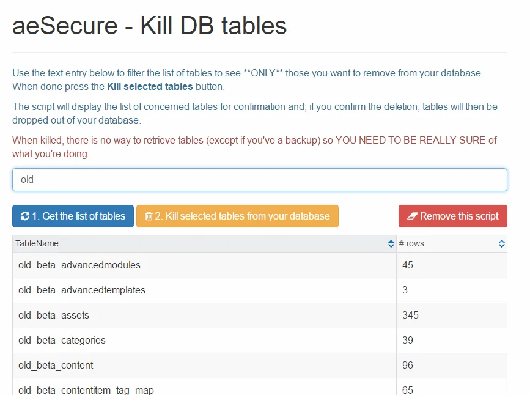

<TLDR>
This article shares a small PHP utility script that deletes Joomla database tables matching a given prefix (e.g. leftovers from an old, removed component). It's uploaded next to `configuration.php`, run from the browser to select and delete matching tables, and must be removed from the server immediately afterward — with a strong warning to back up the database first.
</TLDR>

A recent [post](https://forum.joomla.fr/forum/joomla-4-x-aa/questions-g%C3%A9n%C3%A9rales-aa/2060596-deux-pr%C3%A9fixes-de-tables) on the Joomla French forum was asking how to delete tables present in the Joomla database; the ones using a given prefix like `old_` or something like that.

Indeed, from time to time, it can be useful to take a look at the list of tables in your database and perhaps, you'll find tables prefixed with f.i. `old_` or an old tool you've used years ago (using the correct prefix but with a component you've removed since, like `joomla_oldcomp`).

Years ago, I wrote such a PHP utility; let's see how to use it.

<!-- truncate -->

## What the utility looks like

Type a prefix in the text field and the utility immediately lists every table of your Joomla database matching it. Tick the ones you want gone, click `Kill selected tables`, and they're dropped. The `Remove this script` button on the right deletes the utility from your server once you're done.

That's the whole tool: one screen, one text field, no configuration file.

## How to use it

1. Click on the link [https://github.com/cavo789/joomla_free/blob/master/src/kill_db_tables/kill_db_tables.php](https://github.com/cavo789/joomla_free/blob/master/src/kill_db_tables/kill_db_tables.php) to get a copy of my PHP utility,
2. Copy/download the script and using your FTP client (<Link to="/blog/winscp-synchronize-both">WinSCP</Link> f.i.), upload the script to your Joomla site, in the same directory as your `configuration.php` file. Name the script like, f.i., `delete_tables.php`,
3. Open your internet browser and go to the URL of your website and access `delete_tables.php`, so f.i. `https://yoursite.com/delete_tables.php`
4. In the text field, just start to type your prefix and you'll get the list of tables using that prefix. Once you're sure, just click on the `Kill selected tables` button.
5. Finally, be sure to click on the `Remove this script` button since the script shouldn't stay there.

<AlertBox variant="highlyImportant" title="Make sure to click on `Remove this script`." />

<AlertBox variant="highlyImportant" title="Make sure you know what you're doing and to have a database backup, just in case." />

## Conclusion

A leftover `old_` or `joomla_oldcomp` prefix is the kind of clutter you notice once a year and never take the time to clean, because doing it by hand in phpMyAdmin means ticking thirty checkboxes without being sure. This script does the selection for you, in one screen, and then removes itself.

Before dropping anything, take the time to **look** at what those tables contain: <Link to="/blog/joomla-show-table">Joomla - Run a SQL statement outside Joomla and display a nice HTML table</Link> is the read-only companion of this utility.
