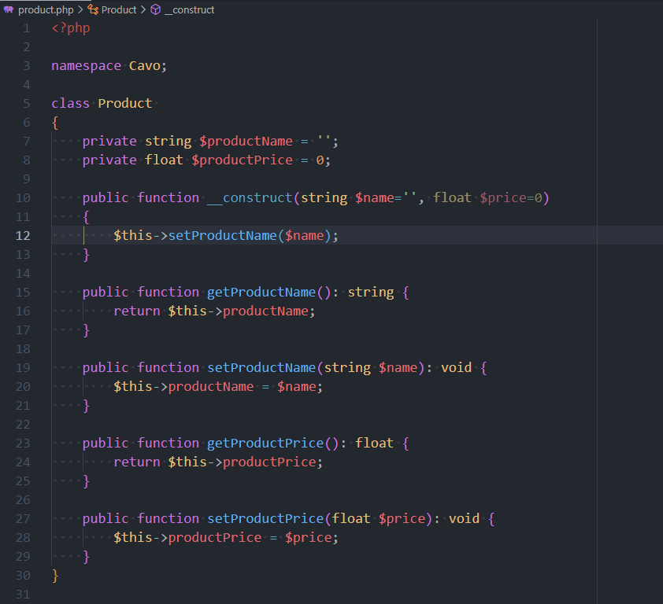

Tabnine is a **MUST HAVE** extension. He will predict your next keystroke and sometimes it's just **WOW; HOW IS IT POSSIBLE?**.

Imagine you've a `private string $firstName` property in PHP. By starting to type `private function set`, Tabnine will understand you're *probably* creating a setter and will then suggest `setFirstName(string $firstname)`.

<Snippets filename="customer.php">

```php
<?php

class Customer
{
    private string $firstName;

    private function set // <=== Tabnine will predict and propose setFirstName(string $firstname)
}
```

</Snippets>

<!-- truncate -->

> Download page [Tabnine: AI Autocomplete & Chat for JavaScript, Python, Typescript, PHP, Go, Java & more](https://marketplace.visualstudio.com/items?itemName=TabNine.tabnine-vscode)

Another example...

Imagine the code below and take a look on the `__construct` method. We need to handle the `$price` parameter. We need to call the setter for it.

<Snippets filename="product.php">

```php
<?php

class Product
{
    private string $productName = '';
    private float $productPrice = 0;

    public function __construct(string $name='', float $price=0)
    {
        $this->setProductName($name);
    }

    public function getProductName(): string {
        return $this->productName;
    }

    public function setProductName(string $name): void {
        $this->productName = $name;
    }

    public function getProductPrice(): float {
        return $this->productPrice;
    }

    public function setProductPrice(float $price): void {
        $this->productPrice = $price;
    }
}
```

</Snippets>

And here is how VSCode will predict my keystrokes when Tabnine is enabled. As you can see, Tabnine will predict that, after I've typed `$this-` that I'll use my `setProductPrice` method. And he knows that this function requires a parameter so he suggests that I use my `$price` one.



It's really amazing.

By default, Tabnine works offline i.e. don't use any cloud data provider like what GitHub Copilot does.

:::info Complete code privacy

The information below comes from [https://marketplace.visualstudio.com/items?itemName=TabNine.tabnine-vscode#complete-code-privacy](https://marketplace.visualstudio.com/items?itemName=TabNine.tabnine-vscode#complete-code-privacy.)

> Your code always remains private.
>
> Tabnine NEVER stores or shares any of your code. Any action that shares your code with the Tabnine servers for the purpose of private code models (part of enterprise) requires explicit opt-in. Tabnine does not retain any user code beyond the immediate time frame required for training models. Private code models created by Tabnine Enterprise are only accessible by your team members.
:::

Tabnine support a lot of languages, for instance, he's also working with pure text file (like this blog post).
