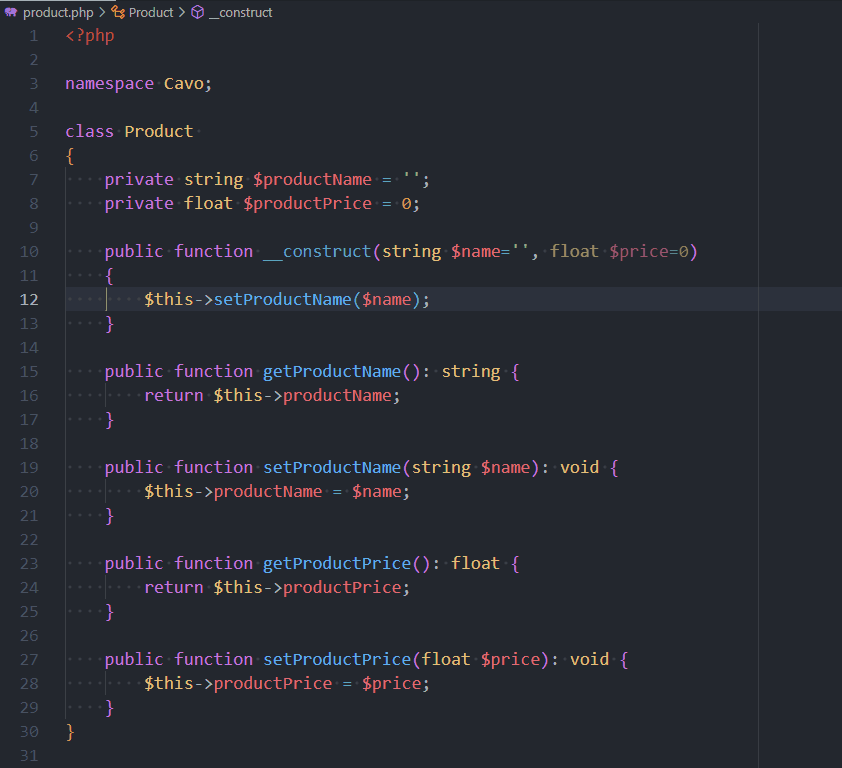

<AlertBox variant="caution" title="Tabnine is no longer free — avoid it">
Tabnine discontinued its free tier on **April 2, 2025** and eliminated its individual Dev plan on **October 16, 2025**. It is now **enterprise-only**, starting at $39/user/month (annual billing required). If you are an individual developer or looking for a free tool, Tabnine is simply not an option anymore. This article is kept as a historical record of what was once an excellent extension.
</AlertBox>

<TLDR>
This article is a historical record of Tabnine, an AI autocomplete VSCode extension that used to predict entire method calls and setters based on context (e.g. suggesting `setFirstName(string $firstname)` from a `firstName` property). It worked offline by default and never stored your code. **As of 2025, Tabnine is enterprise-only and no longer available for free.**
</TLDR>

Tabnine **was** a **MUST HAVE** extension. It would predict your next keystroke and sometimes it was just **WOW; HOW IS IT POSSIBLE?**.

Imagine you have a `private string $firstName` property in PHP. By starting to type `private function set`, Tabnine would understand you are *probably* creating a setter and would then suggest `setFirstName(string $firstname)`.

<Snippet filename="customer.php" source="./files/customer.php" />

<!-- truncate -->

Another example...

Imagine the code below and take a look at the `__construct` method. We need to handle the `$price` parameter. We need to call the setter for it.

<Snippet filename="product.php" source="./files/product.php" />

And here is how VSCode predicted keystrokes when Tabnine was enabled. As you can see, Tabnine predicted that, after typing `$this-`, the `setProductPrice` method would follow — and it even knew the function required a parameter, suggesting the `$price` one.

It was really amazing.

By default, Tabnine worked offline and did not use any cloud data provider. It also had a strong privacy pitch: it never stored or shared your code without explicit opt-in.

## Bye bye, Tabnine

What made Tabnine stand out — offline-first, strong privacy guarantees, genuinely impressive code prediction — was real. It was one of the best free AI coding tools available in its time.

Then came the pricing changes. The free tier disappeared in April 2025. The individual Dev plan followed in October 2025. Today, Tabnine is an enterprise product starting at $39/user/month. For individual developers, it simply does not exist anymore.

There is nothing left to install, nothing left to try. Tabnine as we knew it is gone. Goodbye.
