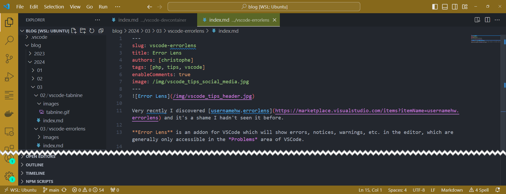
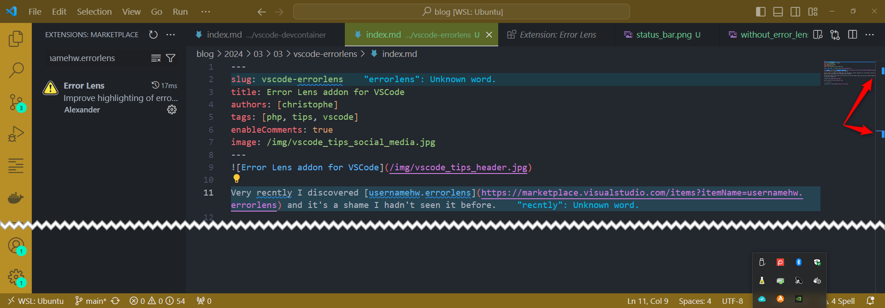

Very recently I discovered [usernamehw.errorlens](https://marketplace.visualstudio.com/items?itemName=usernamehw.errorlens) and it's a shame I hadn't seen it before.

**Error Lens** is an addon for VSCode which will show errors, notices, warnings, etc. in the editor, which are generally only accessible in the *Problems* area of VSCode.

Did you know where is that area? In the status bar of the main VSCode window. Did you see it? Hardly anyone sees it, and yet it should be!

We can see here I've 54 *problems*, ouch.

<!-- truncate -->

The image below is my current VSCode with this blog post opened. Ok, I can see some words underlined in blue but ... this is not really "visible". On a big file, chances are big that you don't see it.

Now, once Error Lens been installed, here is the same screen:

The entire line now has a blue-grey background and, too, I can see in the minimap (at the right side of the screen), that I've two blocks in blue so two *problems*.

This doesn't seem like much since it only "shows" the problems in the editing area, but at the office it has highlighted a huge number of errors (spelling or grammatical errors for text, types like `cente` instead of `center` for a CSS class, a typo in the name of a PHP variable, etc.).

This has greatly improved the quality of our code and removed some silent bug (*But why isn't this area of the screen centred? But I did add the `msg-center` class ... oh no, I forgot the `r`.*)
