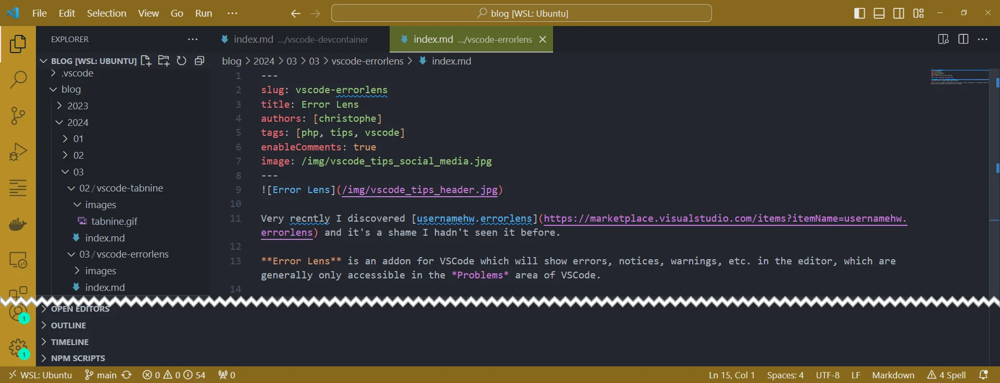
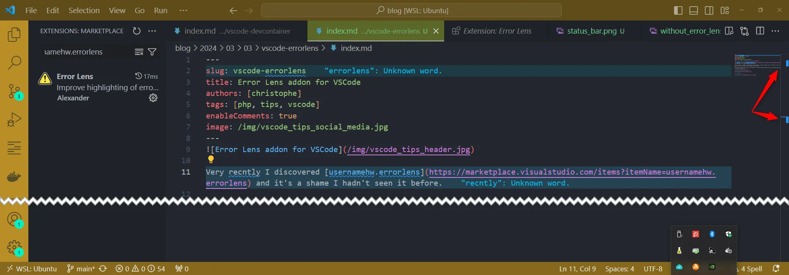

<TLDR>
This article introduces the Error Lens VSCode extension, which surfaces errors, warnings, and notices directly inline in the editor instead of hiding them in the easy-to-miss Problems panel/status bar. The author reports it caught many silent bugs at work — typos in CSS class names, misspelled variables — simply by making existing diagnostics impossible to overlook.
</TLDR>

Very recently I discovered [usernamehw.errorlens](https://marketplace.visualstudio.com/items?itemName=usernamehw.errorlens) and it's a shame I hadn't seen it before.

**Error Lens** is an addon for VSCode which will show errors, notices, warnings, etc. in the editor, which are generally only accessible in the *Problems* area of VSCode.

*It's installed by default in my <Link to="/blog/vscode-devcontainer">PHP devcontainer</Link>: as soon as the linters of that container report something, Error Lens makes it impossible to miss.*

Did you know where that area is? In the status bar of the main VSCode window. Did you see it? Hardly anyone notices it, and yet it should be seen!

We can see here that I have 54 *problems*, ouch.

<!-- truncate -->

The image below is my current VSCode with this blog post opened. Ok, I can see some words underlined in blue but ... this is not really "visible". On a big file, chances are big that you don't see it.

Now, once Error Lens has been installed, here is the same screen:

The entire line now has a blue-grey background, and I can also see in the minimap (on the right side of the screen) that I have two blue blocks, so two *problems*.

This doesn't seem like much since it only "shows" the problems in the editing area, but at the office it has highlighted a huge number of errors (spelling or grammatical errors for text, typos like `cente` instead of `center` for a CSS class, a typo in the name of a PHP variable, etc.).

This has greatly improved the quality of our code and removed some silent bugs (*But why isn't this area of the screen centered? But I did add the `msg-center` class ... oh no, I forgot the `r`.*)

In the same "stop losing things in a panel nobody opens" family, <Link to="/blog/vscode-todo-tree">Todo Tree in VSCode</Link> does for your `TODO` and `FIXME` comments what Error Lens does for diagnostics.
