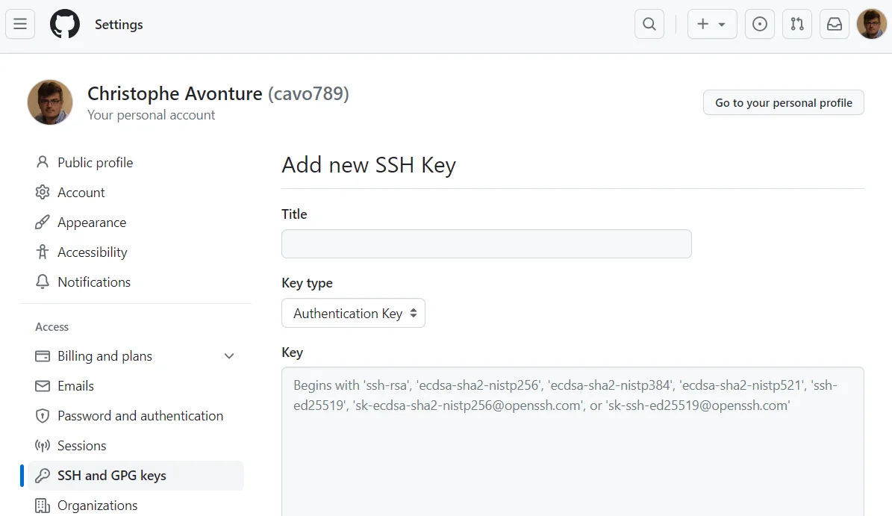

Using SSH instead of HTTPS to connect to Github is more secure. Indeed, SSH relies on public-key cryptography. This makes unauthorized access much harder compared to a password, which can be stolen through phishing or brute-force attacks. Also, HTTPS transmits your username and password (encrypted) over the network, which can be intercepted in a Man-in-the-Middle (MITM) attack. SSH doesn't transmit passwords after the initial setup.

Let's see how to add a SSH key and, from now, being able to work with Github like using the `git@` protocol with `git clone`.

<!-- truncate -->

Adding a SSH key on your computer and use it to connect to Github is quite easy.

First, run the command below on your computer. Replace `your_email@example.com` by the email linked to your existing Github account.

<Terminal>
$ ssh-keygen -t ed25519 -C "your_email@example.com"
</Terminal>

You'll be prompted to enter a *passphrase*, this is not required so just press <kbd>Enter</kbd>.

You'll then see something like this on your console:

<Terminal>
Generating public/private ed25519 key pair.
Enter file in which to save the key (/root/.ssh/id_ed25519):
Enter passphrase (empty for no passphrase):
Enter same passphrase again:
Your identification has been saved in /root/.ssh/id_ed25519
Your public key has been saved in /root/.ssh/id_ed25519.pub
The key fingerprint is:
SHA256:xxxxxxxxxxxxxxxxxxxxxxxxxxxxxxxxxxxxxx your_email@example.com
The key's randomart image is:
+--[ED25519 256]--+
| ( ...... )      |
| ( ...... )      |
| ( ...... )      |
| ( ...... )      |
+----[SHA256]-----+
</Terminal>

Then you'll need to add the key to your SSH agent. Simply run:

<Terminal>
$ eval "$(ssh-agent -s)"
$ ssh-add ~/.ssh/id_ed25519
</Terminal>

Finally, add the key to GitHub by surfing to [https://github.com/settings/ssh/new](https://github.com/settings/ssh/new).

Give a clear title like f.i. `Home computer`.

In the `Key` textarea, you'll need to paste there your **public** key.

Take a look on what you got on screen previously when running the `ssh-keygen` command. The public key path was mentioned; f.i., `Your public key has been saved in /root/.ssh/id_ed25519.pub`.

So, just run `cat /root/.ssh/id_ed25519.pub` in your Linux console and you'll get the key value. Copy/paste that line in Github settings page and, then, click on the `Add SSH key` button.

Finally, if you want to test if the connection is successfully created, just run `ssh -T git@github.com`. You should get `Hi cavo789! You've successfully authenticated, but GitHub does not provide shell access.` (with your own pseudo of course).
