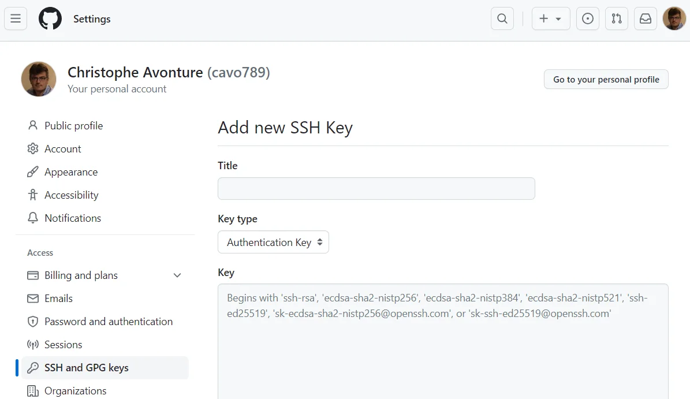

<TLDR>
This article explains why connecting to GitHub over SSH is more secure than HTTPS, then walks through the setup: generating an ed25519 key pair with `ssh-keygen`, adding it to the SSH agent, and pasting the public key into GitHub's SSH key settings. It finishes with a quick `ssh -T git@github.com` command to verify the connection works, so you can start using the `git@` protocol with `git clone`.
</TLDR>

Using SSH instead of HTTPS to connect to GitHub is more secure. Indeed, SSH relies on public-key cryptography. This makes unauthorized access much harder compared to a password, which can be stolen through phishing or brute-force attacks. Also, HTTPS transmits your username and password (encrypted) over the network, which can be intercepted in a Man-in-the-Middle (MITM) attack. SSH doesn't transmit passwords after the initial setup.

Let's see how to add an SSH key and, from now on, be able to work with GitHub using the `git@` protocol with `git clone`.

<!-- truncate -->

Adding an SSH key to your computer and using it to connect to GitHub is quite easy.

First, run the command below on your computer. Replace `your_email@example.com` with the email linked to your existing GitHub account.

<Terminal typewriter>
$ ssh-keygen -t ed25519 -C "your_email@example.com"
</Terminal>

You'll be prompted to enter a *passphrase*, this is not required so just press <kbd>Enter</kbd>.

You'll then see something like this on your console:

<Terminal typewriter source="./files/terminal-1.txt" />

Then you'll need to add the key to your SSH agent. Simply run:

<Terminal typewriter>
$ eval "$(ssh-agent -s)"
$ ssh-add ~/.ssh/id_ed25519
</Terminal>

Finally, add the key to GitHub by surfing to [https://github.com/settings/ssh/new](https://github.com/settings/ssh/new).

Give a clear title like f.i. `Home computer`.

In the `Key` textarea, you'll need to paste there your **public** key.

Take a look at what appeared on screen previously when running the `ssh-keygen` command. The public key path was mentioned; f.i., `Your public key has been saved in ~/.ssh/id_ed25519.pub`.

So, just run `cat ~/.ssh/id_ed25519.pub` in your Linux console and you'll get the key value. Copy/paste that line into the GitHub settings page and, then, click on the `Add SSH key` button.

Finally, if you want to test if the connection is successfully created, just run `ssh -T git@github.com`. You should get `Hi cavo789! You've successfully authenticated, but GitHub does not provide shell access.` (with your own pseudo of course).

Two follow-ups: if you have repositories already cloned over HTTPS, <Link to="/blog/git-config">Git - Some tips for your .gitconfig file</Link> shows a one-line setting to force SSH globally without re-cloning anything; and the same key mechanism works for your hosting server, see <Link to="/blog/connect-using-ssh-to-your-hosting-server">How to connect to your hosting server using SSH</Link>.
