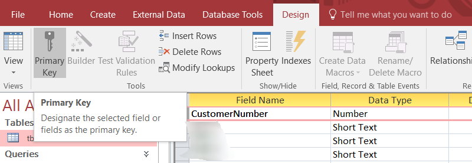

Several years ago, I had to intervene on an MS Access database that had been created by a person of good will but with little affinity for computers and optimization.

The result: a cumbersome and exasperatingly slow database.

In this article, resurrected from my personal archive, I'm going to present the different stages I went through.

<!-- truncate -->

:::note Disclaimer
This guide deliberately concerns **existing databases**, for this reason, I will not speak for example about how to correctly design tables, not having more than 100 fields, not about drawing a relational schema, ... The objective is therefore to improve performance without deep programming (no re-engineering) and without migration to f.i. SQL Server.
:::

## MS Access - Analyze Performance

MS Access 2016 provide a tool for analyzing the current database.


You can run the tool only for a selection like, f.i., only for queries.

## Do it yourself

### Tables

#### Add a primary key in each table

Depending on your data model, try to add a Primary key in each table.

For instance, if you've a Customer table, you'll probably have one field that one field that will define, without any doubt, a given customer; a field like `CustomerID` (whatever his name).

Examine all your tables and if you've such unique field, define that field as the Primary key.

If possible, a primary key should be

* only one field (you can indeed define several fields to be the key),
* a number, not a text field,
* smaller as possible (if you really need to use a text field, prefer a field with 5 characters f.i. and not 255)

Right-click on the table name and select `Design`.


Select the field then click on the `Primary key` button.



Be careful: be sure to correctly identify the unique field; don't add a primary key to f.i. a customer name (since more than one customer can have such name). A primary key will increase speed and data coherence in your table but will also prevent to have a second record with the same key (so, if you choose the wrong field, we can have side effect).

#### Use indexes

Take a look to your queries: do you often make a filter on a specific field? You could have a very strong performance improvement by just adding an index for that field.

To do it, open your table in design mode by just right-clicking on the name of the table


Then click on the `Indexes` button to show a small window and, there, add indexes on important fields.


Note: don't abuse, don't *over index*. Add indexes only on fields often used in query's criteria since maintaining indexes ask CPU and thus has a cost on insert/update/delete statements.

#### Create relationships between tables if possible

When you're using, in a query, two tables or more having a link between them, MS Access optimization technique suggest creating this link, also, in the relationships window i.e. at a global level.

To do this, once your database is opened, click on the `Database Tools` menu and choose `Relationships`.

Draw your relation, select carefully the join type (which can be also adjusted in a query) and save the relations.


Example: link between two tables on the `ID` from a first table and the associated field, `tblOneID` in the second table. The arrow is draw from `table1` to `table2` (it's the `join type`) and this means: "take all records of `table1` and, if the value is also known in `table2` then return values.

Tip: always try to use an index for the relation and not "any field".


#### Use the right data type and the right size

In your tables, try to correctly choose the data type:

* if you should store a True/False (or 1/0) information, choose a `Yes/No`
* if you need to store a small number (f.i. `Number of children`), don't choose Number - Long Integer when Number - Byte is enough,
* ...

And the right size: specially for text fields, don't use a 255 length (it's almost never needed) but try to think about the longest value (do you really have a customer with a family name of 255 characters? probably 50 will be enough).

### Queries

#### Use Between

When you need to write a `between` criteria, f.i. ID between 5 and 9, you can do this like this:


* Twice the same column, one with `>= 5` and the second with `< 10`
* Or in the same column using a `Between 5 and 9`

The best way is the yellow one: only one field and thus only one criteria to evaluate.

#### Count the number of records

If you use the Count function to calculate the number of records returned by a query, use the syntax `Count(*)` instead of `Count([some_field])`.

`Count(*)` is faster since it doesn't have to check for Null values in the specified field and won't skip records that are null.

*By using `Count([some_field])` the number returned **can be lower** than the real number of records if the column `some_field` is sometime equal to the Null value.*

#### Only needed fields

If you're using a query in another query like illustrated below, if you just need three fields in the second query, perhaps the first query can be modified and return only these three fields.


If, in this example, the query called `qryFirst` is only used by this second query, then you can modify the first query to only returned three columns.

The less data returned, the faster the query will be processed.

#### Use Is Null and not IsNull()

In a query, use `Is Null` which is native in the SQL standard while `IsNull()` is, in fact, a VBA feature.

Using `IsNull()` is therefore slower than `Is Null`

So, avoid,

```SQL
SELECT ... FROM ... WHERE IsNull(fld)
```

And use,

```SQL
SELECT ... FROM ... WHERE (fld Is Null)
```

#### Use Iif() and not NZ()

NZ() is a VBA feature: if a field is equal to the Null value, NZ() allow to return something else.

Iif() is native SQL.

Simplified illustration: if the hiring date is null, assumes that it was the 1st January 2000.

```SQL
SELECT NZ([dteHiring], #2000-01-01#) As dteEntry
```

The same can be also written like:

```SQL
SELECT Iif([dteHiring] Is Null, #2000-01-01#, [dteHiring]) As dteEntry
```

Why it's bad? **NZ() will return a variant object which is less performant because the .JET engine of MS Access treats Variants as Text**. In the first example `NZ([dteHiring], #2000-01-01#) As dteEntry`, the data type of dteEntry is therefore a text field, not a date.

So, in the example below, we're not comparing a date versus another date but a date `dteEntry` with a text (the result of the `NZ()` formula). So .JET engine will convert `dteEntry` to a text too. The conversion is therefore done twice and this is inefficient.


With `Iif([dteHiring] Is Null, #2000-01-01#, [dteHiring]) As dteEntry` the type remains a date field. So we can quickly solve the double conversion introduced by `NZ()` using this construction:


Here, .JET won't complain anymore and will immediately compare a date with an another date; faster.

#### Avoid VBA functions

We've already see this. Use `Is Null` and not `IsNull()`, use `Iif` and not `NZ()` and this apply to a lot of others formulas.

##### Year()

Year() is a VBA function. The query below requires that every single date are processed by Year() to determine the year before evaluating the criteria.

If there is an index on `dteHiring`, the index is ignored due to the VBA call.

```SQL
SELECT ... FROM ... WHERE (Year([dteHiring]) = 2018)
```

Prefer the native SQL `BETWEEN` verb:

```SQL
SELECT ... FROM ... WHERE ([dteHiring] between '1/1/2018 00:00:00' and '12/1/2018 23:59:59')
```

Here the index is well used, .JET also don't need to make VBA call record by record but can work on a set of records in one time.

##### DCount(), DSum()

Prefer to rewrite the query and use, f.i., sub-queries with a GROUP BY and the desired formula (Count(), Sum(), ...)

#### Sorting on columns not formula's

If possible, it's better to use a sort feature on columns (so probably use indexes).

In the following example, ORDER BY is done on a formula (a string concatenation), no indexes can be used here, the time needed to sort records is slower.

```SQL
SELECT ClientID, Name + " " + FirstName As FullName
FROM tblClient
ORDER BY Name + " " + FirstName
```

In the example below, the result will be exactly the same except that if one or the two columns are indexed, the result will be faster.

```SQL
SELECT ClientID, Name + ", " + FirstName As FullName
FROM tblClient
ORDER BY Name, FirstName
```

#### Use the same (or compatible) data type in join fields

When you make a link between two tables (with a join), try to respect the data type: avoid making a link between f.i. a number and a text field.

Consider the following example:


*The field `ID` in `tblCustomer` is a number*


*The field `CustomerNumber` in `tblOrder` is a text (and a big one)*


MS Access will be able to make the join and will make things working but, implicitly, will convert any fields so they have the same data type and this will cost CPU.

In this example, if possible, change the data type of  `CustomerNumber` in `tblOrder` to a `Long integer` so the fields will be compatible.

#### First filter by using WHERE before HAVING

Totals queries (those with a `GROUP BY` clause) can have both a `WHERE` clause and a `HAVING` clause.

* `WHERE` is executed first **before aggregation**
* `HAVING` is executed afterwards **when the totals have been calculated**

Below, there is no `WHERE` clause: the calculation "How many invoices by customer" is made for all customers (several thousand maybe) and, once all this calculation is done, you just ask for figure for the customer 99. Rather very deficient.

```SQL
SELECT ClientID, Count(InvoiceID) AS HowMany
FROM tblInvoice
GROUP BY ClientID
HAVING ClientID = 99;
```

Take advantage of the `WHERE` priority and obtain the same information, much faster, like this:

```SQL
SELECT ClientID, Count(InvoiceID) AS HowMany
FROM tblInvoice
WHERE ClientID = 99
GROUP BY ClientID;
```

Here, .JET only take records for that customer before starting to count.

#### If you're group on the primary key

As soon as you're using a GROUP BY in your SQL, every "not" calculated field should be mentioned in the GROUP BY clause.

Because we're not using a formula like Count(), Max(), ... on the LastName, that field should be mentioned in the GROUP BY clause so:

```SQL
SELECT EmployeeID, LastName, Count(Illness)
FROM Employees
GROUP BY EmployeeID, LastName
```

But, here, GROUP on the LastName is unnecessary because EmployeeID is already unique: when using the primary key in the GROUP BY, any other fields are needless and due to their presence, .JET will make grouping for nothing. Unneeded actions...

Because the primary key is in the GROUP BY clause, we can use such SQL:

```SQL
SELECT EmployeeID, First(LastName) AS LastName, Count(Illness) As IllDays
FROM Employees
GROUP BY EmployeeID
```

By using First() we allow .JET to only retain the first LastName for that Employee ID (and, of course, the employee has only one LastName).

This is therefore faster.

<!-- below, content of ./020-do-it-yourself/030_macros/readme.md -->

### Macros

#### Convert macros to modules

Converting a macro to Visual Basic for Applications (VBA) code can enable certain actions to run faster.

To convert a macro to VBA, select the macro (don't open it, just select it) and, in the `Database Tools` tab click on `Convert Macros to Visual Basic`.

Then, once done, you'll probably need to update your interface: if you've forms, you'll need to update f.i. buttons to fire the VBA module and no more the macros.

If everything goes fine, just delete the converted macros.

<!-- below, content of readme.md -->

### Modules

#### Save modules in a compiled state

If the database contains modules, be sure in the production version, to compile the source code. You just need to open one module (no importance) and to click on the `Debug` menu then `Compile`.


#### Use Option Explicit statement

If you've modules or form's event coded in VBA, open every module / forms (press then `ALT-F11` to open the editor) and in the very first line of your code, type `Option Explicit` like f.i.:

```vbnet
Option Compare Database
Option Explicit

Sub DoSomething()
    ' your own code
End Sub
```

Option Explicit force the VB Engine to check that variables exists before starting to run the code and not every time a variable is accessed. This give a (small) little speed improvement.

:::caution
Option Explicit is more an excellent way of coding: variables should be declared before using them
:::

#### Unload references

Take a look, in your code, if you're referencing too much external dependencies.

From within the VB Editor, click on the `Tools` menu then select `References` and pay attention to the first items in the list, the checked one. Do you really need them?

An easy way to answer to this question is: uncheck them and click on the `OK` button.

Click on the `Debug` menu and choose `Compile`. If you get compilation errors (and no errors before), go back in the `References` window and check the library back.


Most of time, only two references are needed:

1. `Visual Basic For Applications` (always at the top)
2. `Microsoft Access 16.0 Object Library` (the second one) (Note: "16.0" is variable and depends on your MS Office installed version)

<!-- below, content of readme.md -->

### Database

#### Compact the database

If you've temporary tables, remove them before.

Compacting the database will free up spaces, remove unneeded objects and records, updates internal statistics and this will have a positive impact on performance.

#### Save the database as a .mde file

**!!! Be careful !!!**

A .mde file is smaller and faster than a normal MS Access (.accdb file) but you can't modify anymore the structure of such file.

With a .mde, you'll no more be able to change the design of a table, add a field, modify your forms, ... but just use them.


**If you wish to use a .mde, always take a backup of your .accdb (or .mdb) file and keep it in a secured folder. Once more: if you don't have anymore the .accdb file but only the .mde, you won't be able to change the structure of the application, you won't be able to modify a macro, a form, ...**

:::tip Scan all tables and export an exhaustive fields list in Excel
Also see my post <Link to="/blog/vbs-msaccess-get-fields">VBS - Retrieve the list of fields in a MS Access Database</Link>.
:::
