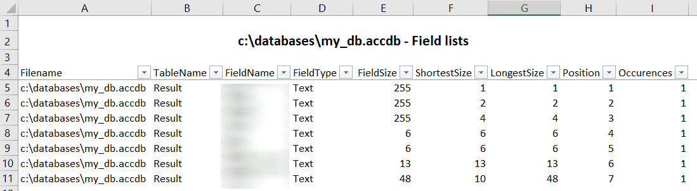

Years ago, I've created a .vbs script that will scan a MS Access database, loop for each table and, for each of them, will get the list of fields.

For each fields, a lot of information will be retrieved like, not exhaustive, his name, size, type, ... and also the shortest and longest value size (for text and memo fields). For instance, if a text field is found, the script will retrieve his size (f.i. 255 chars max) and will examine all records in the table for retrieving, for that field, the smallest size (f.i. 10) and the greatest one (f.i. 50). So, if the max size is 50 and the size has been set to 255, perhaps the MS Access developer can safely modify the max size from 255 to 50.

To make the script to run:

1. Copy/paste the source code below, one by one, and save it to a text file (with Notepad). The first file to create will be `access_get_fields_list.vbs`, the second will be `access_get_fields_list.cmd` (see after),
2. Before saving the `access_get_fields_list.cmd` be sure to edit the file and mention the full filename of your database (see after),
3. You're ready, from your File Explorer, just double-click on the `access_get_fields_list.cmd`, the analyze script will be executed and Excel will be opened at the end.

*If everything goes fine, you'll see a DOS window and after a few seconds (depending on the size and complexity of the database), you'll have the report in Excel, automatically opened.*

#### Prepare files

##### access_get_fields_list.vbs

Get the source code from my GitHub page: [https://github.com/cavo789/vbs_access_get_fields_list/blob/master/access_get_fields_list.vbs](https://github.com/cavo789/vbs_access_get_fields_list/blob/master/access_get_fields_list.vbs).

Copy the code in f.i. Notepad then save it on your disk, f.i. `access_get_fields_list.vbs` as filename. 

##### access_get_fields_list.cmd

Proceed the same way for the [https://github.com/cavo789/vbs_access_get_fields_list/blob/master/access_get_fields_list.cmd](https://github.com/cavo789/vbs_access_get_fields_list/blob/master/access_get_fields_list.cmd) script. Copy/paste the line in Notepad and think to change the database name (no more `C:\temp\my_db.accdb` but yours).

Save the file onto your hard disk and give `access_get_fields_list.cmd` as filename. You can then quit Notepad.

#### Understand the report

Once the process is finished, Excel will be automatically fired with something like this:

* Filename: The MS Access filename (absolute)
* TableName: The name of the table
* FieldName: The name of the field found in that table
* FieldType: The data type (integer, string, date, ...)
* FieldSize: The maximum size defined in the table (f.i. 255 means that this field can contains up to 255 characters)
* ShortestSize: When the table contains records, the ShortestSize info is "what is the smaller information stored in that field?" (example: if the field is a firstname, size 255 but the shortest firstname is `Paul`, then `ShortestSize` will be set to 4)
* LongestSize: When the table contains records, the `LongestSize` info is "what is the biggest information stored in that field?" (example: if the field is a firstname, size 255 but the longest firstname is `Christophe`, then `LongestSize` will be set to 10)
* Position: The position of that field in the structure of the table (is the first defined field, the second, ...)
* Occurences: How many time, that specific `FieldName` is found in the entire database. If you've a lot of tables, perhaps the field called `CustomerID` is used in the `Customers` table and in the `Orders` table too so `Occurences` will be set to 2 in this case.

In a context of optimization:

* Be sure to not have too big field size. By default, MS Access suggest a size of 255 for text fields but for name and firstname a size of 40 characters is enough.
* Check the `LongestSize` property: if you see f.i. a size of 4 this means that you're probably storing a code (a ZipCode f.i. is max 4 digits in Belgium). If the `FieldSize` is set to 50, you know you can reduce that size to 4.
