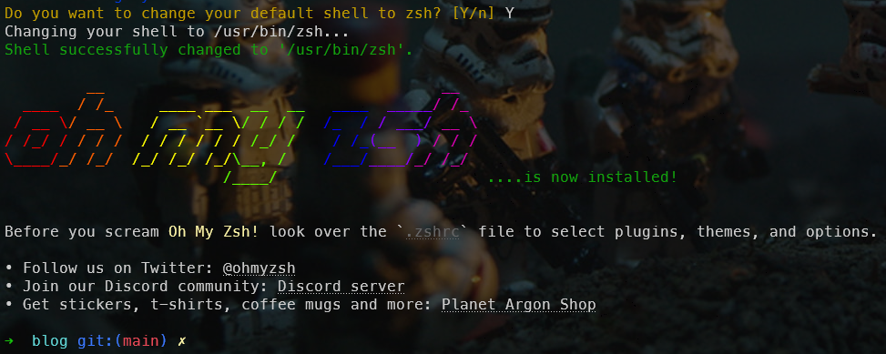
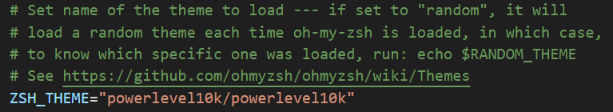
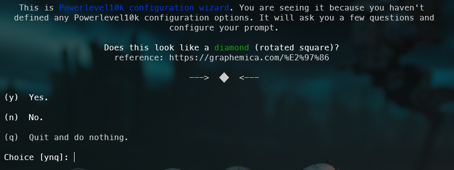
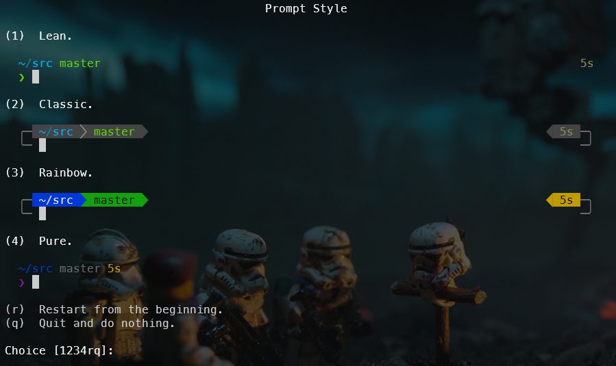
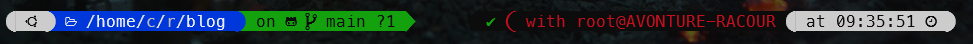
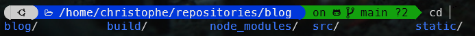
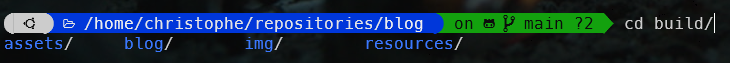
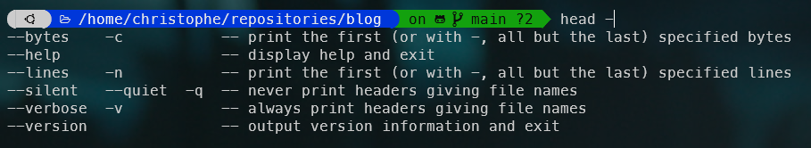

ZSH is a powerful alternative to Linux Bash offering a lot of features like auto-completion (I like this so much), plugins and even themes.

The idea here is to empower your Linux console, both the command line like, f.i. new aliases out-of-the-box and make the look and feel even better.

I've chosen [Oh My ZSH](https://ohmyz.sh/) since years, let's see how to install it followed by a discovering some features.

<!-- truncate -->

## Installation

The installation is quite easy, just three commands:

```bash
sudo apt-get update && sudo apt-get install zsh
chsh -s /usr/bin/zsh
sh -c "$(curl -fsSL https://raw.githubusercontent.com/ohmyzsh/ohmyzsh/master/tools/install.sh)"
```

With the last instruction, you'll be asked if you want to change the default shell to zsh; simply answer `Y`es.

And very quickly you can see a change in your console:



One first change concern the prompt. Right now, I'm in my blog folder and it's a git repository. So, Oh-My-ZSH is showing me that info and, on top, the current branch I'm working on (branch `master` here).

Nice but, we can do much better.

Time to install a template engine called [Powerlevel10k](https://github.com/romkatv/powerlevel10k)? You can read my previous article [Customize your Linux prompt with Powerlevel 10k](/blog/powerlevel10k_sandbox) if you wish to just test it. In the next paragraph, I'll well install PowerLevel10 on my computer so let's go ahead.

### Powerlevel10k

Installation is easy too, just run `git clone --depth=1 https://github.com/romkatv/powerlevel10k.git ${ZSH_CUSTOM:-$HOME/.oh-my-zsh/custom}/themes/powerlevel10k` in your console. You'll then download the template.

The second action to take is to edit the `~/.zshrc` file. Since I'm using VSCode, I just start VSCode, press <kbd>CTRL</kbd>+<kbd>O</kbd> and open the `~/.zshrc` file.

Search for `ZSH_THEME` and set the value to `powerlevel10k/powerlevel10k`.



The last thing is to close your current Linux console and start a new one. The first time, you'll get the Powerlevel10k configuration wizard:



Just answer to all questions and when it's time to define your preference, just select the option you like the most.



When done, here is my prompt will look like:



And this is so much better (and much prettier). Quickly, I know I'm in my `blog` folder, that it's a Git repository, that I'm on branch `main` and `?1` means I've one *untracked* or *modified* file on my computer and not yet pushed to the central repo (Github here).

At the right, we can see I'm connected as `root` on my computer machine. It is red just to notify I've root access.

#### Customizing the prompt

Ok, let's remove that part since, yeah, it's my home computer, it's normal here I'm root since I've just one local account and that information is then meaningless to me.

Powerlevel10k has a great documentation and by reading [How do I add username and/or hostname to prompt?](https://github.com/romkatv/powerlevel10k?tab=readme-ov-file#how-do-i-add-username-andor-hostname-to-prompt), we just learn how to remove it by the same way.

Just edit the `~/.p10k.zsh` file, search for `POWERLEVEL9K_RIGHT_PROMPT_ELEMENTS` and then retrieve his `context` entry and comment the line. Save the file, open a new console and bingo, the right side of the prompt don't contain anymore the username.


## Somes features I use daily

You might think these features are not needed but the fact is I'm using them so much in my daily work.

For instance, `take /tmp/new_folder` will create the folder if not yet present and will jump in it.

Be honest, `take /tmp/new_folder` is easier and faster than `mkdir -p /tmp/new_folder && cd $?` no?

:::info Take is just a custom function
`take` is, in fact, a function defined in file `~/.oh-my-zsh/lib/functions.zsh`.
:::

A second, so stupid but so valuable feature is `cd ..` followed by two or three or ... dots.

Imagine you're in the folder `/tmp/new_folder/a/b/c/d/e/f` and you want to use `cd ..` to jump back to parent `a`. Using ZSH, I can just type `cd ......` and that's cool. `cd ..` jump to the first parent, `cd ...` to the grand parent and so on. 

There is also one king key with ZSH and it's <kbd>TAB</kbd>. Imagine you're in a folder having multiple sub-folders. Just type `cd ` (the space is really important) and press <kbd>TAB</kbd>. You'll then get the list of sub-folders. Navigate between suggestions by using <kbd>TAB</kbd> and press <kbd>ENTER</kbd> to select one.



Then, continue, press <kbd>TAB</kbd> again and you'll be able to select a sub-folder and you can continue like that. 



<kbd>TAB</kbd> is then used by ZSH for auto-completion. Let's try something else: `head -` followed by <kbd>TAB</kbd>. As you can see below, I'll get the list of command line flags I can use, I can navigate still using <kbd>TAB</kbd> and continue to type my command line.



In term of aliases, one I use several times a day is `gst` for `git status`. You can retrieve the list of all aliases for Git in your `/root/.oh-my-zsh/plugins/git/git.plugin.zsh` file. A nice one is `gwip` to commit all your changes as `work in progress` allowing you to store your current work, checkout another branch (f.i. to work on an issue) and when done, checkout back your feature branch and retrieve your work. Easy.

And for sure, that are more, I just probably don't know they're part of ZSH anymore.

There are much, much more like [plugins](/blog/tags/zsh). I'll write other posts for them.