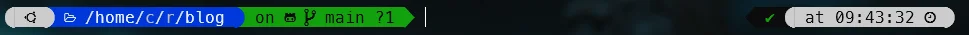
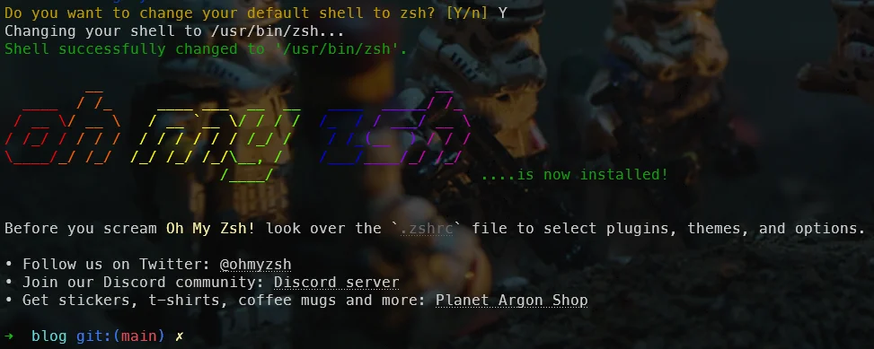
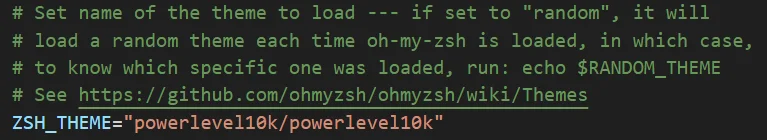
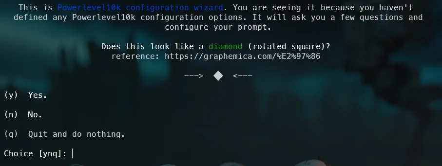
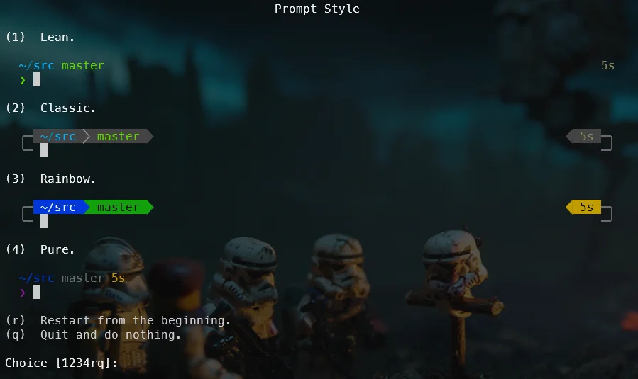
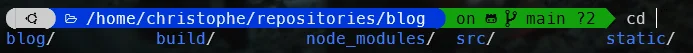
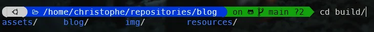
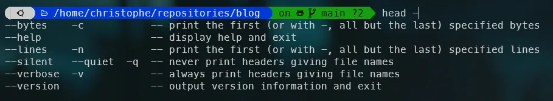

<TLDR>
This article walks through installing Zsh and Oh My Zsh on Linux, then upgrading the prompt with the Powerlevel10k theme and trimming its default username/hostname display. It also highlights a handful of daily-use features worth knowing: the `take` function to create and enter a folder in one step, `cd ...` chains to jump up multiple parent directories, <kbd>TAB</kbd>-driven autocompletion, and Git aliases like `gst` and `gwip`.
</TLDR>

ZSH is a powerful alternative to Linux Bash offering a lot of features like auto-completion (I like this so much), plugins and even themes.

*Once installed, two articles take it further: <Link to="/blog/modular-zsh-workflow">Beyond the Monolith - Organizing Your ZSH Workflow Like a Pro</Link> to keep your `.zshrc` from becoming a monster, and <Link to="/blog/zsh-docker-functions">ZSH Functions - Customizing Your Shell for Docker Management</Link>.*

The idea here is to empower your Linux console: improve the command line (f.i. new aliases out-of-the-box) and make the look and feel even better.

I've been using [Oh My ZSH](https://ohmyz.sh/) for years; let's see how to install it, followed by discovering some features.

<!-- truncate -->

## Where We're Going

This is my prompt once Zsh, Oh-My-Zsh and the Powerlevel10k theme are in place:

At a glance I know I'm in my `blog` folder, that it's a Git repository, that I'm on branch `main` and that `?1` means one *untracked* or *modified* file is waiting on my computer, not yet pushed to GitHub. No command typed, no `git status` run: the information is simply there, refreshed at every prompt.

## Why it's worth the ten minutes

- **Oh-My-Zsh is a framework, not a theme.** It ships hundreds of aliases and functions out of the box, so you get value before configuring anything.
- **The prompt becomes a dashboard.** Folder, repository, branch and pending-changes count are permanently displayed, which is exactly the state you keep checking manually.
- **Autocompletion is on another level.** <kbd>TAB</kbd> lists sub-folders, command flags and Git branches, instead of just completing a file name.

## Seeing It in Action with Docker

Before touching your `~/.zshrc`, spin up a throwaway container and play with Oh-My-Zsh for real.

<AlertBox variant="tip" title="Why Docker first?">
A container lets you feel what Oh-My-Zsh changes — the prompt, the aliases, the daily-use tricks below — without switching your login shell or editing a single file on your machine. Don't like it? Remove the container, nothing lingers.
</AlertBox>

Here is the Dockerfile I prepared. It installs Oh-My-Zsh unattended and also pre-builds a small
playground: a deep folder tree to try `cd ...` on, and a git repository with a commit and an
untracked file so `gst` has something to show:

<Snippet
  filename="Dockerfile"
  source="./files/Dockerfile"
  defaultOpen={false}
/>

Build and run it:

<Terminal title="user@machine: ~/zsh-demo">
$ docker build -t zsh-demo .
[+] Building 22.1s (8/8) FINISHED
 ✔ exporting to image

$ docker run --rm -it zsh-demo
🐳 root ~/demo/a/b/c/d/e/f #
</Terminal>

You land directly inside `/root/demo/a/b/c/d/e/f` — six folders deep, git repo already
initialized. Try the features from the next section right away:

<Terminal title="🐳 root ~/demo/a/b/c/d/e/f #">
$ cd ......
🐳 root ~/demo/a #

$ gst
On branch main
Untracked files:
  notes.txt

$ take /tmp/scratch
🐳 root /tmp/scratch #
</Terminal>

`cd ......` (six dots) jumps up five parents in one go. `gst` shows the untracked `notes.txt`
without you typing `git status` — it works from any depth inside the repo, since Git walks up to
find `.git` on its own. `take` creates `/tmp/scratch` and drops you inside it. Press <kbd>TAB</kbd>
after `cd ` to see folder autocompletion in action.

## Installation

The installation is quite easy, just three commands:

<Terminal typewriter>
$ sudo apt-get update && sudo apt-get install zsh
$ chsh -s /usr/bin/zsh
$ sh -c "$(curl -fsSL https://raw.githubusercontent.com/ohmyzsh/ohmyzsh/master/tools/install.sh)"
</Terminal>

With the last instruction, you'll be asked if you want to change the default shell to zsh; simply answer `Y`es.

And very quickly you can see a change in your console:

The first change concerns the prompt. Right now, I'm in my blog folder and it's a git repository. So, Oh-My-ZSH is showing me that info and, on top, the current branch I'm working on (branch `master` here).

Nice but, we can do much better.

Time to install a template engine called Powerlevel10k ([https://github.com/romkatv/powerlevel10k](https://github.com/romkatv/powerlevel10k)). If you'd rather try it in a throwaway container before touching your machine, read <Link to="/blog/powerlevel10k_sandbox">Customize your Linux prompt with Powerlevel 10k</Link>. In the next paragraph, I'll install Powerlevel10k on my computer, so let's go ahead.

### Powerlevel10k

Installation is easy too, just run `git clone --depth=1 https://github.com/romkatv/powerlevel10k.git ${ZSH_CUSTOM:-$HOME/.oh-my-zsh/custom}/themes/powerlevel10k` in your console. You'll then download the template.

The second action to take is to edit the `~/.zshrc` file. Since I'm using VSCode, I just start VSCode, press <kbd>CTRL</kbd>+<kbd>O</kbd> and open the `~/.zshrc` file.

Search for `ZSH_THEME` and set the value to `powerlevel10k/powerlevel10k`.

The last thing is to close your current Linux console and start a new one. The first time, you'll get the Powerlevel10k configuration wizard:

Just answer all the questions and when it's time to define your preference, just select the option you like the most.

When done, here is what my prompt will look like:

And this is so much better (and much prettier). Quickly, I know I'm in my `blog` folder, that it's a Git repository, that I'm on branch `main` and `?1` means I've one *untracked* or *modified* file on my computer and not yet pushed to the central repo (GitHub here).

At the right, we can see I'm connected as `root` on my machine. It's shown in red just to indicate I have root access.

#### Customizing the prompt

Ok, let's remove that part since, yeah, it's my home computer, it's normal here I'm root since I've just one local account and that information is then meaningless to me.

Powerlevel10k has great documentation, and by reading [How do I add username and/or hostname to prompt?](https://github.com/romkatv/powerlevel10k?tab=readme-ov-file#how-do-i-add-username-andor-hostname-to-prompt), we learn how to remove it the same way.

Just edit the `~/.p10k.zsh` file, search for `POWERLEVEL9K_RIGHT_PROMPT_ELEMENTS` and then find its `context` entry and comment out the line. Save the file, open a new console and bingo, the right side of the prompt no longer contains the username — you're now looking at the prompt shown at the top of this article.

## Some features I use daily

You might think these features are not needed but the fact is I'm using them so much in my daily work.

For instance, `take /tmp/new_folder` will create the folder if not yet present and will jump in it.

Be honest, `take /tmp/new_folder` is easier and faster than `mkdir -p /tmp/new_folder && cd $_` no?

<AlertBox variant="info" title="Take is just a custom function">
`take` is, in fact, a function defined in file `~/.oh-my-zsh/lib/functions.zsh`.

</AlertBox>

A second, so stupid but so valuable feature is `cd ..` followed by two or three or ... dots.

Imagine you're in the folder `/tmp/new_folder/a/b/c/d/e/f` and you want to use `cd ..` to jump back to parent `a`. Using ZSH, I can just type `cd ......` and that's cool. `cd ..` jumps to the first parent, `cd ...` to the grandparent and so on.

There is also one key feature with ZSH and it's <kbd>TAB</kbd>. Imagine you're in a folder having multiple sub-folders. Just type `cd` (the space is really important) and press <kbd>TAB</kbd>. You'll then get the list of sub-folders. Navigate between suggestions by using <kbd>TAB</kbd> and press <kbd>ENTER</kbd> to select one.

Then, continue, press <kbd>TAB</kbd> again and you'll be able to select a sub-folder and you can continue like that.

<kbd>TAB</kbd> is then used by ZSH for auto-completion. Let's try something else: `head -` followed by <kbd>TAB</kbd>. As you can see below, I'll get the list of command line flags I can use, I can navigate still using <kbd>TAB</kbd> and continue to type my command line.

In terms of aliases, one I use several times a day is `gst` for `git status`. You can retrieve the list of all aliases for Git in your `/root/.oh-my-zsh/plugins/git/git.plugin.zsh` file. A nice one is `gwip` to commit all your changes as `work in progress` allowing you to store your current work, checkout another branch (f.i. to work on an issue) and when done, checkout back your feature branch and retrieve your work. Easy.

And for sure, there are more — I probably don't even know they're part of ZSH anymore.

## Conclusion

Three commands install Zsh and Oh-My-Zsh, a `git clone` and one `ZSH_THEME` line bring the Powerlevel10k prompt, and a single commented-out entry in `~/.p10k.zsh` removes the noise you don't need. From there the gains are permanent: `take`, `cd ...`, <kbd>TAB</kbd> completion and `gst` are typed dozens of times a day without you thinking about them.

There is much, much more, like <Link to="/blog/tags/zsh">plugins</Link>. Next up, <Link to="/blog/zsh-plugin-autosuggestions">zsh-autosuggestions</Link> and <Link to="/blog/zsh-syntax-highlighting">zsh-syntax-highlighting</Link>, two must-haves once Oh-My-Zsh is in place.
