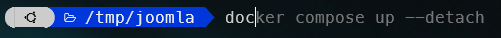

ZSH supports plugin and one of the wonders is the [zsh-autosuggestions](https://github.com/zsh-users/zsh-autosuggestions) one.

That one will suggests commands as you type based on your previous history and completions.

The more you use your Linux console, the more valuable this plugin will prove to be, as it will learn from you; it will know which commands you have already executed and will suggest them as soon as you start typing the first characters. Finish thinking "Gee, what were the parameters I used for ...".

<!-- truncate -->

## Installation

Just clone the official repository like below:

<Terminal>
$ {`git clone https://github.com/zsh-users/zsh-autosuggestions \${ZSH_CUSTOM:-~/.oh-my-zsh/custom}/plugins/zsh-autosuggestions`}
</Terminal>

Then edit the `~/.zshrc` file, search for `plugins=(` and add `zsh-autosuggestions` to the list. You'll have f.i. something like:

<Snippet filename="~/.zshrc" source="./files/.zshrc" />

Close your console, open a new one and it's done.

## How to use it

Auto-suggestions will retrieve from the HISTORY the commands you've already used on your computer and will use them as suggestions.

Imagine you've already type, today, yesterday or weeks ago the `docker compose up --detach` command. Today, just by typing `doc` you'll get, in gray, the suggestion. Press <kbd>TAB</kbd> if it's fine for you and it's done.

You can also play with <kbd>UP</kbd> and <kbd>DOWN</kbd> to switch and use another commands that match with the keys (*doc* in my example). Auto-suggestions is using the HISTORY of Linux.

