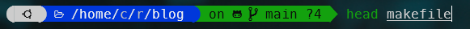
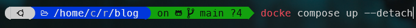

[zsh-syntax-highlighting](https://github.com/zsh-users/zsh-syntax-highlighting/) is another gem for ZSH.

As you type, you'll be able to tell from the colors that, for example, something isn't quite right.

If you type `head` followed by a space, ZSH will display this word in green: this command exists and is valid.  If you type `heat` there, the word will appear in red: this command does not exist.

It sounds simple, but it's so practical.

<!-- truncate -->

## Installation

Just clone the official repository like below:

<Terminal>
$ {`git clone https://github.com/zsh-users/zsh-syntax-highlighting \${ZSH_CUSTOM:-~/.oh-my-zsh/custom}/plugins/zsh-syntax-highlighting`}
</Terminal>

Then edit the `~/.zshrc` file, search for `plugins=(` and add `zsh-autosuggestions` to the list. You'll have f.i. something like:

<Snippet filename="~/.zshrc" source="./files/.zshrc" />

Close your console, open a new one and it's done.

## How to use it

In fact, nothing has to be done.

From now, when you'll type a command like f.i. `cat` or `head`, the command will appears in green meaning this is a valid one, correctly typed and executable.

As the opposite, it'll appears in red when the command contains a typo i.e. isn't an executable one:

