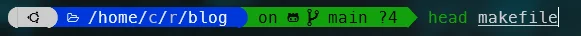
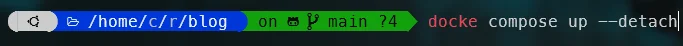

<TLDR>
This article introduces `zsh-syntax-highlighting`, a Zsh plugin that colors commands in your terminal as you type: green for valid, executable commands and red for typos or unknown ones. It walks through cloning the plugin into your Oh My Zsh custom plugins folder and adding it to the `plugins=(...)` list in `~/.zshrc`, with no further configuration needed to start using it.
</TLDR>

[zsh-syntax-highlighting](https://github.com/zsh-users/zsh-syntax-highlighting/) is another gem for ZSH — assuming you've already installed Oh-My-Zsh (see <Link to="/blog/zsh-install">How to install Oh-My-ZSH</Link> if not).

As you type, you'll be able to tell from the colors that, for example, something isn't quite right.

If you type `head` followed by a space, ZSH will display this word in green: this command exists and is valid.  If you type `heat` there, the word will appear in red: this command does not exist.

It sounds simple, but it's so practical.

*Its natural companion is <Link to="/blog/zsh-plugin-autosuggestions">Autosuggestions in the console using ZSH</Link>: one tells you whether what you're typing is valid, the other saves you from typing it at all.*

<!-- truncate -->

## Installation

Just clone the official repository like below:

<Terminal typewriter>
$ {`git clone https://github.com/zsh-users/zsh-syntax-highlighting \${ZSH_CUSTOM:-~/.oh-my-zsh/custom}/plugins/zsh-syntax-highlighting`}
</Terminal>

Then edit the `~/.zshrc` file, search for `plugins=(` and add `zsh-syntax-highlighting` to the list. You'll have f.i. something like:

<Snippet filename="~/.zshrc" source="./files/.zshrc" />

Close your console, open a new one (or run `source ~/.zshrc` to load your change) and it's done.

## How to use it

In fact, nothing has to be done.

From now, when you type a command like f.i. `cat` or `head`, the command will appear in green meaning this is a valid one, correctly typed and executable.

Conversely, it will appear in red when the command contains a typo i.e. isn't an executable one:

