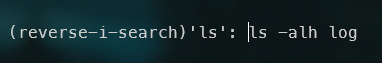

As you probably know, <kbd>CTRL</kbd>+<kbd>R</kbd> in the console will give you access to your HISTORY i.e. you'll retrieve the list of the commands you previously typed in your console. Just like using <kbd>UP</kbd> or <kbd>DOWN</kbd> keys but with a very small search engine.

And it makes the job but, honestly, this is really basic, no?

The Fuzzy Finder (aka `fzf`) command line utility will explode the possibilities linked to searching in the history but, in reality, this is just one of the consequences of installing fzf, which is so much more powerful.

Let's have a look.

<!-- truncate -->

By pressing <kbd>CTRL</kbd>+<kbd>R</kbd>, you'll natively get a *reverse search* in for your history. Start to type a command like `ls` in my example below and Linux will show you the last command used.

## Installation

The installation of `fzf` is simple, you just need to run `git clone --depth 1 https://github.com/junegunn/fzf.git ~/.fzf ; ~/.fzf/install` and answer by `Y`es to two questions.

When done, close and restart a new console (so Linux will take into account changes made to your configuration files).

## Playing with the history

Now, press <kbd>CTRL</kbd>+<kbd>R</kbd> again and you'll get something much better:

Just like previously, start to type the command you would like to retrieve; in my case, I know, once, I've tried to install a repo from github but don't remember the instruction so I'll start to type `github`:

If you look at the image, you'll see that `fzf` is searching for the `g`, `i`, `t`, `h`, `u` and `b` letters, not for the word.  So the first line has the word `git` then there is a `h` somewhere and the word `public` so, `ub` are there.  

This is handy since you don't need to remember the exact order of words in your previous command line, just type words in any particular order.

For me, just for this usage, the installation of `fzf` is already fully justified.

## Getting a list of files

Imagine you wish to display the content of a file so, you start to type `cat ` and, oh, you don't remember well the exact filename. By pressing <kbd>CTRL</kbd>+<kbd>T</kbd> you'll get a list of files from the current directory and subdirectories:

You can navigate using <kbd>UP</kbd> and <kbd>DOWN</kbd> but also type some letters to filter the list.

On my machine, by starting to type `doc` I'll get the list of files, anywhere in the tree structure, with `doc`. I can continue and type `doc.md` to force the presence of letters `md` and thus, in my case, search for articles about Docker and having the extension `.md`

Such use is handy since I don't, first, to retrieve the exact name of the file I was to use. In this example it was for `cat` but, of course, it works for anything: type your command and press <kbd>CTRL</kbd>+<kbd>T</kbd>.

:::note `**` followed by <kbd>TAB</kbd> is an alias
Not sure it's something to remember but `cat **` followed <kbd>TAB</kbd> will works just like pressing <kbd>CTRL</kbd>+<kbd>T</kbd>. Here, `**` will be expanded to <kbd>CTRL</kbd>+<kbd>T</kbd>.
:::

Here, using <kbd>CTRL</kbd>+<kbd>T</kbd>, you'll be able to select just one file. Imagine you wish to select more than one? For instance you wish to run `rm` to kill more that one files.

By running `fzf -m | xargs rm` followed by <kbd>ENTER</kbd>, Fuzzy Finder will display the list of all files present in the current directory. Like previously, I can start to type and filter the list. In my example below, I've typed `run.sh.log` to retrieve logs and, in the list, I press <kbd>TAB</kbd> to select four files (see the red `>` character at the left). Then I press <kbd>ENTER</kbd> to validate my choice and ... files have been removed since my command was `rm`.

If I rerun the same command and the same filter, I can see I just retrieve three files, the one I've not selected. The `rm` has worked correctly.

Now, instead of killing files, I'll just display the first five lines of each selected files: To do this, I'll execute `fzf -m | xargs head -n 5`. Filter on `run.sh.log` again, select the three files using <kbd>TAB</kbd>, press <kbd>ENTER</kbd> to validate my choice and tadaaa:

## Keybindings

* <kbd>CTRL</kbd>+<kbd>R</kbd>: show the list of commands you've previously typed (your history thus), allow you to select a command by pressing <kbd>ENTER</kbd>,
* <kbd>CTRL</kbd>+<kbd>T</kbd>: display the list of files in the current directory and subfolders, allow you to select one or more files (just press <kbd>TAB</kbd> for a multiple selection) then press <kbd>ENTER</kbd> to return the list to the console and
* <kbd>ALT</kbd>+<kbd>C</kbd>: get the list of folders recursively of the current directory, allow you to select one and by pressing <kbd>ENTER</kbd>, fzf will jump in that folder.