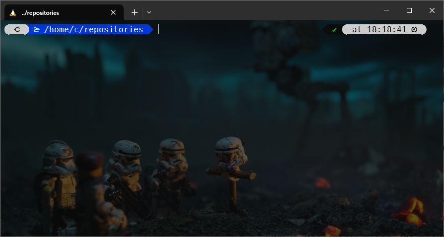
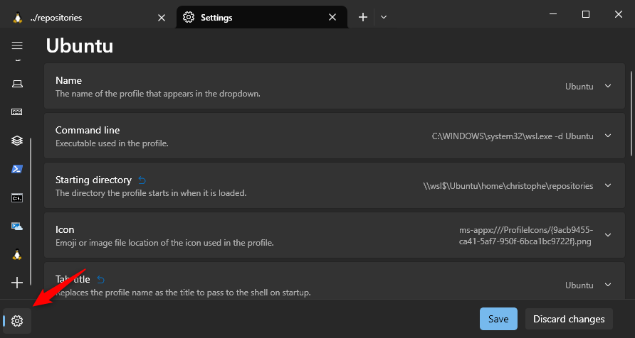
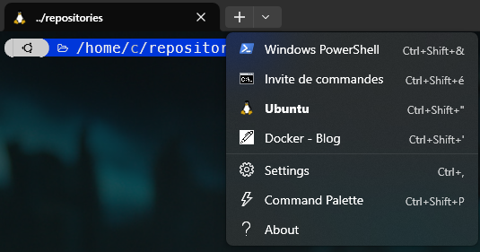
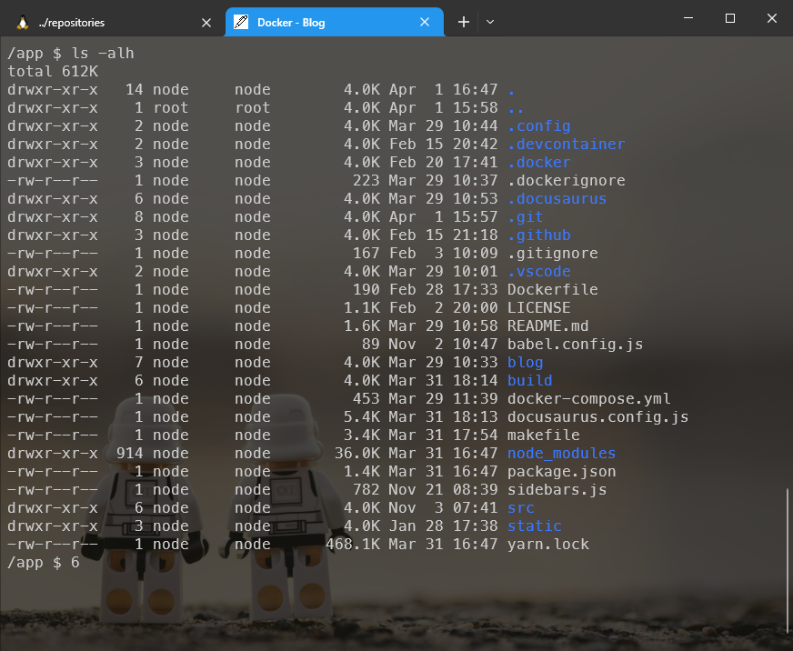

<!-- cspell:ignore wekyb,bbwe,xmens -->


For people who like working in a console, Windows Terminal can be seen as a successor of the old DOS console; you know the *black screen* where you can type commands like `dir` or `mkdir`.

Windows Terminal is a multi-tab software so instead of having multiple windows, you just have multiple tabs but the most killing features for me is the possibility to have a DOS console in one tab, a Powershell one in a second tab, having one or more tabs for Linux and why not, a tab for a SSH connection.

And that feature is really comfortable! Using the same window, you can have multiple active consoles and f.i. share your Linux history between tabs. Pretty cool!

<!-- truncate -->

## Installation

Windows Terminal is part of Windows 11, so you already have it if you're running that OS. If you're running an older version of Windows, you can install Windows Terminal using the Windows Store, or, third possibilities, if you can't, you can download [the latest release from GitHub](https://github.com/microsoft/terminal/releases).

## Customize your profile

On my computer this is how my Ubuntu console looks like. I'm using Windows Terminal and <Link to="/blog/powerlevel10k_sandbox">PowerLevel10k</Link>:



But to make the interface geekier, I'm using a wallpaper instead of, just, a black screen.

If you want to, proceed like this:

* Click on the `+` button and chose `settings`
* Click on the gear wheel, bottom left to open settings as a JSON file (in my case VSCode will be open)
    
* In the opened editor, unfold the `list` of `profiles` and retrieve the one you wish to customize (in my case `Ubuntu`)

In my case, my profile has these settings:

<Snippet filename="settings.json">

```json
{
    "backgroundImage": "c:/Users/Christophe/Backgrounds/ubuntu.jpg",
    "backgroundImageOpacity": 0.3,
    "guid": "{2c4de342-38b7-51cf-b940-2309a097f518}",
    "hidden": false,
    "name": "Ubuntu",
    "source": "Windows.Terminal.Wsl",
    "startingDirectory": "\\\\wsl$\\Ubuntu\\home\\christophe\\repositories",
    "tabTitle": "Ubuntu"
}
```

</Snippet>

As you can see, I've downloaded some nice background picture and saved it in my `Backgrounds` folder then I use Linux notation to refer it.

## Add a new profile

To add a new profile, let's say a console inside one of your Docker containers (yes! it's possible), see the `list` array in the JSON content: just copy/paste a profile to use it for your newer one.

For example, I'll create a new profile so I can immediately open my blog in a Docker container (since, of course, my blog has his Docker image):

<Snippet filename="settings.json">

```json
{
    "profiles": {
        "list": [
            {
                "commandline": "wsl.exe -d Ubuntu docker-compose exec docusaurus /bin/sh",
                "backgroundImage": "c:/Users/Christophe/Backgrounds/blog.jpg",
                "backgroundImageOpacity": 0.3,
                "tabColor": "#2496ED",
                "guid": "{d77a8e47-3017-4745-9300-d338d849ee20}",
                "icon": "ms-appdata:///roaming/pen.png",
                "name": "Docker - Blog",
                "startingDirectory": "\\\\wsl$\\Ubuntu\\home\\christophe\\repositories\\blog"
            }
        ]
    }
}
```

</Snippet>

<AlertBox variant="note" title="Your settings">

* `commandline`: to start a Linux subsystem, start your command by `wsl.exe -d` followed by the distribution name like `wsl.exe -d Debian` f.i. Of course, that distribution needs to be on your machine. You can complete the command line by a parameter: the command to run on the startup like, f.i. `docker-compose` or `ls` or anything else.
* `backgroundImage`: Optional. You should type here, in a Linux notation, the path to where you've saved the image to use for the background,
* `backgroundImageOpacity`: Optional. Between `0` and `1`; in fact, it'll depend on the image you'll choose,
* `guid`: You should, every time, generate a new GUID. To do this, just run `uuidgen` in a Linux console, then copy/paste the obtained value inside `{...}`,
* `ìcon`: Optional. In order to customize the icon, grab any icon from the Internet and save the image in the `%USERPROFILE%\AppData\Local\Packages\Microsoft.WindowsTerminalPreview_8wekyb3d8bbwe\RoamingState` folder. The notation to use then is `ms-appdata:///roaming/your_image_name.png`

</AlertBox>





## Set the default profile

Take a look the list of profiles defined in your `settings.json` file, each profile has his own `guid`. Just copy/paste the guid of the profile of your choice to the `defaultProfile` root node.

## Set the default folder for Ubuntu

Directly opening the desired directory is done by setting the `startingDirectory` node in a profile. Let's say we wish to open the user home folder by starting a new Ubuntu shell:

<Snippet filename="settings.json">

```json
{
  "profiles": {
    "list": [
      {
        "name": "Ubuntu",
        "source": "Windows.Terminal.Wsl",
        "startingDirectory": "\\\\wsl$\\Ubuntu\\home\\christophe\\"
      }
    ]
  }
}
```

</Snippet>

You just need to specify the `startingDirectory` node and set it to `\\wsl$\Ubuntu\home\christophe\`

## Open multiple tabs during the startup process

Windows Terminal has a `startupActions` property which allows you to specify actions to be performed during the startup process.

Let's imagine I wish to launch two tabs; the default one (nothing to foresee) and a second tab. To make things easier to maintain, I'll use a profile:

<Snippet filename="settings.json">

```json
"startupActions": "; new-tab --profile \"DOS Command Prompt\"",
```

</Snippet>

So now I need to create a profile called `DOS Command Prompt` :

<Snippet filename="settings.json">

```json
{
    "profiles": {
        "list": [
            {
                "guid": "{0caa0dad-35be-5f56-a8ff-afceeeaa6101}",
                "hidden": false,
                "name": "DOS Command Prompt"
            },
        ]
    }
}
```

</Snippet>

And tadaaa, now by starting Windows Terminal, my default terminal will be open (Ubuntu in my case) and, in a second tab, I'll also open a DOS console.
