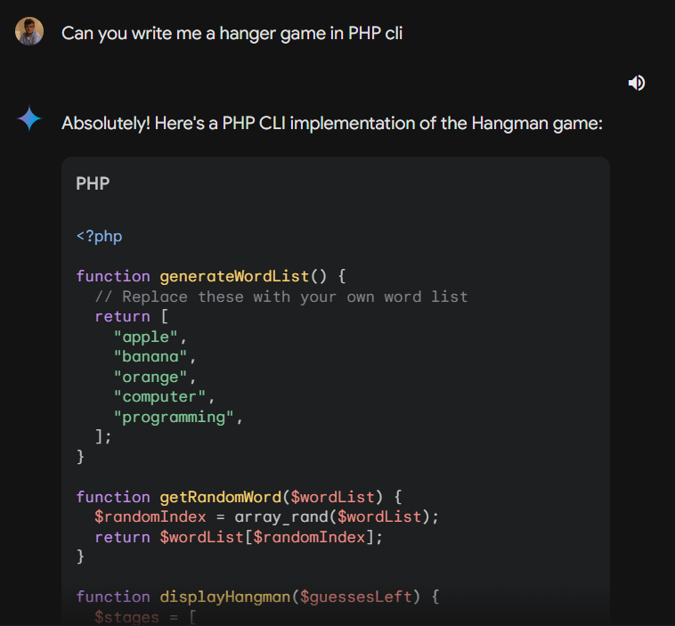
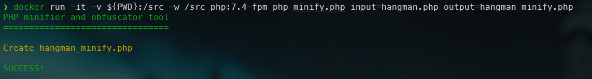
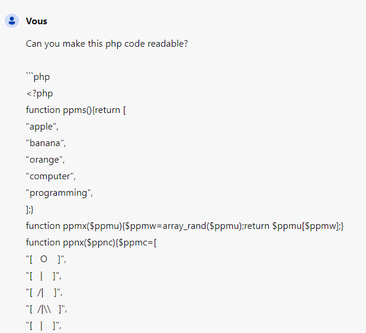
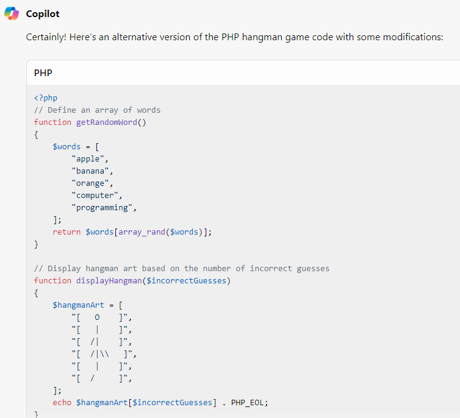

<!-- cspell:ignore ctype, fgets, ppmb, ppmc, ppms, ppmu, ppmw, ppmx, ppnc, ppnt, ppnx, ppny, ppnz, strlen, strpos, strtolower -->

A few years ago, I sold a software called aeSecure, which was a Web Application Firewall. In order to prevent my proprietary code from being picked up by someone who could then sell it, for example, I had developed an obfuscation script.

Since then, I've released a reusable version of that script: [https://github.com/cavo789/php_obfuscator](https://github.com/cavo789/php_obfuscator).

And what if, today, with artificial intelligence, this type of code was no longer of any interest? The aim of this article is to see if it's always a good idea to make your code unreadable.

<!-- truncate -->

## Obtaining a previously non-existent code, ask Gemini

Just to give you some PHP code to use as an example for this article, let's create a hangman game using artificial intelligence.

Here is the code proposed by [Gemini](https://gemini.google.com/). Save it to your disk as `hangman.php`:

<Snippet filename="hangman.php" source="./files/hangman.php" />

To play with this game, just run `docker run -it -v ${PWD}:/src -w /src php:7.4-fpm php hangman.php`.

As you'll see the script works fine without any change!

## Obfuscate

Now, we'll make this code unreadable by removing unneeded spaces, carriage return and replacing names by some random letters. For instance, replace the `playHangman` function name by a random suite like `ppny`. And to make the code more unreadable, I'll choose only suites like `ppmx`, `ppnx`, `ppny` and so on.

To do such obfuscation, just download my [https://github.com/cavo789/php_obfuscator/blob/main/src/minify.php](https://github.com/cavo789/php_obfuscator/blob/main/src/minify.php) script and save it on your disk as `minify.php`. Also create a file called `settings.json` with this content:

<Snippet filename="settings.json" source="./files/settings.json" />

Right now, in your folder, you've three files:

<Terminal>
$ ls -alh
total 28K
drwxr-xr-x  2 root root 4.0K Apr  7 20:11 .
drwxrwxrwt 22 root root 4.0K Apr  7 19:55 ..
-rw-r--r--  1 root root 1.9K Apr  7 20:07 hangman.php
-rw-r--r--  1 root root  12K Apr  7 19:34 minify.php
-rw-r--r--  1 root root  731 Apr  7 19:47 settings.json
</Terminal>

Time to make the `hangman.php` file unreadable by running `docker run -it -v ${PWD}:/src -w /src php:7.4-fpm php minify.php input=hangman.php output=hangman_minify.php`.

Now, you've a new file called `hangman_minify.php`:

<Snippet filename="hangman_minify.php" source="./files/hangman_minify.php" />

What you see here above is the newer version of the `hangman.php` file and it's still running. You can check by running `docker run -it -v ${PWD}:/src -w /src php:7.4-fpm php hangman_minify.php`.

## Make the code readable again, ask Copilot

The first time, [Copilot](https://copilot.microsoft.com/) has kept my minified function name. By asking him *Can you suggest me another version?*, Copilot suggests this code:

<Snippet filename="hangman.php" source="./files/hangman.part2.php" />

The artificial intelligence managed to understand the purpose of the script (a hangman game) and rewrote the code to make it readable. Not only is the code readable, the function names are too, but it has also written comments. Just incredible!
