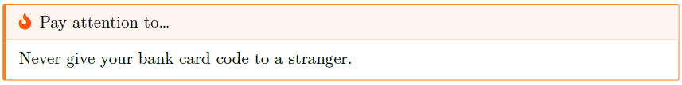
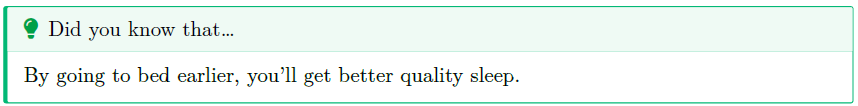
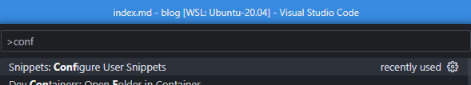
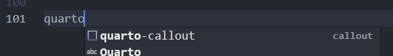
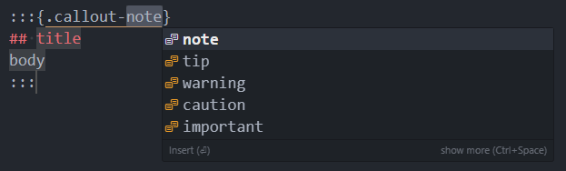

A callout (called *admonition* by [Docusaurus](https://docusaurus.io/docs/markdown-features/admonitions)) is a special syntax used to highlight a paragraph, f.i. a *Pay attention to...* or *Tip: Did you know that...* box.

On this blog powered by Docusaurus, the syntax for *admonition* is

```markdown
<AlertBox variant="caution" title="Pay attention to...">
Never give your bank card code to a stranger.

</AlertBox>
```

and this is rendered like

<AlertBox variant="caution" title="Pay attention to...">
Never give your bank card code to a stranger.

</AlertBox>

And now a nice tip:

<AlertBox variant="info" title="Did you know that...">
By going to bed earlier, you'll get better quality sleep.

</AlertBox>

Quarto implements this a little differently, so let's have a look...

<!-- truncate -->

<AlertBox variant="info" title="Docker image with Quarto">
If you don't have yet a Docker image with Quarto, read this article <Link to="/blog/docker-quarto">Running Quarto Markdown in Docker</Link>.

</AlertBox>

## Syntax

Unfortunately, the syntax is not part of the standard Markdown language so every tool has his own actually.

For Quarto, the syntax is:

```markdown
:::{.callout-caution}
## Pay attention to...
Never give your bank card code to a stranger.
:::
```

And, that paragraph is converted like this in PDF:



The Quarto syntax for a tip is:

```markdown
:::{.callout-tip}
## Did you know that...
By going to bed earlier, you'll get better quality sleep.
:::
```



Callouts are supported in PDF, HTML, revealJS and other formats.

Get in-depth syntax on the [official documentation](https://quarto.org/docs/authoring/callouts.html)

## VSCode snippet

If you're a VSCode user, don't make effort to remind the correct syntax but use the *Snippet* feature of VSCode.

Press <kbd>CTRL</kbd>-<kbd>SHIFT</kbd>-<kbd>P</kbd> to get access to the **Command Palette**.

Start to type `Configure User Snippets`, validate and select `markdown.json` since our snippets should be available only when writing Markdown content.



If this is your first snippet, the JSON file will be empty. Copy/paste the text below. Otherwise, just copy the `callout` node and paste it in your file to the correct location.

<Snippet filename="markdown.json" source="./files/markdown.json" />

Save and close the `markdown.json` file and go back to any markdown file (or create a new one).

Now, by typing `quarto` and by pressing <kbd>CTRL</kbd>-<kbd>space</kbd>, VSCode will show the list of possibilities for that word and you'll retrieve your snippet. Select it and press <kbd>Enter</kbd> to validate.



And, as you can see on the image below, VSCode will ask you three things:

1. First the tip of callout and you'll have a list of possible values; easy no?
2. Then, after having pressed the <kbd>tab</kbd> key, you'll be prompted to type a title and, finally,
3. The body of your paragraph.



VSCode will show you the snippet interactively and you can then, easily, create it without having to remind the correct syntax.

```markdown
:::{.callout-caution}
## Pay attention to...
Never give your bank card code to a stranger.
:::
```