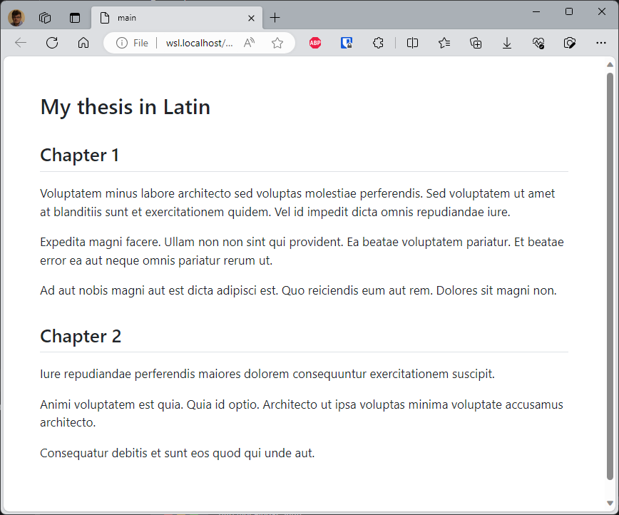

Using the Quarto `includes` short code, writing a long document can easily be broken down into several smaller ones.

Imagine the following `main.qmd` file:

<Snippet filename="main.qmd" source="./files/main.qmd" />

Quarto will then merge the three files when you render `main.qmd`.

<!-- truncate -->

<AlertBox variant="info" title="Docker image with Quarto">
If you don't have yet a Docker image with Quarto, read this article <Link to="/blog/docker-quarto">Running Quarto Markdown in Docker</Link>.

</AlertBox>

## Includes tag

The tag is simple, you just need to specify the relative path to the file to include. Get in-depth syntax on the [official documentation](https://quarto.org/docs/authoring/includes.html)

Here is some dummy content for `chapter1.md`:

<Snippet filename="chapter1.md">

<!-- cspell:disable -->
```markdown
## Chapter 1

Voluptatem minus labore architecto sed voluptas molestiae perferendis. Sed voluptatem ut amet at blanditiis sunt et exercitationem quidem. Vel id impedit dicta omnis repudiandae iure.

Expedita magni facere. Ullam non non sint qui provident. Ea beatae voluptatem pariatur. Et beatae error ea aut neque omnis pariatur rerum ut.

Ad aut nobis magni aut est dicta adipisci est. Quo reiciendis eum aut rem. Dolores sit magni non.
```

</Snippet>

And for `chapter2.md`:

<Snippet filename="chapter2.md">

```markdown
## Chapter 2

Iure repudiandae perferendis maiores dolorem consequuntur exercitationem suscipit.

Animi voluptatem est quia. Quia id optio. Architecto ut ipsa voluptas minima voluptate accusamus architecto.

Consequatur debitis et sunt eos quod qui unde aut.
```

</Snippet>

<!-- cspell:enable -->

Now, by running, f.i., `quarto render main.qmd --to html`, Quarto will merge files and you'll get:



<AlertBox variant="info" title="What is a `.qmd` files?">
For Quarto, the extension isn't very important: whether it's `.qmd` or `.md`, there's no difference in treatment.

On the other hand, it's probably more interesting for us to use the `.qmd` extension when using a Quarto-specific syntax, as is the case here.

</AlertBox>
