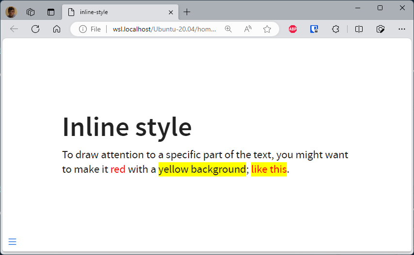
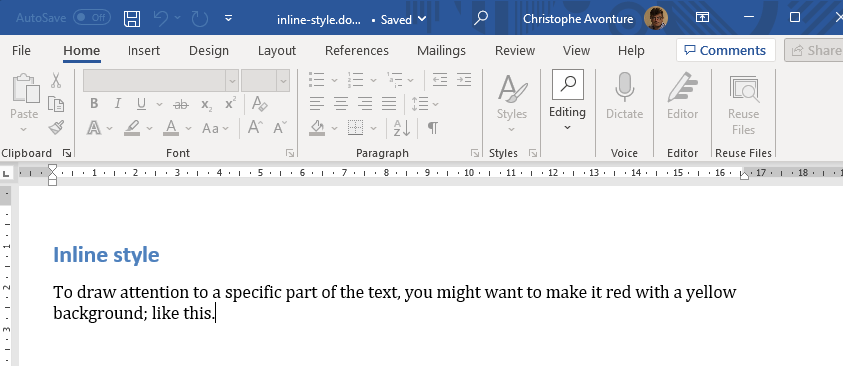
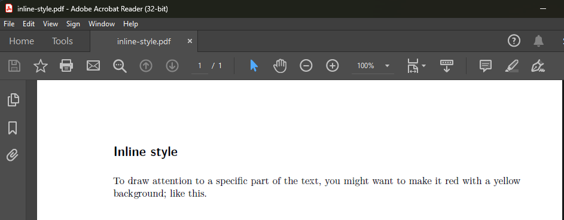

Don't want to take the time to create a CSS class and figure out how to integrate it into Quarto to quickly highlight part of your paragraph?

Quarto supports an *inline css style* syntax for producing **HTML documents** (not working for, f.i., pdf or docx).

:::tip Syntax
You can apply styles to inline text by creating spans using `[]` to surround the text you want to style and `{}` to define the style you want to apply.
:::

<!-- truncate -->

:::tip Docker image with Quarto
If you don't have yet a Docker image with Quarto, read this article [Running Quarto Markdown in Docker](/blog/docker-quarto).
:::

> [source](https://mine-cetinkaya-rundel.github.io/quarto-tip-a-day/posts/11-spans/).

So to put a text like *red* in <span style={{color: 'red'}}>red</span>, the syntax for Quarto is `[red]{style="color: red;"}`. The text enclosed between brackets will get the specified inline CSS style.

```markdown
# Inline style

To draw attention to a specific part of the text, you might want to make it [red]{style="color: red;"} with a [yellow background]{style="background-color: yellow;"}; [like this]{style="color: red; background-color: yellow;"}.
```

This is correctly rendered in HTML:



But just ignored in Word or PDF:




