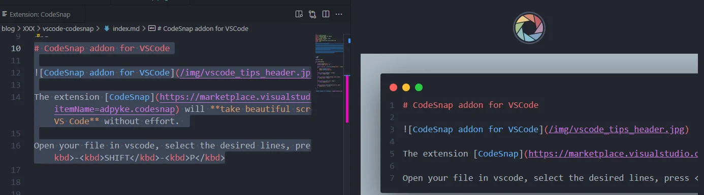
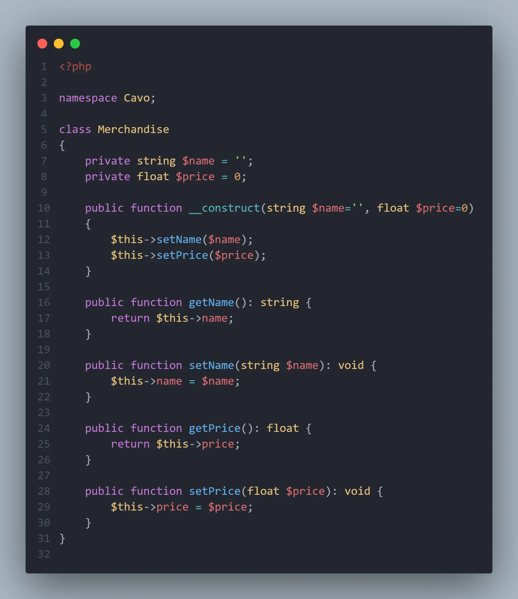

<TLDR>
This article introduces the CodeSnap VSCode extension, which generates a nicely styled screenshot of selected code directly from the editor: run the `CodeSnap` command, select the lines to capture in the live preview, then save the resulting image.
</TLDR>

The extension [CodeSnap](https://marketplace.visualstudio.com/items?itemName=adpyke.codesnap) will **take beautiful screenshots of your code in VS Code** without effort.

*Handy for social media, but not for a blog article: an image of code can't be copied, searched or indexed. For that, use a real code block — see <Link to="/blog/docusaurus-snippets">A component for showing code snippets in a Docusaurus blog</Link>.*

Open your file in VS Code, press <kbd>CTRL</kbd>-<kbd>SHIFT</kbd>-<kbd>P</kbd> and run `CodeSnap`. You just need to select lines now.

<!-- truncate -->

## Result

That's what CodeSnap produces from a selection of PHP source code — a styled, shareable image:

As soon as you've called `CodeSnap`, a vertical preview window will appear.

In your source code, select one or more lines and CodeSnap will update the preview.

When you're done, just click on the `Polaroid` button just above the preview, save the image and it's done — that's the PHP example shown above.

Since these screenshots are meant to be shared, the font you use shows up in every one of them. If you haven't picked one deliberately yet, see <Link to="/blog/vscode-jetbrains-font">Using the JetBrains Mono font in vscode</Link>.
