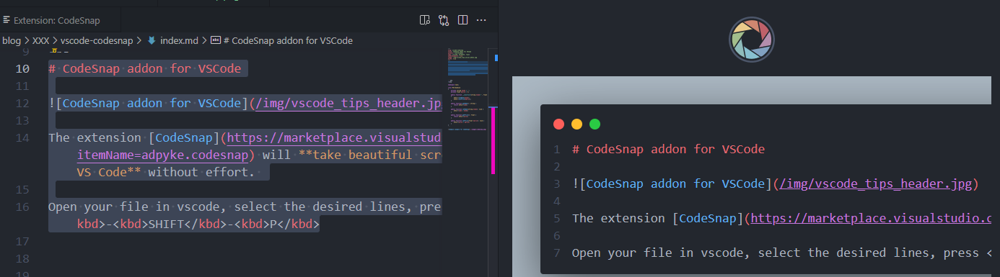
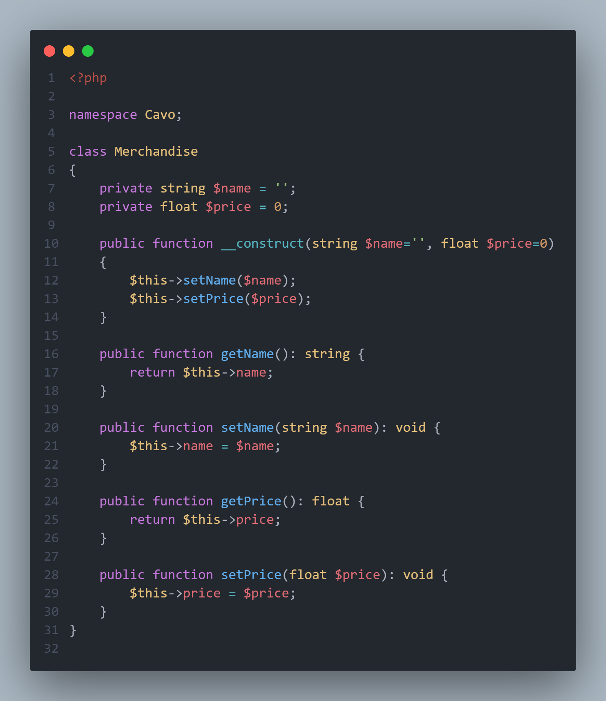

The extension [CodeSnap](https://marketplace.visualstudio.com/items?itemName=adpyke.codesnap) will **take beautiful screenshots of your code in VS Code** without effort.

Open your file in vscode, select the desired lines, press <kbd>CTRL</kbd>-<kbd>SHIFT</kbd>-<kbd>P</kbd>, run `CodeSnap`. You just need to select lines now.

<!-- truncate -->

As soon as you've called `CodeSnap` a preview vertical window will appears.

In your source code, select one or more lines and the CodeSnap will update the preview.

When you're done, just click on the `Polaroid` button just above the preview, save the image and it's done.

Below an example of a PHP source code:

