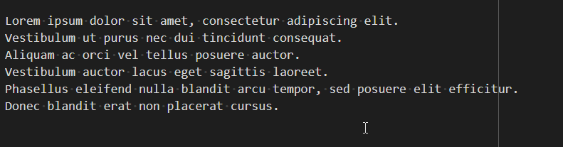

<TLDR>
This article shows VSCode's Multiple Cursors feature for bulk-editing many lines at once (e.g. turning a block of lines into a bullet list) when search-and-replace can't do the job: select the lines, press <kbd>Shift</kbd>+<kbd>Alt</kbd>+<kbd>I</kbd> to place a cursor on each, then edit them all simultaneously with <kbd>Home</kbd>/<kbd>End</kbd>/<kbd>Ctrl</kbd>+<kbd>Right</kbd> navigation.
</TLDR>

One of the best features in vscode is the *Multiple cursors* one.

Imagine you have a bunch of lines where you need, for instance, to remove the first two characters. Each line starts with `//` and you want to remove just that prefix, not any `//` that might appear elsewhere in the line (a search & replace can't be used for that).

Or, for another example, you must enclose each line in double brackets.

With vscode, it's ultra-simple: multiple cursors.

*Multiple cursors shine for one-off, irregular edits. When the change is a repeatable rule applied to a whole file, <Link to="/blog/linux-sed-tips">Search and replace (or add) using sed</Link> is the better tool.*

<!-- truncate -->

Imagine the lines below and you need to add `*` before each line to make a list of items. In this example, I only have six lines so yeah, it's possible to do it manually, one by one. Imagine you had a hundred or a thousand.

<!-- cspell:disable -->
```markdown
Lorem ipsum dolor sit amet, consectetur adipiscing elit.
Vestibulum ut purus nec dui tincidunt consequat.
Aliquam ac orci vel tellus posuere auctor.
Vestibulum auctor lacus eget sagittis laoreet.
Phasellus eleifend nulla blandit arcu tempor, sed posuere elit efficitur.
Donec blandit erat non placerat cursus.
```
<!-- cspell:enable -->

Here is how to do it:

- Select all the lines you need to update,
- Press <kbd>SHIFT</kbd>-<kbd>ALT</kbd>-<kbd>I</kbd> to enable multiple cursors,
- Press <kbd>Home</kbd> to put cursors at the beginning of each line,
- Press `*` followed by a space to transform the list of lines to a bullet list.
- Press <kbd>ESC</kbd> to quit the multiple cursors mode.



While the multiple cursor mode is enabled, you can also press <kbd>END</kbd> to go to the end of lines, add/remove f.i. a character, you can press <kbd>CTRL</kbd>-<kbd>RIGHT</kbd> to move from one word right and so on.

Pretty cool option.

VSCode is full of these built-in features you only discover by accident. Two others I use every day: <Link to="/blog/vscode-sticky-scroll">sticky scroll</Link>, to always know which function or heading you're inside of, and <Link to="/blog/vscode-autosave">autosave</Link>, to stop pressing <kbd>CTRL</kbd>+<kbd>S</kbd> altogether.
