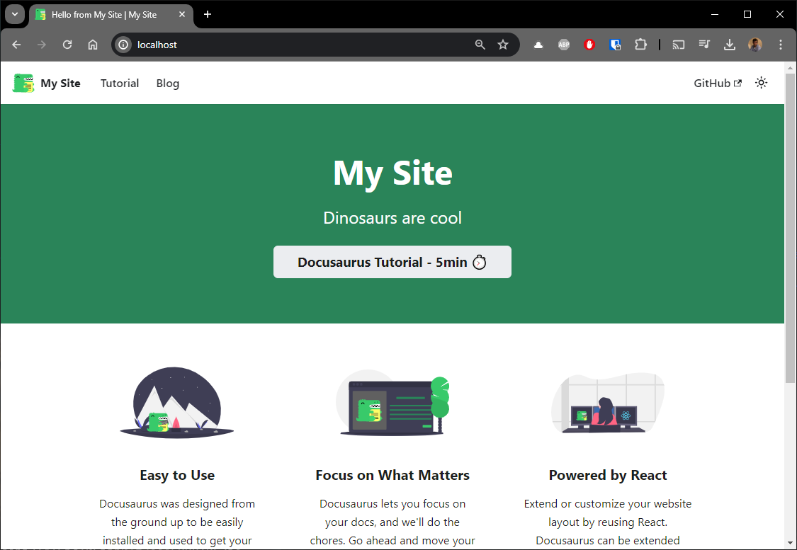
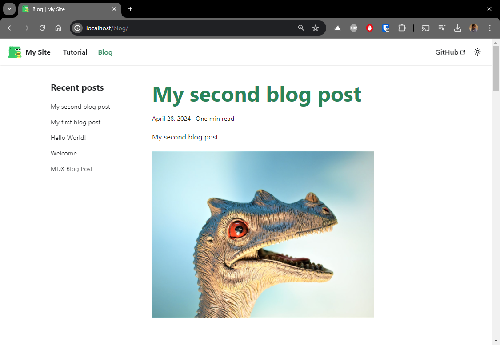
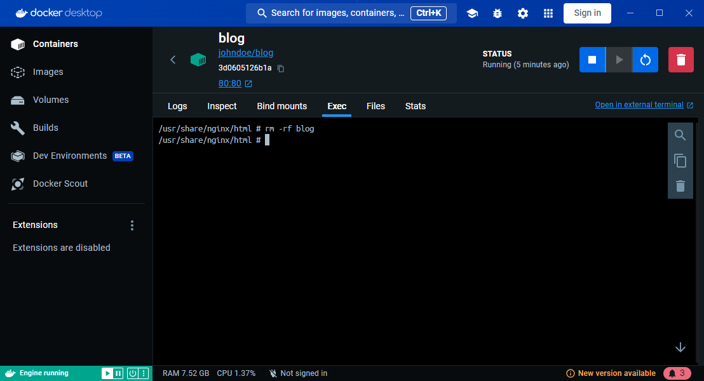

<!-- cspell::ignore corepack,docusaurus,johndoe -->


Started on 2 November 2023, this article is already the hundredth I've published on this blog. To mark the occasion, I wanted to do something a bit special to honor the blog. What better way than to build a **100% Docker version**, i.e. in the form of a downloadable Docker image that **you can run with a single command line**.

A single command to download the blog and run it on your machine (Linux, Mac or Windows) and have a fully working site; nice isn't it?

And as usual, you'll find all the information you need below so that you can do the same for your own Docusaurus installation.

:::tip Don't wait more
Start a console, run `docker pull cavo789/blog && docker run -d -p 80:80 --name blog cavo789/blog` to download a local copy of my blog and to start it. Once done, just open `http://localhost` on your computer and ... congratulations, you've just obtained an offline yet executable version!
:::

Now, we'll learn to do the same for your own Docusaurus instance. Ladies and gentlemen, please follow the guide...

<!-- truncate -->

## Create a dummy blog if needed

*If you already have a Docusaurus installation on your computer, just skip this chapter.*

In this part, I'll suppose you don't have a Docusaurus installation yet, so we'll create a dummy site with a very few, basics, blog posts.

Jump in a console and run the following commands: `mkdir /tmp/docusaurus && cd $_`.

You're now in the `/tmp/docusaurus` folder.

Copy/paste in the console instructions below, with the parentheses included. This will create a subfolder called `blog` with three markdown files in it, our three fake articles.

<Terminal>
(
  $ mkdir -p blog && cd $_
  $ echo '---' > 2024-04-26-welcome-world.md
  $ echo 'title: Hello World!' >> 2024-04-26-welcome-world.md
  $ echo '---' >> 2024-04-26-welcome-world.md
  $ echo 'Hello world! Proud to be here!!!' >> 2024-04-26-welcome-world.md
  $ echo '---' > 2024-04-27-my-first-post.md
  $ echo 'title: My first blog post' >> 2024-04-27-my-first-post.md
  $ echo '---' >> 2024-04-27-my-first-post.md
  $ echo 'My first blog post' >> 2024-04-27-my-first-post.md
  $ echo '' >> 2024-04-27-my-first-post.md
  $ echo '' >> 2024-04-27-my-first-post.md
  $ echo '---' > 2024-04-28-my-second-post.md
  $ echo 'title: My second blog post' >> 2024-04-28-my-second-post.md
  $ echo '---' >> 2024-04-28-my-second-post.md
  $ echo 'My second blog post' >> 2024-04-28-my-second-post.md
  $ echo '' >> 2024-04-28-my-second-post.md
  $ echo '' >> 2024-04-28-my-second-post.md
)
</Terminal>

So, now, we've a dummy blog.

## Prepare our Docusaurus installation for Docker

*If you've skipped the previous folder because you already had a Docusaurus instance, jump in your it (`cd <your_docusaurus_folder>`).*

We'll need to create some files for Docker.

Start your preferred editor and open the folder; on my side, I'm using Visual Studio Code so I'll just run `code .` in my Linux console.

We need to create a few files...

### Create a Dockerfile file

Please create a file called `Dockerfile` with this content:

<Snippet filename="Dockerfile">

```docker
# syntax=docker/dockerfile:1

# Inspired by https://docusaurus.community/knowledge/deployment/docker/?package-managers=yarn

# Stage 1: Base image.

FROM node:21-alpine AS base

# Disable color output from yarn to make logs easier to read.
ENV FORCE_COLOR=0

# Enable corepack.
RUN corepack enable

# --------------------------------------------------------------------

# Stage 2: Production build mode.

FROM base AS building_production

# Install the latest version of Docusaurus
RUN npx create-docusaurus@latest /opt/docusaurus/ classic --javascript \
  # Uncomment the line below to remove dummy files like dummy blog, docs, src, ...
  # && rm -rf /opt/docusaurus/blog /opt/docusaurus/docs /opt/docusaurus/src\
  && chown -R node:node /opt/docusaurus/

# Set the working directory to `/opt/docusaurus`.
WORKDIR /opt/docusaurus

# We need our package.json / package.lock file before running yarn install
COPY package.* .

# Install dependencies with `--immutable` to ensure reproducibility.
RUN yarn install --immutable

# Copy over the source code.
COPY . /opt/docusaurus/

# Build the static site (generated files will be created in /opt/docusaurus/build)
RUN yarn build

# --------------------------------------------------------------------

# Stage 3: Serve with nginx

FROM nginx:stable-alpine3.19-perl AS production

# Copy the Docusaurus build output.
COPY --from=building_production /opt/docusaurus/build /usr/share/nginx/html

WORKDIR /usr/share/nginx/html
```

</Snippet>

This file is a **multi-stages** Dockerfile. The main objectives are to have an improved cache layer system and a smaller, in size, final image. A multi-stages file is also really useful to be able to build more than one image like a development or a production one.

As you can see, we are using three stages (a stage starts with the `FROM` clause).

Our goal in this article is to create a final Docker image with a static version of our Docusaurus installation. **We wish to have an image containing a web server and our site.**

Before being able to do this, we need to:

1. Use a `node` image since Docusaurus is a `NodeJS` application. We'll use `node:21-alpine` as base image.
2. Then we need to install `docusaurus` and start `yarn` to install dependencies. This done, we'll copy all files from our current folder in the Docker image. Once copied, we need to build our site and convert markdown files to HTML pages and, finally,
3. We need a web server like `Apache`, `Caddy` or `nginx` *(`Caddy` will give the smallest image in size but still quite difficult to configure SSL using Docker)*.

This is our three stages.

**The stage 1 is called `base`**. In that stage, we do almost nothing, just download a `node` alpine version and initialize some variables. This step can be, in the future, be also used by a `development` stage but, in this article, let's concentrate on the `production` one.

<Snippet filename="Dockerfile">

```docker
FROM node:21-alpine AS base

# Disable color output from yarn to make logs easier to read.
ENV FORCE_COLOR=0

# Enable corepack.
RUN corepack enable
```

</Snippet>

**In stage 2, called `building_production`**, we're extending the `base` stage.

As you can see below, we'll install Docusaurus and his dependencies.

Then we'll copy files from our current folder into the image in the process of being created and, finally, we'll generate (build) static web pages (HTML, CSS, JavaScript and images).

At the end of this stage, we'll obtain a static version of our Docusaurus site in the folder `/opt/docusaurus/build`.

<Snippet filename="Dockerfile">

```docker
FROM base AS building_production

# Install the latest version of Docusaurus
RUN npx create-docusaurus@latest /opt/docusaurus/ classic --javascript \
  # Uncomment the line below to remove dummy files like dummy blog, docs, src ...
  # && rm -rf /opt/docusaurus/blog /opt/docusaurus/docs /opt/docusaurus/src \
  && chown -R node:node /opt/docusaurus/

# Set the working directory to `/opt/docusaurus`.
WORKDIR /opt/docusaurus

# We need our package.json / package.lock file before running yarn install
COPY package.* .

# Install dependencies with `--immutable` to ensure reproducibility.
RUN yarn install --immutable

# Copy over the source code.
COPY . /opt/docusaurus/

# Build the static site (generated files will be created in /opt/docusaurus/build)
RUN yarn build
```

</Snippet>

What is important to note here is our working directory: `/opt/docusaurus/`. Our static site has been copied into that folder so the result of the last instruction of the second stage (`yarn build`) will thus create a subfolder `build` in `/opt/docusaurus/`.

At the end of this stage, we've our static website but not yet a web server.

**In stage 3**, we will use [nginx](https://hub.docker.com/_/nginx).

<Snippet filename="Dockerfile">

```docker
FROM nginx:stable-alpine3.19-perl AS production

# Copy the Docusaurus build output.
COPY --from=building_production /opt/docusaurus/build /usr/share/nginx/html

WORKDIR /usr/share/nginx/html
```

</Snippet>

As you can see, this stage is very basic. We just use nginx, copy in his default web folder the static website created earlier and it's done.

:::tip Why a multi-stages image is better than a "monolithic" stage?
Take a look on the last stage, our web server. We're just using the `nginx` web server and to make it working, we need to copy our `build` folder where Docusaurus has put his static files (html, css, js and images).

Since we're only recovering the `build` folder from the previous stage, the final image will no longer contain `NodeJs`, `Yarn`, `Docusaurus` or anything else previously installed. Nor will we have any temporary files that may have been installed; we don't need the original version of our blog, i.e. our original markdown files.

We'll use the `nginx` image and in that image we'll just copy files we need from the previous stage. Doing so, our final image will be smaller in size and will just contain what we need to run the final application, here our Docusaurus static site.

The image size of the `building_production` stage was 740MB and the one of the `nginx` stage is just 87MB. **Around 9 times lower!!!**
:::

:::tip See my own Dockerfile
I'm using, for my own blog, a development stage. Take a look on my [Dockerfile](https://github.com/cavo789/blog/blob/main/Dockerfile) to see how I do. Make also sure to take a look on my [makefile](https://github.com/cavo789/blog/blob/main/makefile) and the different `docker-compose-xxx.yml` files in my project.
:::

### Create a .dockerignore file

The second file we need to create should be called `.dockerignore` and with this content:

<Snippet filename=".dockerignore">

```ignore
build/
node_modules/
.git/

.dockerignore
.gitignore
.markdownlint_ignore
.markdownlint.json
*.log
compose.yaml
Dockerfile
LICENSE
makefile
README.md
```

</Snippet>

The `.dockerignore` file is there to ask Docker not to copy everything in your final image when running the instruction `COPY . /opt/docusaurus/` present in the `Dockerfile`.

Indeed, in our final image we don't need f.i. folders like `build/` or `node_modules/` because they'll be created while building the image. We don't need too our `.git/` folder (if present), we don't need temporary or files needed just for the build.

The `.dockerignore` file is then needed to keep the image smaller in size and to prevent to copy sensitive files (those containing secrets or configuration items) in the final image.

## Small summary

If you've followed the creation of the temporary folder as described here above, you should have the following situation: two files in the `/tmp/docusaurus` folder and three Markdown files in the `blog` subdirectory.

<Terminal>
$ ls -alhR
drwxr-xr-x  3 root root 4.0K Apr 28 11:02 .
drwxrwxrwt 25 root root  12K Apr 28 10:44 ..
-rw-r--r--  1 root root  155 Apr 27 09:47 .dockerignore
-rw-r--r--  1 root root 1.2K Apr 28 10:45 Dockerfile
drwxr-xr-x  2 root root 4.0K Apr 28 11:02 blog
.
$ ls -alh ./blog:
.
drwxr-xr-x 2 root root 4.0K Apr 28 11:02 .
drwxr-xr-x 3 root root 4.0K Apr 28 11:02 ..
-rw-r--r-- 1 root root   61 Apr 28 11:02 2024-04-26-welcome-world.md
-rw-r--r-- 1 root root  119 Apr 28 11:02 2024-04-27-my-first-post.md
-rw-r--r-- 1 root root  121 Apr 28 11:02 2024-04-28-my-second-post.md
</Terminal>

## Build our Docker image

Our objective was to create a Docker image containing our Docusaurus site.

When creating a Docker image, we should give it a name.

:::important The name of the image should be respect the `owner/name` pattern.
`owner` has to be your pseudo on Docker Hub. In my case, my pseudo there is `[cavo789](https://hub.docker.com/u/cavo789)` so if I wish to publish an image, I should use `cavo789` for the first part. Then, I need to specify an unique name not yet present in my profile.

In my case `cavo789/blog` is then a good choice. For this article, I'll use `johndoe/blog` since I'll not publish that image on the Internet.
:::

Still in your console, please run the following command:

<Terminal>
$ docker build --tag johndoe/blog --target production .
</Terminal>

The final `.` in the instruction above means *current folder*; `/tmp/docusaurus` in my case.

:::caution
Since our `Dockerfile` is a multi-stages one, we need to specify which stage we wish. This is done by using the `--target` CLI flag.

If you look at our `Dockerfile` file we've created earlier, our three stages are called `base`, `building_production` and `production`. To build the image with the web server, you need to specify `production` for the target but if you're interested in the generated files, not the web server, you can run `docker build --tag johndoe/blog --target building_production .`.
:::

The `docker build` command will take one or two minutes depending on the speed of your network connection and computer. Once successfully fired, you'll then have a new Docker image on your computer. You can retrieve it by running `docker image list` to get the list of local images.

:::info
By running `docker image list | grep -i blog`, you can retrieve the image and his size. It's 87MB for me on this moment for the dummy blog created in this blog post.

By running `docker build --tag johndoe/blog --target building_production .` (without `nginx` thus but with `Node`) the size will be 740MB. As you can see, we've divided the size by, almost, 9.
:::

## And use it

Now that our image is created, we can do a few things like just running it and get an offline version of our Docusaurus site or play with a container and start an interactive shell session or, of course, publish it on Docker hub.

### Run the image i.e. create a container and run the site

To do this, just run the following command:

<Terminal>
$ docker run -d --publish 80:80 --name blog johndoe/blog
</Terminal>

Very quickly, you'll get a very long ID as result like f.i. `cae6989bee2a2339a4c0116be2b86ee3dae0b46d47a6c53dcb6e50098726c0b1`. Just ignore this at this moment, it just means you're container has been created successfully.

Now, start your browser and surf to `http://localhost`.



As you can see, the Docusaurus website is now running on your machine.

Click on the **Blog** menu item; top left and enjoy your reading:



As mentioned, the site will be running on your computer i.e. offline. You can disconnect from the Internet, everything is running in RAM; on your machine.

If you're curious, just run `docker ps` (or `docker container list` which is a synonym) to see the list of containers. You'll see yours.

By running `docker container stop blog` (`blog` is the name we've defined in the `docker run` used above in this chapter); we can stop the blog. Return to your browser, surf on `http://localhost` and you'll see, the site is no more active. Run `docker container start blog` to reactivate it.

### Start an interactive shell session

If you want to start an interactive shell in your image, just run `docker run -it johndoe/blog /bin/sh`.  You'll then be *inside* the container and you'll be able to inspect files f.i.

Be careful to correctly understand the notion of container: your website is running in a container and you've just started a second one. To prove this, just run `rm -rf blog` to kill the blog in your shell container, go back to the browser, refresh the page: it's still working.

Type `exit` to quit the shell and return to your console. Rerun `docker run -it johndoe/blog /bin/sh` and check if the removed `blog` folder is there or not: it's there.

A container is something that is recreated every time so everything done in a container (when there is no mounted volumes like the one we use here) just stay in RAM.

:::note Use Docker Desktop - Containers if you want to interact with your site
Purely informative: if you're using Windows, you can jump in *Docker Desktop*, open the list of containers, click on your running one (the blog) then click on the *Exec* tab to start an interactive shell in *that* container. If you remove f.i. the blog folder as illustrated below; then if you go back to the browser, yes, you've removed the blog and refreshing the site will conduct to a 404 error page.



Just remove the container and create it again to retrieve the blog.
:::

### Push it on Docker

Before being able to publish your image on Docker hub, first, you should make sure you've logged in.

Run `docker login` on your command line and make a login with a valid account. *If you were already authenticated, you'll see `Authenticating with existing credentials...`

Now, push your image by running `docker image push` followed by your image name; in my case, it'll be `cavo789/blog` since I'm logged in as `cavo789`.

### Retrieve it from Docker Hub

The circle is now complete... You can tell your friends and colleagues that they can now use your image by just running the command `docker pull <your_image> && docker run -d -p 80:80 --name blog <your_image>` as I stated in the preface of this article.

Enjoy!
