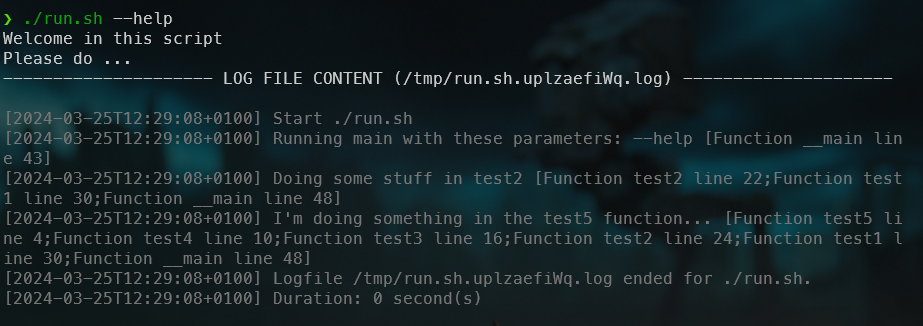

<!-- cspell:ignore uplzaefi -->


> Also read <Link to="/blog/bash-console-log-together">Bash - Echo on the console and in a logfile in the same time</Link>

When you write Bash scripts and certainly when you foresee running them in a cron, you should implement a logfile. Every action fired by your script should be logging somewhere so you can start the script in a non-interactive mode and in case of need, consult the last logfile.

Below is a script I've developed in the form of a library, which means you can easily include it in your existing code without having to change anything.

You just need to include the file in your script (i.e. add a `source log.sh` line) then here and there foresee a `log::write "Something to log"`. Easy no?

<!-- truncate -->

To illustrate how the log feature works, we will create two files. Your script (here, I'll call it `run.sh`) and the one containing the log implementation (`log.sh`).

## Your script

If you already have a script, please open it. Otherwise, just create a new one and copy/paste the code below.

Name the file just as you want (I will name it `run.sh` for example) and make sure the script can be executed by running `chmod +x run.sh` in your console.

<Snippet filename="run.sh" source="./files/run.sh" />

## The log helper

Please create a file called `log.sh`, in the exact same folder of your script, and copy/paste this content:

<Snippet filename="log.sh" source="./files/log.sh" />

## The result

By running the script, we can see our different `echo` but, too, the content of the generated log.



You can for sure not display the log automatically, just comment the line `log::__displayLog`.

### Trace

Each statement logged will have a trace as you can see. For instance, the block `[Function __main line 43]` means that the caller was function called `__main` and it was on line `43`.

```log
[2024-03-25T12:29:08+0100] Start ./run.sh
[2024-03-25T12:29:08+0100] Running main with these parameters: --help [Function __main line 43]
[2024-03-25T12:29:08+0100] Doing some stuff in test2 [Function test2 line 22;Function test1 line 30;Function __main line 48]
[2024-03-25T12:29:08+0100] I'm doing something in the test5 function... [Function test5 line 4;Function test4 line 10;Function test3 line 16;Function test2 line 24;Function test1 line 30;Function __main line 48]
[2024-03-25T12:29:08+0100] Logfile /tmp/run.sh.uplzaefiWq.log ended for ./run.sh.
[2024-03-25T12:29:08+0100] Duration: 0 second(s)
```

When there are multiple parents, you'll get the entire trace, f.i. `[Function test5 line 4;Function test4 line 10;Function test3 line 16;Function test2 line 24;Function test1 line 30;Function __main line 48]`: the function `__main` on line 48 has called `test1` who has called then `test2` and so.

Each statement in the log will then contain the entire trace, making debugging easier.
