<!-- cSpell::ignore ELECTRABEL,taxud -->


If you are developing your own API (whatever the language) or if you need to consume some, [Postman](https://www.postman.com/) can be really handy.

Calling an API and getting the response is one thing, quite simple in fact, but a nice feature of Postman is the ability to validate the response like making sure the returned type is, f.i. `application/json`, the HTTP status code is 200, the response body is a JSON object (or an XML string), that the body contains some required information and so on.

You can also validate the response against a given schema to make sure the structure is well the one expected.

In this article, we'll use Postman like a unit test tool i.e. run checks on our own API and make a lot of assertions. This is improving the quality of your code by highlighting potential errors and, for any refactoring you'll do in the future, by running the tests again, you'll make sure you've not broken something; that you don't have any regression. Make sure you've not broken an API when you upgrade some code is gold.

<!-- truncate -->

You can download Postman for free here: [https://www.postman.com/](https://www.postman.com/). You've to create an account before being able to download the program. A documentation is located at [https://learning.postman.com/docs/introduction/overview/](https://learning.postman.com/docs/introduction/overview/) so this post won't explain in detail how to use the program but will just give some tips.

## Creating an environment

By creating an environment, it's just like creating global variables.

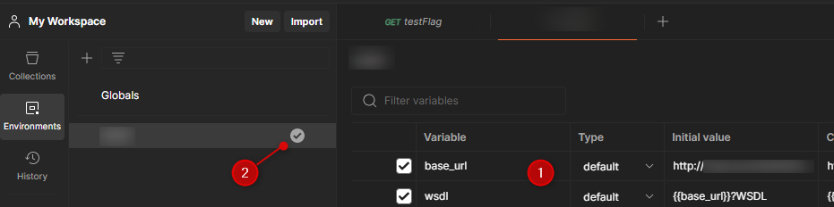

In the example above, I'm defining my `base_url` to the URL of my web service.

Make sure to activate the environment (see point 2 on the image).

So, from now, I can create a request and use `{{base_url}}`

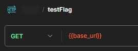

## Creating a collection

If you need to create more than one request, it's best to create a collection (understand *a project*). You'll be able to store all requests in a collection but the biggest advantage is to be able to set some defaults rules like, f.i. some tests to fire for each request:

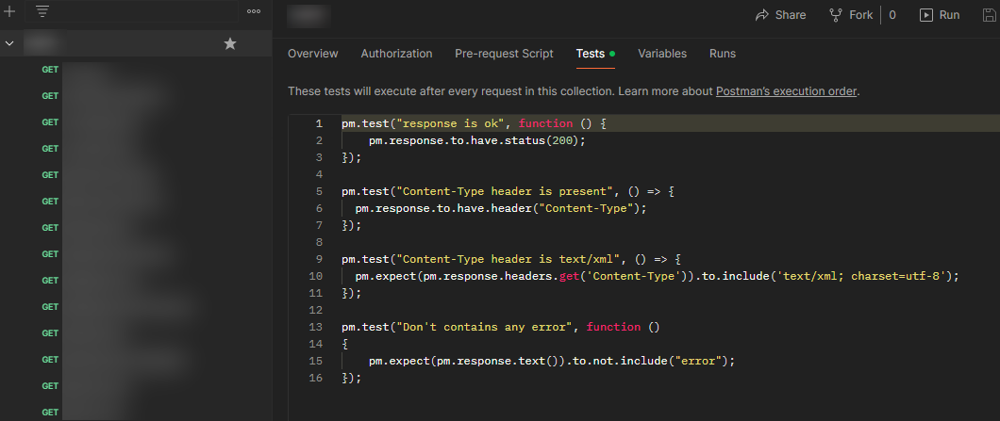

So, whatever the request I'll start, the four tests below will always be fired:

```php
pm.test("response is ok", function () {
    pm.response.to.have.status(200);
});

pm.test("Content-Type header is present", () => {
  pm.response.to.have.header("Content-Type");
});

pm.test("Content-Type header is text/xml", () => {
  pm.expect(pm.response.headers.get('Content-Type')).to.include('text/xml; charset=utf-8');
});

pm.test("Don't contain any error", function ()
{
    pm.expect(pm.response.text()).to.not.include("error");
});
```

## Creating a request

By creating a new request, to pass information in the header, I just need to click on the `Headers` tab then fill in the key I need to send. In the example of a SOAP request (i.e. called with a *XML envelope*), I'll need to send a `SOAPAction` key with the name of the action to start (`testFlag` here) and I'll specify that the body I'll send is `application/xml`.

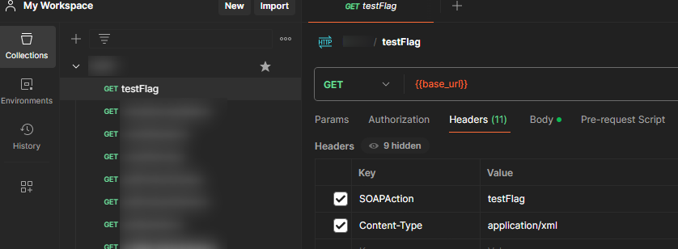

Then, since this example is for a SOAP request, I need to send a XML body, as expected by the action:

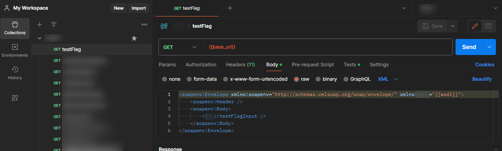

```xml
<soapenv:Envelope xmlns:soapenv="http://schemas.xmlsoap.org/soap/envelope/" xmlns:ns1="{{wsdl}}">
    <soapenv:Header />
    <soapenv:Body>
        <ns1:testFlagInput />
    </soapenv:Body>
</soapenv:Envelope>
```

The `{{wsdl}}` placeholder is a variable defined in the environment.

And, optionally, we can also add a specific test for the request:

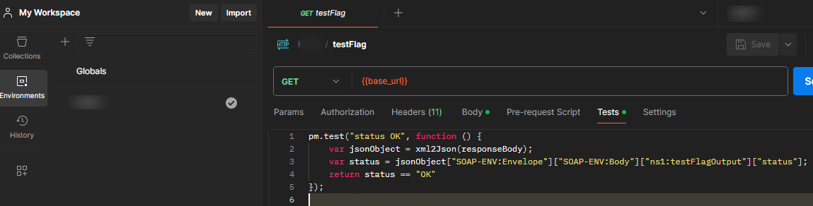

```php
pm.test("status OK", function () {
    var jsonObject = xml2Json(responseBody);
    var status = jsonObject["SOAP-ENV:Envelope"]["SOAP-ENV:Body"]["ns1:testFlagOutput"]["status"];
    return status == "OK"
});
```

<AlertBox variant="note" title="Replace `testFlag` by the name of your node" />

By running the request, in this example, we'll run five tests since we already have defined four tests for the collection.

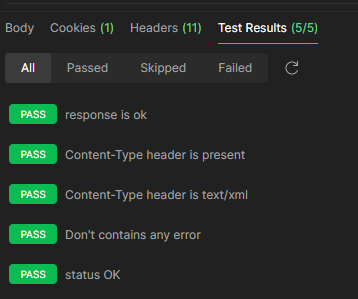

## Exporting / importing a collection

By putting all your requests in a collection, you can easily export it (as a `.json` file)

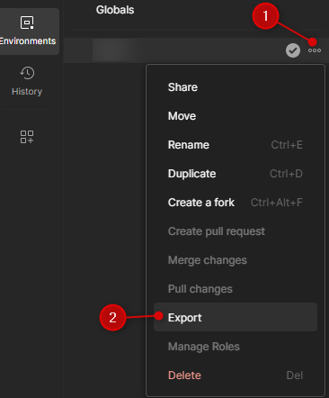

And, of course, import it almost the same way:

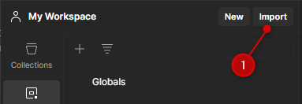

## Real-world example

As seen in the article <Link to="/blog/vba-excel-call-soap-webservice">MS Excel - How to call a SOAP web service</Link>, we can call an European web service to check the validity of a VAT number.

Let's try with Postman:

The base url for the service is `http://ec.europa.eu/taxation_customs/vies/services/checkVatService`, the method has to be `POST` and we need to set the `SOAPAction` header to `checkVAT`.

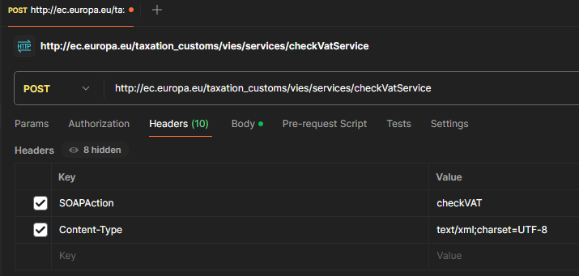

Then we need to send a specific XML body. For the example, we'll ask for a VAT number in Belgium.

```xml
<soapenv:Envelope xmlns:soapenv="http://schemas.xmlsoap.org/soap/envelope/">
    <soapenv:Body>
        <urn:checkVat xmlns:urn="urn:ec.europa.eu:taxud:vies:services:checkVat:types">
            <urn:countryCode>BE</urn:countryCode>
            <urn:vatNumber>0403170701</urn:vatNumber>
        </urn:checkVat>
    </soapenv:Body>
</soapenv:Envelope>
```

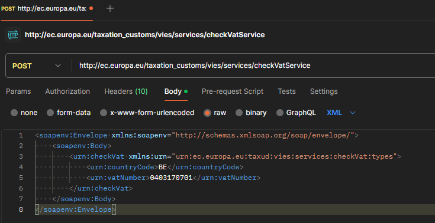

By running the request, Postman will return:

```xml
<env:Envelope xmlns:env="http://schemas.xmlsoap.org/soap/envelope/">
    <env:Header/>
    <env:Body>
        <ns1:checkVatResponse xmlns:ns1="urn:ec.europa.eu:taxud:vies:services:checkVat:types">
            <ns1:countryCode>BE</ns1:countryCode>
            <ns1:vatNumber>0403170701</ns1:vatNumber>
            <ns1:requestDate>2024-03-05+01:00</ns1:requestDate>
            <ns1:valid>true</ns1:valid>
            <ns1:name>SA ELECTRABEL</ns1:name>
            <ns1:address>Boulevard Simon Bolivar 36 1000 Bruxelles</ns1:address>
        </ns1:checkVatResponse>
    </env:Body>
</env:Envelope>
```

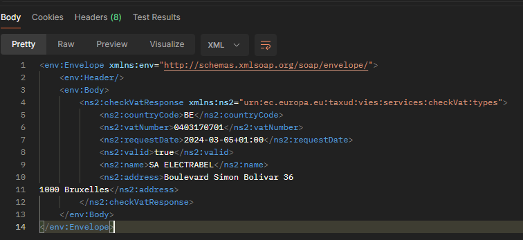

## Some checks

<AlertBox variant="info" title="I'll use `{{wsdl}}` as a placeholder">
In the examples below, you'll see `{{wsdl}}` in XML code sample. It's just a placeholder i.e. in a normal situation, you'll retrieve there a URL to a WSDL (or a REST API) service.

</AlertBox>

### Check some metrics like the responseTime

If you wish to validate the response time of a request, f.i. 500 ms:

```php
pm.test('Response time is within an acceptable range', function () {
    pm.expect(pm.response.responseTime).to.be.below(500);
})
```

### Controls the HTTP status code

Validate the response status code is `200`:

```php
pm.test('Response status code is 200', function () {
    pm.expect(pm.response.code).to.equal(200);
})
```

### Ensure the response returns a content-type

```php
pm.test("Content-Type header is present", () => {
  pm.response.to.have.header("Content-Type");
});
```

And if we wish to check the value of the returned content-type:

```php
pm.test("Content-Type header is text/xml", () => {
  pm.expect(pm.response.headers.get('Content-Type')).to.include('text/xml; charset=utf-8');
});
```

### Assert the response is a valid XML string

Simple test to ensure we got a valid XML response:

```php
pm.test('Response body is in valid XML format', function () {
    const responseData = pm.response.text();
    try {
        xml2Json(responseData);
        pm.expect(true).to.be.true;
    } catch (error) {
        pm.expect.fail('Response body is not in valid XML format');
    }
})
```

### Validate the absence or presence of some words

Parse the response **as a string** and make sure the word *error* isn't present:

```php
pm.test("Don't contain any error", function ()
{
    pm.expect(pm.response.text()).to.not.include("error");
});
```

This example will thus fail as soon as the word *error* is present in the returned response.

Or, the opposite, make sure some words are present in the response:

```php
pm.test("Assert 'is successful'", function ()
{
    pm.expect(pm.response.text()).to.include("is successful");
});
```

### Make assertions on the absence of nodes

This assertion is more specific. It will fail as soon as a `<error>` node is present in the response.

```php
pm.test("The error node shouldn't be part of the response", function () {
    const responseData = xml2Json(pm.response.text());
    pm.expect(responseData).to.be.an('object');
    pm.expect(responseData['SOAP-ENV:Envelope']['SOAP-ENV:Body']['ns1:testOutput']['error']).to.not.exist;
})
```

If your response is the one below, the assertion will then fail since `<ns1:testOutput>` contains an `<error>` node.

```xml
<?xml version="1.0" encoding="UTF-8"?>
<SOAP-ENV:Envelope xmlns:SOAP-ENV="http://schemas.xmlsoap.org/soap/envelope/" xmlns:ns1="{{wsdl}}">
    <SOAP-ENV:Body>
        <ns1:testOutput>
            <error>
                <!-- ... -->
            </error>
        </ns1:...>
    </SOAP-ENV:Body>
</SOAP-ENV:Envelope>
```

### Make assertions on the presence of nodes

As an example, we will ensure the response always have `<SOAP-ENV:Envelope>` and `<SOAP-ENV:Body>`:

```xml
<?xml version="1.0" encoding="UTF-8"?>
<SOAP-ENV:Envelope xmlns:SOAP-ENV="http://schemas.xmlsoap.org/soap/envelope/" xmlns:ns1="{{wsdl}}">
    <SOAP-ENV:Body>
        <!-- ... -->
    </SOAP-ENV:Body>
</SOAP-ENV:Envelope>
```

```php
pm.test('Validate SOAP-ENV:Envelope and SOAP-ENV:Body elements are present', function () {
    const responseData = xml2Json(pm.response.text());
    pm.expect(responseData).to.be.an('object');
    pm.expect(responseData).to.have.property('SOAP-ENV:Envelope');
    pm.expect(responseData['SOAP-ENV:Envelope']).to.exist;
    pm.expect(responseData['SOAP-ENV:Envelope']).to.have.property('SOAP-ENV:Body');
    pm.expect(responseData['SOAP-ENV:Envelope']['SOAP-ENV:Body']).to.exist;
})
```

<AlertBox variant="note" title="`to.exist` is equivalent to `to.have.property`"/>

`pm.expect(responseData['SOAP-ENV:Envelope']['SOAP-ENV:Body']).to.exist` can also be written like this: `pm.expect(responseData['SOAP-ENV:Envelope']]).to.have.property('SOAP-ENV:Body');`

### For XML, check the value of a given node

If you wish to ensure a given node has a specific property:

```php
pm.test('Response body has the required fields', function () {
    const responseData = xml2Json(pm.response.text());
    pm.expect(responseData).to.have.property('SOAP-ENV:Envelope');
    pm.expect(responseData['SOAP-ENV:Envelope']).to.have.property('SOAP-ENV:Body');
    pm.expect(responseData['SOAP-ENV:Envelope']['SOAP-ENV:Body']).to.have.property('ns1:testFlag');
    pm.expect(responseData['SOAP-ENV:Envelope']['SOAP-ENV:Body']['ns1:testFlag']).to.have.property('count');
    pm.expect(responseData['SOAP-ENV:Body']['ns1:getSessionsLanguagesOutput'].list).to.exist;
})
```

#### Assertions for collections

Let's say your response returns a collection like, below, a list of languages:

```xml
<?xml version="1.0" encoding="UTF-8"?>
<SOAP-ENV:Envelope xmlns:SOAP-ENV="http://schemas.xmlsoap.org/soap/envelope/" xmlns:ns1="{{wsdl}}">
    <SOAP-ENV:Body>
        <ns1:getLanguagesOutput>
            <list>
                <description>English</description>
                <iso>en</iso>
                <language>E</language>
            </list>
            <list>
                <description>Français</description>
                <iso>fr</iso>
                <language>F</language>
            </list>
            <list>
                <description>Nederlands</description>
                <iso>nl</iso>
                <language>N</language>
            </list>
        </ns1:getLanguagesOutput>
    </SOAP-ENV:Body>
</SOAP-ENV:Envelope>
```

Make sure the list node exists:

```php
pm.test('List array contains at least one element', function () {
    const responseData = xml2Json(pm.response.text());
    pm.expect(responseData).to.be.an('object');
    pm.expect(responseData['SOAP-ENV:Envelope']['SOAP-ENV:Body']['ns1:getLanguagesOutput']).to.have.property('list');
    pm.expect(responseData['SOAP-ENV:Envelope']['SOAP-ENV:Body']['ns1:getLanguagesOutput']['list']).to.exist;
})
```

You wish to make sure there is at least one record:

```php
pm.test('List array contains at least one element', function () {
    const responseData = xml2Json(pm.response.text());
    pm.expect(responseData).to.be.an('object');
    pm.expect(responseData['SOAP-ENV:Envelope']['SOAP-ENV:Body']['ns1:getLanguagesOutput'].list).to.be.an('array').and.to.have.lengthOf.at.least(1);
})
```

Check every item in the list have expected nodes; for instance:

```php
pm.test('Validate expected structure', function () {
    const responseData = xml2Json(pm.response.text());
    pm.expect(responseData['SOAP-ENV:Envelope']['SOAP-ENV:Body']['ns1:getLanguagesOutput']).to.have.property('list');
    pm.expect(responseData['SOAP-ENV:Envelope']['SOAP-ENV:Body']['ns1:getLanguagesOutput'].list).to.be.an('array').and.to.have.lengthOf.at.least(1);

    responseData['SOAP-ENV:Envelope']['SOAP-ENV:Body']['ns1:getLanguagesOutput']['list'].forEach(function (node) {
        pm.expect(node.description).to.exist.and.to.not.be.empty;
        pm.expect(node.iso).to.exist.and.to.not.be.empty;
        pm.expect(node.language).to.exist.and.to.not.be.empty;
    });
})
```

When the `<list></list>` only contains one element (and thus not an array):

```php
pm.test('Validate expected structure', function () {
    const responseData = xml2Json(pm.response.text());
    pm.expect(responseData['SOAP-ENV:Envelope']['SOAP-ENV:Body']['ns1:getLanguagesOutput']).to.have.property('list');

    const list = responseData['SOAP-ENV:Envelope']['SOAP-ENV:Body']['ns1:getLanguagesOutput']['list']
    pm.expect(list).to.have.property('description').and.to.not.be.empty;;
    pm.expect(list).to.have.property('iso').and.to.not.be.empty;;
    pm.expect(list).to.have.property('language').and.to.not.be.empty;;
})
```

#### Assertions on value

##### Check on the value

Imagine you've something like this and you want to assert that the status is `OK`:

```xml
<?xml version="1.0" encoding="UTF-8"?>
<SOAP-ENV:Envelope xmlns:SOAP-ENV="http://schemas.xmlsoap.org/soap/envelope/" xmlns:ns1="{{wsdl}}">
    <SOAP-ENV:Body>
        <ns1:testFlagOutput>
            <status>OK</status>
        </ns1:testFlagOutput>
    </SOAP-ENV:Body>
</SOAP-ENV:Envelope>
```

```php
pm.test("status OK", function () {
    var jsonObject = xml2Json(responseBody);
    var status = jsonObject["SOAP-ENV:Envelope"]["SOAP-ENV:Body"]["ns1:testFlagOutput"]["status"];
    return status == "OK"
});
```

Same idea but we will make sure the `count` property is set correctly i.e. to a number.

```php
pm.test("Returned count is a number", function () {
    var jsonObject = xml2Json(responseBody);
    var count = jsonObject["SOAP-ENV:Envelope"]["SOAP-ENV:Body"]["ns1:testFlagOutput"]["count"];
    pm.expect(Number.isInteger(count));
});
```

If you've an error node in your response, make sure the error code property is not empty:

```php
pm.test('Error code is not empty', function () {
    const responseData = xml2Json(pm.response.text());
    pm.expect(responseData).to.be.an('object');
    pm.expect(responseData['SOAP-ENV:Envelope']['SOAP-ENV:Body']['ns1:testFlag'].error.code).to.exist.and.to.not.be.empty;
})
```

And if you also have an error message property, make sure it's not empty but contains an error description.

```php
pm.test('Error message is not empty', function () {
    const responseData = xml2Json(pm.response.text());
    pm.expect(responseData).to.be.an('object');
    pm.expect(responseData['SOAP-ENV:Envelope']['SOAP-ENV:Body']['ns1:testFlag']['error']['message']).to.exist.and.to.not.be.empty;
})
```

##### Checks on date value

You've a list of employees in a collection and you wish to assert the birthDate:

```php
pm.test('Validate birthDate is null or in a valid date format', function () {
    const responseData = xml2Json(pm.response.text());
    pm.expect(responseData).to.be.an('object');
    pm.expect(responseData['SOAP-ENV:Envelope']['SOAP-ENV:Body']['ns1:getEmployeesOutput']['list']['birthDate']).to.satisfy(function (date) {
        return date === null || new Date(date).toString() !== 'Invalid Date';
    });
})
```