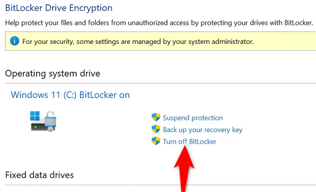
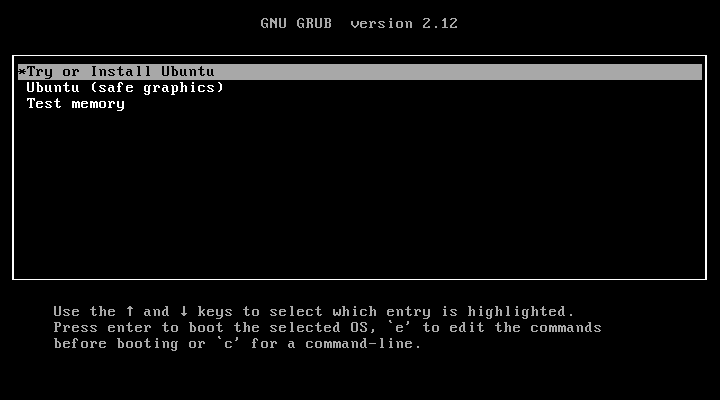
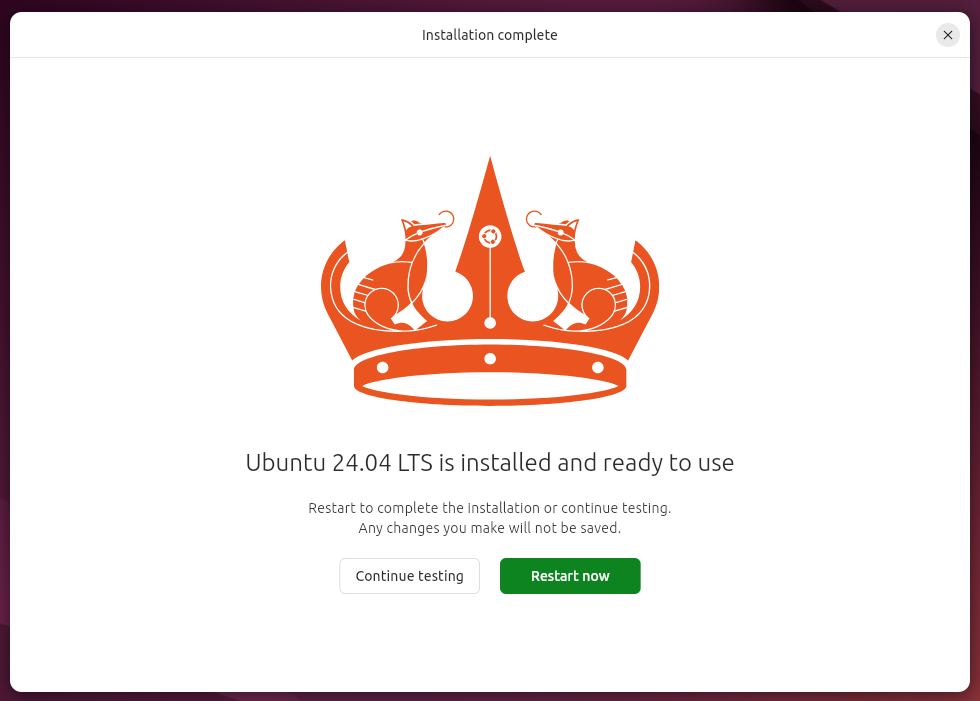

<!-- cspell:ignore Bitlocker,bootable,balena,askubuntu -->

Today is a public holiday in Belgium, so I'm finally taking the time to install Ubuntu on my old PC.

The idea is to remove Windows and install Ubuntu Desktop 24.04 on the computer.

Let's go, you'll see, it's easy.

<!-- truncate -->

## Turn off Bitlocker first

If you're using Bitlocker on your computer, first, you must first deactivate it; if not just skip this chapter.

You can follow the official documentation here: [Turn Bitlocker off](https://ubuntu.com/tutorials/install-ubuntu-desktop#13-additional-installing-ubuntu-alongside-windows-with-bitlocker).

Shortly, still in your Windows session, start your **Control Panel**, search for **Bitlocker** and click on **Turn off Bitlocker**. Depending on the speed of your computer and the size of the hard disk, it'll take minutes.

:::info Follow progression in the tray panel
If, like me, you didn't see any progression on the screen, think to click on the tray panel icon (near the clock). You'll find there an icon about the decryption process.
:::

## Download Ubuntu and create your bootable USB stick

You'll need to get the ISO of Ubuntu; just go to [https://ubuntu.com/tutorials/install-ubuntu-desktop#2-download-an-ubuntu-image](https://ubuntu.com/tutorials/install-ubuntu-desktop#2-download-an-ubuntu-image) and download it.

Once the file **ubuntu-24.04-desktop-amd64.iso** is successfully downloaded, you'll need an additional software called [balenaEtc](https://etcher.balena.io/). balenaEtc has to be used to create the bootable USB stick. It couldn't be simpler: just select the downloaded ISO file, then the letter of the USB drive (D: for me) and confirm.

After a few minutes, the USB stick will be ready.

## Think to plug an Ethernet cable before installing Ubuntu

Even if it's optional, make sure to plug an Ethernet cable so, during the installation process, Ubuntu will be able to download additional software like your graphic card driver directly from Internet.

## Start the installation wizard

Turn on your old computer and make sure to boot on the USB stick. For this, during the boot process (in my case, when I see the Dell logo), press the <kbd>F12</kbd> or <kbd>DEL</kbd> key to start the BIOS setup.

There, make sure to select the option allowing you to boot on a USB stick; save your changes if any and quit.

Your computer you'll now boot on the USB stick and start the installation process of Ubuntu.

Everything is nicely covered by the [official tutorial](https://ubuntu.com/tutorials/install-ubuntu-desktop).

A few notes:

* Select the *interactive mode* so you can select the options that suit you best in more detail;
* When asked, select *Extended selection* to be able to install additional software during the installation process (like desktop tools, utilities and web browser);
* When asked *Install recommended proprietary software?*, make sure checkboxes are **unchecked** (see below);
* The wizard will ask *how to install Ubuntu*; alongside Windows (so with a dual boot) or alone. I'm going to opt for the latter.
Personally, that's my goal and I'm going to ask to delete my entire current disk (Windows) and to do that, I'm going to click on *Erase disk and install Ubuntu* and click on the *Advanced features* button. I'm going to opt for *Use LVM and encryption* which will allow me to have encryption like I had with Bitlocker: someone who came to steal my hard disk wouldn't have access to my files without the decryption key.

:::caution IMPORTANT - DON'T INSTALL ADDITIONAL DRIVERS IF YOU'VE A NVIDIA GRAPHIC CARD
The wizard will ask if you want to **Install recommended proprietary software**. The first time, I've answered Yes on both options. The installation had been running for nearly twenty minutes and then I got an error message *The Secure Boot key is not valid*.

While looking on the **askubuntu.com** website, someone has told this was a bug and that we shouldn't install drivers during the installation of Ubuntu but we can do this easily later one and refers to this bug: [https://bugs.launchpad.net/subiquity/+bug/2060353](https://bugs.launchpad.net/subiquity/+bug/2060353).

So, I've abandoned the installation and start a new one.
:::

You'll be asked to create your administrative account and to select your time zone.

Then, once you've confirmed your choices, the wizard will start to prepare your machine then copy files on your computer. This process is, of course, the slowest one. It can takes 10 minutes or more.

:::note The installation seems frozen
For a few minutes, the screen seemed to be stuck on *Setting up the system...*. However, I could move the mouse pointer and, for example, view the menu (on the left). I kept waiting and everything *unblocked*. So be patient if you need to.

You can start discovering the interface even before installation is complete! Just move the mouse cursor to the left side of your screen and you'll get access to some applications.
:::

:::tip See the progression in a console-mode
In the bottom right of the installation screen, you'll find a small button. Click on it and you'll get a log window where you can follow which action is running.
:::

## Reboot and enable Ubuntu Pro

Once the installation is done, remove the USB stick and reboot.

The post-installation wizard will welcome you and ask if you wish to enable the *Ubuntu Pro* service; just proceed.

[Ubuntu Pro](https://ubuntu.com/pro) is a free (for personal use) service proposed by Canonical and will keep your computer up-to-date.

As very last step, run the **Software Updater** application to check if there is no additional software to install. If you're a pro of the console, it's the same as you run `sudo apt update`.

## Time to add software

* [Firefox](https://snapcraft.io/firefox) as browser (`sudo snap install firefox`),
* [Thunderbird](https://snapcraft.io/thunderbird) for your email client (`sudo snap install thunderbird`),
* [LibreOffice](https://snapcraft.io/libreoffice) to create documents, spreadsheets or slideshows (`sudo snap install libreoffice`),
* [Visual Studio Code](https://snapcraft.io/code) to start coding (`sudo snap install code --classic`),
* [Docker](https://docs.docker.com/engine/install/ubuntu/#install-using-the-repository) to work with containers,
* [Gimp](https://snapcraft.io/gimp) to edit images (`sudo snap install gimp`),
