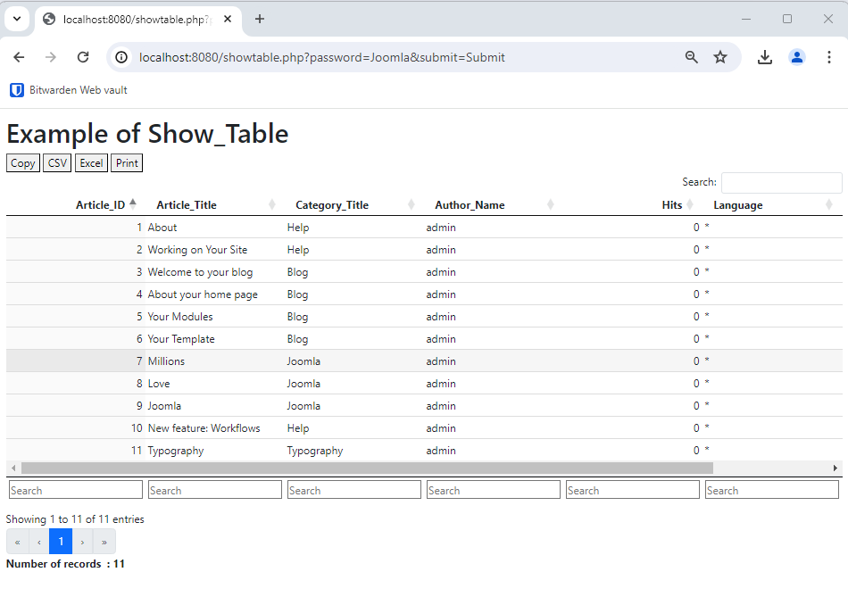

<!-- cspell:ignore showtable,sortering,qrjlq -->

A long time ago, years from now, I needed to expose data from my Joomla site in a simple web page *outside* Joomla, as an HTML table. This was so that I could link a Microsoft Excel spreadsheet to this table and therefore, in Excel, simply do a *Refresh* to obtain the most recent data from my Joomla site.

The aim was to find the list of people who had bought software or services from me. Among other things, I needed their first name, family name, billing address, etc. so that I could create an invoice in Microsoft Word using the mail merge functionality (data source=Excel).

:::tip Real world use case
Oh, wait, so a web page that would execute a SQL query of the type `SELECT ... FROM ... WHERE ...` against the Joomla database, retrieve the records then display them in an HTML page so Excel can link the table and Word can retrieve them and generate f.i. pdf. Cool, isn't it?
:::

Of course, just running a query on your database and show the result as a web page can be really useful.

<!-- truncate -->

You can find all the information on my repo at [https://github.com/cavo789/joomla_show_table](https://github.com/cavo789/joomla_show_table); compatible up to Joomla 5.1.

## Let's create an example

1. If you don't have a Joomla site yet, please create a new one. I'll follow my tutorial <Link to="/blog/docker-joomla">Create your Joomla website using Docker</Link> for this;

2. Download a copy of my [showtable.php](https://raw.githubusercontent.com/cavo789/joomla_show_table/master/src/showtable.php) script and copy the script in the root folder of your Joomla site;

3. Access the script by starting your browser (like f.i. `http://localhost:8080/showtable.php`); you'll be prompted for a password, it's `Joomla` by default (as you can see [here](https://github.com/cavo789/joomla_show_table/blob/master/src/showtable.php#L131));

4. By default, you'll get the list of users of your Joomla site:

    

So you can see how easy it is to use the script: there's nothing to configure for it to work.

## Show the list of articles

As you can see, the script comes with an already predefined query to show the list of users.

Let's show the list of articles: open your preferred editor and open the `showtable.php` script; go to the line 70 and comment that line until line 79. Then uncomment the next query, as illustrated below.

We'll then use another predefined example... Save and refresh your web page. You'll get a new result:

If you want to export that list to Excel, see the `Excel` button top left and click on it :

## From within Excel, retrieve our Joomla data

Start Excel and click on the `Data` menu then in `Get & Transform Data`, click on the `From Web` button and paste the URL to your `showtable.php` script like this in my case: `http://localhost:8080/showtable.php?password=Joomla&format=raw`.

:::caution The format should be raw
Make sure to add `&format=raw` for the URL. This is important so `showtable.php` knows he shouldn't add extra features like filtering or sortering options. Using RAW output, the script will only create a simple `<table></table>` HTML object and this will make life easier for Excel.
:::

And now, just right-click on the table in Excel and click then on `Refresh` to get an update of your Joomla content's at any time.

You can give that Excel sheet to anyone like your client and tell him *Right click on the sheet to get an update from Joomla site.* Nothing more.

:::caution
Yes! You should provide the password on the query string otherwise Excel won't be able to access the table. It's under your own responsibility to not show confidential data.
:::

## Using another password

Open your preferred editor and open the `showtable.php` script. Search for `const PASSWORD` and look at the comment. The value is encrypted using md5. You can use any MD5 encryption tool like f.i. [http://www.md5.cz/](http://www.md5.cz/).

Type the password you want (`MyVeryStrongPassword`); submit the form and copy/paste the result (`41ae0707c6150f0f1c78803424949f5f`) as the new password value.

Go to your website back, refresh the page and you'll see the `password=Joomla` URL won't work anymore. Type your password in the form field and, yes, it's back.

## Creating your own SQL

To create your own SQL statement, you'll need to get access to your database. You can use any tool you want for this like `Adminer`, `phpMyAdmin`, `pgAdmin`, ... i.e. the one who had your preference.

I'll not explain each tool right now (read my <Link to="/blog/docker-adminer-pgadmin-phpmyadmin#run-adminer">Using Adminer, pgadmin or phpmyadmin to access your Docker database container</Link> blog post to get some info) but the objective is to be able to create a query in such interface and make sure the query is working.

Once you've successfully created it, you'll get a query statement like `SELECT ... FROM ... WHERE ...`, copy the query in the `showtable.php` script: search for the `'SQL'` pattern and you'll see the current, used, SQL. Paste yours and make sure you've respected the syntax. You can replace the prefix of your database by the `#_` placeholder so f.i. `qrjlq_content` has to become `#_content`.

