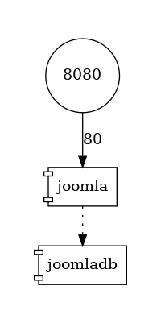

<UpdateAt
  title="Recent Changes"
  updates={[
    { date: "2025-05-14", content: "Adding the `--format` flag" },
  ]}
/>

Imagine you to have a very big `compose.yaml` file with a lot of services and dependencies.

You've too multiple exposed ports.

You'd like to have an at-a-glance view of services, dependencies and open ports. Is this possible? Yes! [https://github.com/compose-viz/compose-viz](https://github.com/compose-viz/compose-viz) do the magic for us.

<!-- truncate -->

For the demo, please start a Linux shell and run `mkdir -p /tmp/compose-viz && cd $_` to create a folder called `compose-viz` in your Linux temporary folder and jump in it.

Please create a new file called `compose.yaml` with this **simplified** content:

<Snippet filename="compose.yaml" source="./files/compose.yaml" />

Let the magic happen and run `docker run --rm -it -u $(id -u):$(id -g) -v $(pwd):/in wst24365888/compose-viz compose.yaml`.

And the image here below will be generated by the tool:

<AlertBox variant="info" title="How to interpret the image?">
We can see that the port `8080` is exposed to the computer. That port is, in fact, port `80` of the `joomla` container. And, too, we see that `joomla` has a dependency with the `joomladb` container. Easy no?

</AlertBox>

<!-- cspell:disable -->
<AlertBox variant="info" title="See the --format flag">
By adding `--format svg`, you'll get a SVG instead of a PNG. The list of supported output formats is huge: `png|dot|jpeg|json|svg|bmp|canon|cmap|cmapx|cmapx_np|dot_json|emf|emfplus|eps|fig|gif|gv|imap|imap_np|ismap|jpe|jpg|json0|metafile|mp|pdf|pic|plain|plain-ext|pov|ps|ps2|tif|tiff|tk|vml|xdot|xdot1.2|xdot1.4|xdot_json`.

</AlertBox>
<!-- cspell:enmkeable -->

## Much complex example

Replace the content of the `compose.yaml` with this one:

<Snippet filename="compose.yaml" source="./files/compose.part2.yaml" />

And the image here below will be generated by the tool:

Here, we can see:

* We've four exposed ports: `5001`, `5000`, `6379` and `8080`.
* Port `8080` is linked to a `visualizer` web service; that service is using a volume pointing to `/var/run/docker.sock`
* Ports `5000` and `5001` are referring to services called `vote` and `result`. Since the internal port is port `80`, we know that these ports are web interfaces.
* The `vote` service (port `5000`) is using a `redis` service; accessible using port `6379`.
* The `result` service (port `5001`) is linked to a Postgres service called `db` and having persistent data (since we have a Docker volume called `db-data`).
* And so on.

Such a visualization tool greatly simplifies the understanding of a Docker architecture.

## Docker config

If like me you're using a lot of `.yml` files by running Docker and/or using environment variables in it; just run `docker compose config` to ask Docker to *render* (on the screen only) what he called *Parse, resolve and render compose file in canonical format* i.e. will merge all your `.yml` in one string and resolve variables.

Copy/paste the screen output in a temporary file and use this tool on that file.
