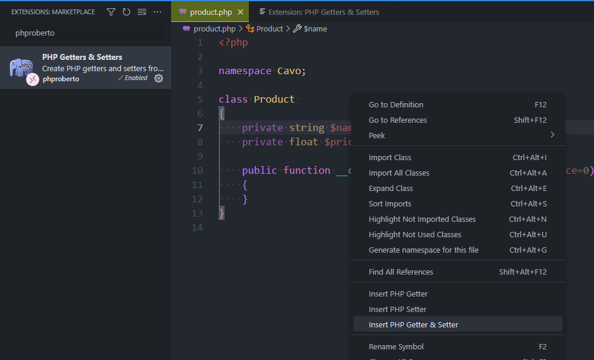
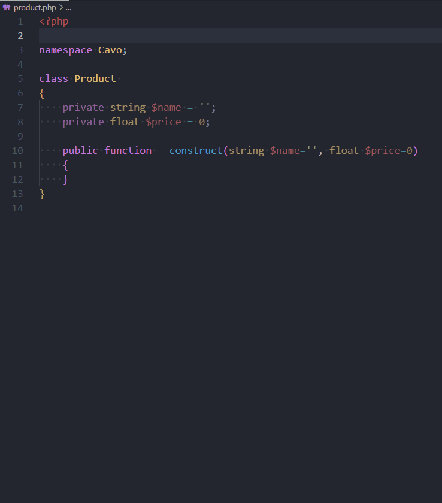

<!-- cspell:ignore strtolower -->


Because you're an excellent developer, you deny anyone access to the properties of your class directly, but only via a getter or setter.

In other words, in your PHP class, you don't have `public` properties (they're devil) but exclusively `protected` ones or better `private`.

And using getter and setters you allow other objects to interact with your private methods by reading them (getters) or updating their values (setters).

Some people will say "Yes, but it's tedious to write these functions", but not at all.

<!-- truncate -->

## The bad scenario

<Snippet filename="product.php" source="./files/product.php" />

As you see `$name` is public so I can write things like below and it's ... OK.

```php
$product = new Product();
$product->name='coMPuteR';
$product->price=-10;
```

By OK I mean, ok, I've used a mix of lower and upper case for the name and ok, I've say that I'm selling computers at the cost of -10€.  It's OK because I don't do any controls of the values and, that, that is very bad.

By using a setter (a function called when the property is initialized) I can verify the value and correct the case f.i. or deny negative price.

## The good way

Let's create our class with private properties:

<Snippet filename="product.php" source="./files/product.part2.php" />

So, for each property, you need to write a function called `Getter` to read its contents and another function called `Setter` to modify it. It could be a hassle, but it's not, thanks to addon [PHP Getters & Setters](https://marketplace.visualstudio.com/items?itemName=phproberto.vscode-php-getters-setters).

Once enabled, we just need to right-click on a property, select what we wish as action and run it.



Here is in action:



Easy no?

Now, I can write:

```php
$product = new Product();
$product->setName('coMPuteR');
$product->setPrice(-10);
```

And the code using the class:

<Snippet filename="product.php" source="./files/product.part3.php" />
