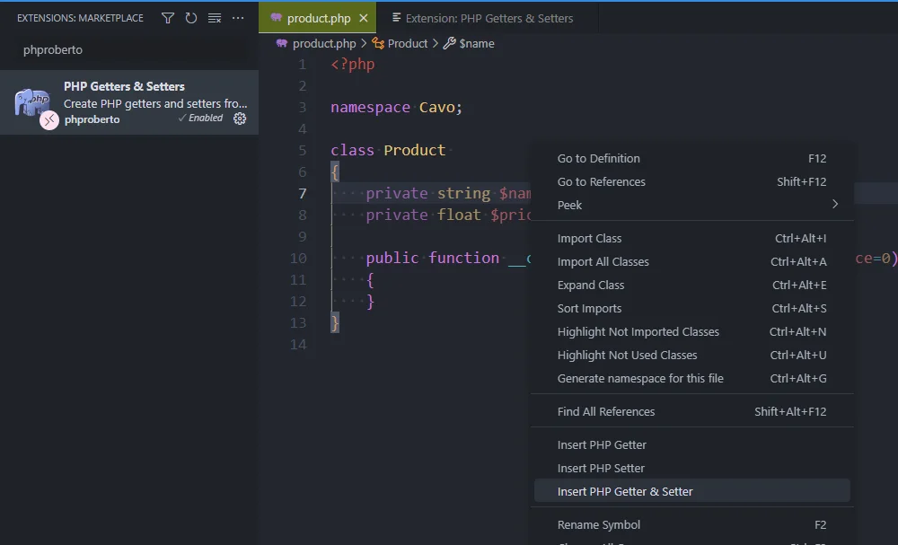
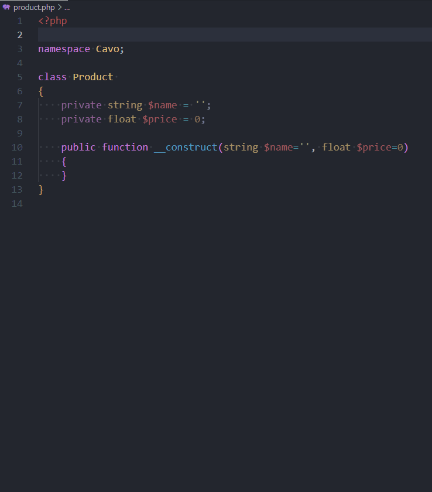

<!-- cspell:ignore strtolower -->


<TLDR>
This article makes the case for private PHP class properties accessed only through getters/setters (so values can be validated, e.g. rejecting a negative price), and shows the `PHP Getters & Setters` VSCode extension that generates them automatically via a right-click on the property — removing the excuse that writing them is tedious.
</TLDR>

Because you're an excellent developer, you deny anyone access to the properties of your class directly, but only via a getter or setter.

In other words, in your PHP class, you don't have `public` properties (they're the devil) but exclusively `protected` ones or better `private`.

And using getters and setters you allow other objects to interact with your private properties by reading them (getters) or updating their values (setters).

*<Link to="/blog/php-rector">Rector</Link> can spot the places where a property should have been private in the first place, and <Link to="/blog/vscode-tabnine">Tabnine</Link> will often guess the whole setter as soon as you start typing `private function set`.*

Some people will say "Yes, but it's tedious to write these functions", but not at all.

<!-- truncate -->

## See the extension in action

Right-click a property, pick an action, and the getter/setter boilerplate is generated for you:





No excuse for skipping them now — the [PHP Getters & Setters](https://marketplace.visualstudio.com/items?itemName=phproberto.vscode-php-getters-setters) extension does the typing for you.

## The bad scenario

<Snippet filename="product.php" source="./files/product.php" />

As you see `$name` is public so I can write things like below and it's ... OK.

```php
$product = new Product();
$product->name='coMPuteR';
$product->price=-10;
```

By OK I mean, well, I've used a mix of lower and upper case for the name and, well, I've said I'm selling computers at the cost of -10€. It's OK because I don't do any validation on the values, and that is very bad.

By using a setter (a function called when the property is initialized) I can verify the value and correct the case f.i. or deny negative price.

## The good way

Let's create our class with private properties:

<Snippet filename="product.php" source="./files/product.part2.php" />

So, for each property, you need to write a function called `Getter` to read its contents and another function called `Setter` to modify it. It could be a hassle, but it's not, thanks to the extension shown at the top of this article: just right-click on a property, select what you wish as action and run it.

Now, I can write:

```php
$product = new Product();
$product->setName('coMPuteR');
$product->setPrice(-10);
```

And the code using the class:

<Snippet filename="product.php" source="./files/product.part3.php" />

Letting the editor generate this boilerplate is one way to keep your PHP clean. Letting it *check* your code is another: <Link to="/blog/vscode-devcontainer">PHP development in a devcontainer with preinstalled code quality tools</Link> sets up a ready-to-use environment with linters and static analysis already in place.
