<!-- cspell:ignore behat,skel,johndoe,chromedriver,gerkin,dmore,nohup,autoload -->


> Also read my article about <Link to="/blog/cypress">Cypress</Link>

At work, I'm part of a team of PHP developers where we work together to create a very large proprietary application with a web interface.

This application is developed using the Laravel framework and we use [PHPUnit](https://phpunit.de/index.html) and [Pest](https://pestphp.com/) to run our unit tests.

However, in addition to the unit tests, we are also putting in place a tool that will simulate actions on our interface, such as accessing the login page, entering a login and password, simulating the click on the 'login' button, wait our main screen is displayed then, on the new page, assert a lot of things / do a lot of tasks.

It's a bit like asking a human to play out scenarios over and over again, every day, to make sure we haven't introduced any regressions in our latest developments, like a cool new feature whose code changes have broken a previous feature.

For this, we're using [Behat](https://docs.behat.org/en/latest/). This is a PHP [composer](https://getcomposer.org/) dependency you can add to your project (or a new one). The idea is to be able to write assertions in pure English (or French) like "I go to the ABC website then I click on the blog menu item and I should receive a list of blog items" or "In the search box, I type Docker then I click on the search button and I should receive articles having the Docker tags".

In this article, we'll learn more about Behat and how to use it for a first test.

<!-- truncate -->

As you can read on the [Behat](https://docs.behat.org/en/latest/) site, *Behat is an open source Behavior-Driven Development framework for PHP. It is a tool to support you in delivering software that matters through continuous communication, deliberate discovery and test-automation.*  This means that, in fact, you can start to write your scenarios even before coding. You can ask to your client to write assertions in common English. Once done, the developer will start to code and once done, he just needs to run the written scenarios to make sure the software answers to the client requirements.

## Introduction to BDD - Behavior-Driven Development

Imagine you're a customer and you ask a developer to create a new website. In your specifications, you tell him things like:

* As a visitor, I'd like a menu entry that, once clicked, will (do this);
* As a visitor, I want to be able to access a search engine that will allow me to make a selection from a category of articles and then, within this category, launch a search for the word (a word). A list of articles on this theme will then be displayed;
* As site manager, I want to be able to connect to a management interface and, after a successful login, I need to see the options (list of features);
* As site manager, I should be able to add a new article where I've to specify a title, a category, a main image and a text. Once I save it, I should see the new article in the list of articles and, by ordering the list on the creation date/time, it has to be the first in the list;
* (and much more)

In terms of Behat, these sentences are called scenarios. You can write them even before the website is created. And during the coding steps, the developer will run your scenarios from time to time. On the first run, all the scenarios are bound to fail (the site doesn't exist; the requested functions have not yet been developed). The developer will work on one or other of the functionalities; he will restart the BDD tests and, as the project progresses, the scenarios will succeed until the end of the project, when all the scenarios will have been successfully completed and the project can be sent to you for acceptance.

## Create a new project

For this article, we'll create a new Behat project and we'll validate this scenario: **"As a visitor, I want to be able to visit the site XYZ; click on a navigation item called 'Blog'. The site will then show me the list of blog posts."**

As you know, if you're a regular reader of my blog, I drink, eat and breathe Docker, which means that I no longer have PHP, composer or Apache on my computer.

So, for our new challenge (that I gladly accept) above, I'm going to create a little project with Docker, PHP 8.2 and composer.

Let's start...

* First, let's create a new directory: `mkdir /tmp/behat && cd $_`.
* There, let's create a file called `Dockerfile` with the content below. That script is already big but; like this, we'll have everything we need right now.

<Snippet filename="Dockerfile">

<!-- cspell:disable -->
```docker
# The user ID and name and group ID of the user to create in our image
ARG DOCKER_UID=1000
ARG DOCKER_GID=1000
ARG USERNAME=johndoe

# The version of Chrome we'll install
ARG CHROME_VERSION=115.0.5763.0

# This is a PHP project
FROM php:8.2-fpm

# Install system dependencies
RUN apt-get update && apt-get install -y git jq zip unzip wget gnupg \
    && apt-get clean \
    && rm -rf /tmp/* /var/list/apt/*

# We'll create a new user with the same uid/gid than ours, on our host machine.
ARG DOCKER_UID
ARG DOCKER_GID
ARG USERNAME

RUN groupadd --gid ${DOCKER_GID} "${USERNAME}" \
    && useradd --home-dir /home/"${USERNAME}" --create-home --uid ${DOCKER_UID} \
        --gid ${DOCKER_GID} --shell /bin/sh --skel /dev/null "${USERNAME}"

# Download and install Chrome
ARG CHROME_VERSION
ARG DOWNLOAD_URL="https://googlechromelabs.github.io/chrome-for-testing/known-good-versions-with-downloads.json"

# Download Chrome (the browser and the driver)
RUN wget --no-check-certificate --no-verbose -O - https://dl-ssl.google.com/linux/linux_signing_key.pub | apt-key add - \
    && sh -c 'echo "deb https://dl.google.com/linux/chrome/deb/ stable main" >> /etc/apt/sources.list.d/google.list' \
    && apt-get update -yqq \
    && apt-get install -y --no-install-recommends -yq gconf-service libasound2 libatk1.0-0 libc6 libcairo2 \
        libcups2 libdbus-1-3 libexpat1 libfontconfig1 libgbm1 libgcc1 libgconf-2-4 \
        libgdk-pixbuf2.0-0 libglib2.0-0 libgtk-3-0 libnspr4 libpango-1.0-0 \
        libpangocairo-1.0-0 libstdc++6 libx11-6 libx11-xcb1 libxcb1 libxcomposite1 \
        libxcursor1 libxdamage1 libxext6 libxfixes3 libxi6 libxrandr2 libxrender1 \
        libxss1 libxtst6 ca-certificates fonts-liberation libnss3 lsb-release \
        xdg-utils \
    && apt-get clean \
    && rm -rf /tmp/* /var/list/apt/* \
    # --- Download the browser ---
    && ZIP_URL=$(curl $DOWNLOAD_URL | jq -r ".versions[] | select(.version==\""$CHROME_VERSION"\").downloads.chrome[] | select(.platform==\""linux64"\") .url") \
    && wget --no-check-certificate --no-verbose -O /tmp/chrome_browser.zip $ZIP_URL \
    && printf "\e[0;105m%s\e[0;0m\n" "Using chromedriver $(/usr/local/bin/chrome/chromedriver --version)" \
    #  Unzip and create the /usr/local/bin/chromedriver executable  (-j means don't create a subfolder with the name of the archive; unzip in the folder directly)
    && unzip -j /tmp/chrome_browser.zip -d /usr/local/bin/chrome \
    && rm -f /tmp/chrome_browser.zip \
    && ls -alh /usr/local/bin/chrome \
    && chmod +x /usr/local/bin/chrome/chrome \
    # --- Download the driver ---
    && ZIP_URL=$(curl $DOWNLOAD_URL | jq -r ".versions[] | select(.version==\""$CHROME_VERSION"\").downloads.chromedriver[] | select(.platform==\""linux64"\") .url") \
    && wget --no-check-certificate --no-verbose -O /tmp/chrome_driver.zip $ZIP_URL \
    #  Unzip and create the /usr/local/bin/chromedriver executable  (-j means don't create a subfolder with the name of the archive; unzip in the folder directly)
    && unzip -j /tmp/chrome_driver.zip -d /usr/local/bin/chrome \
    && rm -f /tmp/chrome_driver.zip \
    && chmod +x /usr/local/bin/chrome/chrome \
    # Make some cleanup
    && apt-get clean \
    && rm -rf /tmp/* /var/list/apt/*

# Get latest composer
COPY --from=composer:latest /usr/bin/composer /usr/bin/composer

# Where we'll put our script
RUN mkdir /opt/behat

# Set working directory
WORKDIR /opt/behat
```
<!-- cspell:enable -->

</Snippet>

* Create a file called `compose.yaml` with this content:

<Snippet filename="compose.yaml">

```yaml
services:
  app:
    build:
      context: .
      args:
        # Please update IDs below if you've another values by running "id -u" (UID) and "id -g" (GID) in your Linux console
        - DOCKER_UID=1000
        - DOCKER_GID=1000
        # The name of the user in Docker; didn't have any importance
        - USERNAME=johndoe
    container_name: php-app
    working_dir: /opt/behat
    volumes:
      # We'll synchronize our local project folder (on our machine) with the Docker container
      - ./:/opt/behat
```

</Snippet>

* Run `docker compose up --detach` to create your Docker container

We'll check if the Chrome driver is correctly installed by running `docker compose exec -u $(id -u):$(id -g) app /usr/local/bin/chrome/chromedriver --version`. Same for the Chrome browser `docker compose exec -u $(id -u):$(id -g) app /usr/local/bin/chrome/chrome --version`. Nice! Seeing these values means Chrome is ready to be used.

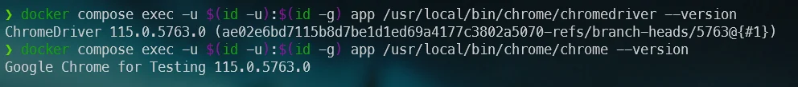

Ok, let's do one more thing; we need to create our `composer.json` file since we need to include the PHP `Behat` dependency.

* Run `docker compose exec -u $(id -u):$(id -g) app /bin/bash` to start an interactive shell in your Docker container and be yourself (i.e. by using `-u $(id -u):$(id -g)` files and folders created in Docker will be owned by you),

* Run `composer init` to start the composer wizard; type any value you want f.i.
  * Package name: `johndoe/behat`,
  * Description: `Introduction to Behat`,
  * Author: `John Doe`,
  * Minimum Stability: *Just press enter*,
  * Package Type: `project`,
  * License: *Just press enter*,
  * Composer will ask if you want to define dependencies and dev dependencies; answer `no` twice right now,
  * The next question will be about PSR-4, *just press enter*,
  * Finally answer `yes` to the confirmation message.

Now, if you're curious, you'll see you've a new file called `composer.json` and two folders called `src` and `vendor`.

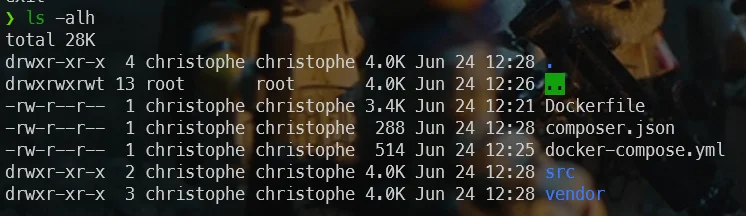

## Let's install Behat

As stated in the [How to install?](https://docs.behat.org/en/latest/quick_start.html#installation) documentation, you just need to execute `composer require --dev behat/behat:^3` to install Behat as a dev dependency.

:::info
Make sure you're still in an interactive Bash session in the Docker container before running `composer require --dev behat/behat:^3`.  An interactive Bash session is started by running `docker compose exec -u $(id -u):$(id -g) app /bin/bash`.
:::

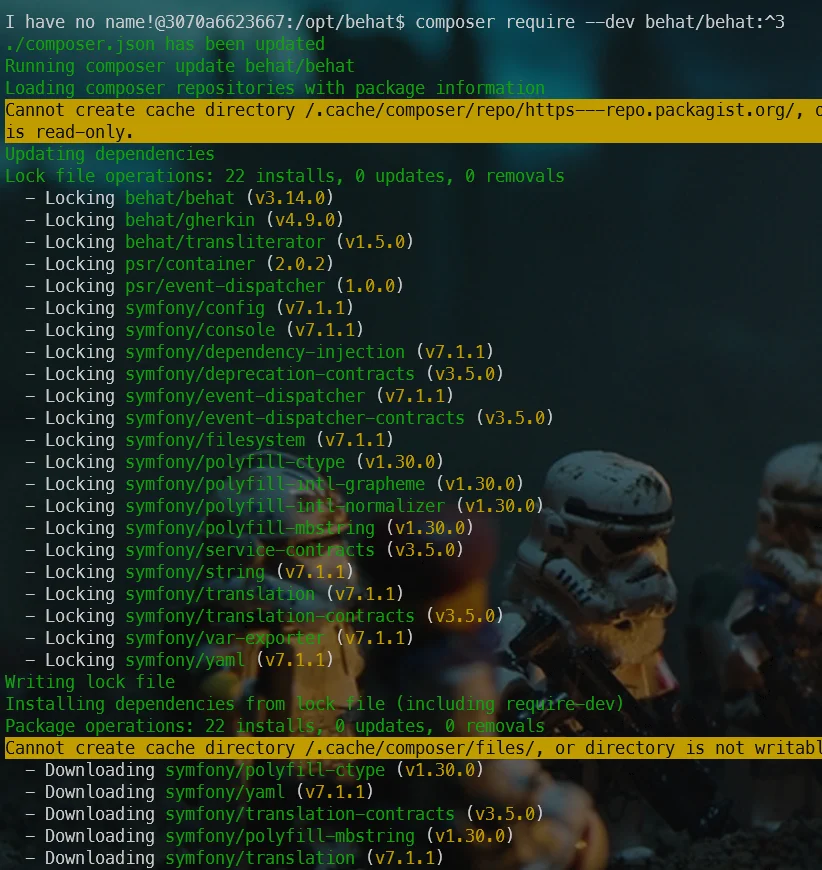

Once installed, you can start Behat by running `vendor/bin/behat` but right now, you'll got an error and this is perfectly normal since we need to start to write our first scenario.

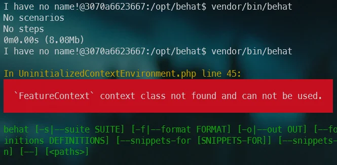

As you can read in the official documentation, just run `vendor/bin/behat --init` to create the required, minimum, files.

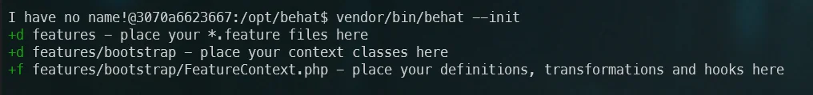

Now, if you look at your folder, you can see you've now a new folder called `features/bootstrap` with a file called `FeatureContext.php`. The screenshot below illustrate how the project appears in my VSCode editor at this point in the tutorial:

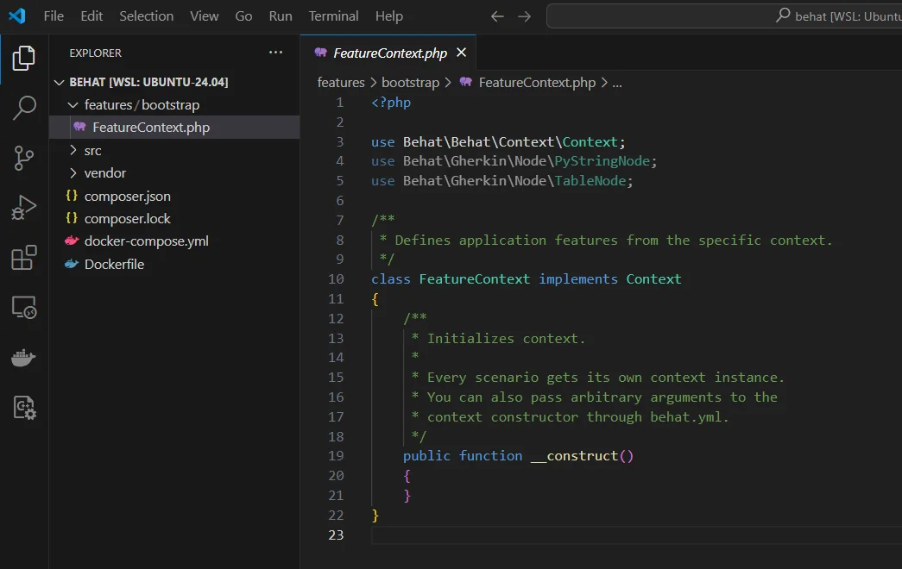

## Time to learn more about features

The image here above is displaying a major concept of Behat: it's a feature. This is something you need to write and this will guide our automation. For instance:

<Snippet filename="Blog.feature">

```gherkin
Feature: Clicking on the Blog menu item should give me the list of articles

  Scenario: I click on the Blog menu
    Given I am on "https://www.avonture.be"
    Then I click on the "Blog" menu item
    Then I should be on "/blog"
```

</Snippet>

This has to be put in a file having the `.feature` extension in the  `features` folder; let's create the `Blog.feature` file with this content:

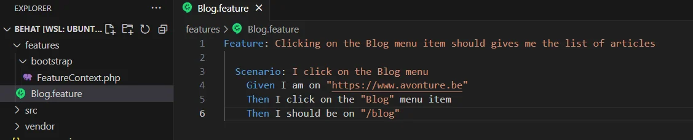

:::note Think to install `Cucumber (Gerkin) Full Support`
If you're using Visual Studio Code, you can install [Cucumber (Gerkin) Full Support](https://marketplace.visualstudio.com/items?itemName=alexkrechik.cucumberautocomplete) to get colorization, a better integration in vscode like autocompletion.
:::

<StepsCard
  title="Your scenario here above is using three steps:"
  variant="steps"
  steps={[
    '`Given I am on "https://www.avonture.be"`',
    '`Then I click on the "Blog" menu item` and',
    '`Then I should be on "/blog"`.'
  ]}
/>


Now we've our scenario, we need to teach Behat how to *translate* these sentences (it's the [Gherkin language](https://cucumber.io/docs/gherkin/)) in our PHP code.

## Writing your steps in PHP

Now, please open the file `features/bootstrap/FeatureContext.php` in your preferred editor:

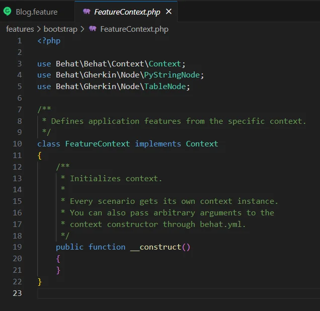

As you can see, this is the default file we've created earlier. We need to create some PHP code here but how?

Go back to your interactive Bash console and run `vendor/bin/behat --dry-run --append-snippets`. This will ask Behat to create the steps for you, automagically.

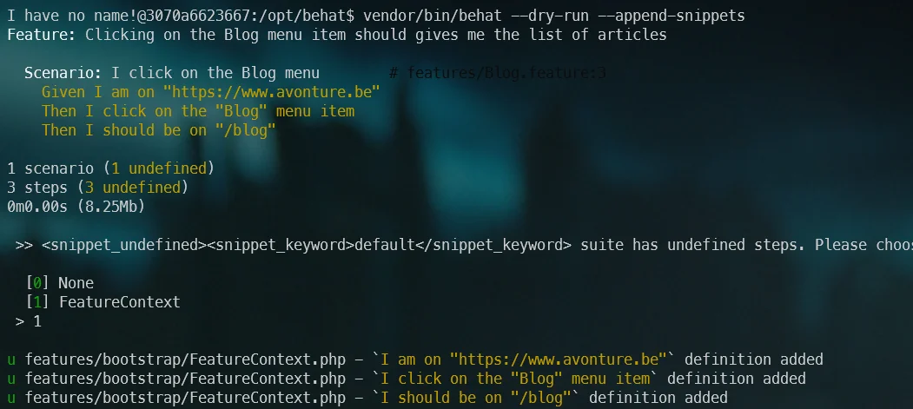

Please type `1` to ask Behat to use your `FeatureContext.php` file. You'll then get a confirmation on screen:

```bash
u features/bootstrap/FeatureContext.php - `I am on "https://www.avonture.be"` definition added
u features/bootstrap/FeatureContext.php - `I click on the "Blog" menu item` definition added
u features/bootstrap/FeatureContext.php - `I should be on "/blog"` definition added
```

Please open the file `features/bootstrap/FeatureContext.php` once more in your preferred editor:

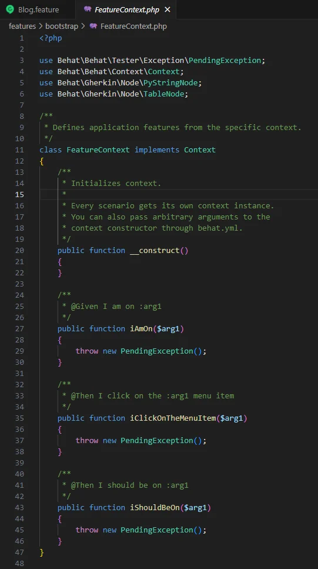

Nice isn't? Behat has look at our `Blog.feature` file and create as many methods in our PHP code that we had sentences in our scenario and, each method is assigned to the sentence (take a look to the php comment before each method).

And, now, before even starting to code, let's ask Behat to run our scenario; please run `vendor/bin/behat` in the console:

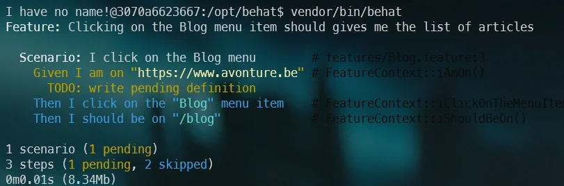

Wow! So far, perfect! We've thus asked Behat to run our scenario and he knows that we've three steps and we still need to write the associated code in PHP (therefore the **TODO: write pending definition** message in yellow).

Let's give ourselves the means to do the best we can as quickly as possible, without reinventing the wheel if someone else has already done it. Let's install two new dependencies. In your console, please run `composer require --dev friends-of-behat/mink` and `composer require --dev dmore/behat-chrome-extension`.

`friends-of-behat/mink` is a very nice dependency coming with already predefined steps like doing a login, navigating to pages, asserting the current page is ....  And by using `friends-of-behat/mink`, life will be simpler and we won't have to reinvent the wheel.

## Using Mink

Now that Mink has been installed, go to your editor, open the file `features/bootstrap/FeatureContext.php` and replace the line `class FeatureContext implements Context` like this `class FeatureContext extends \Behat\MinkExtension\Context\MinkContext`.

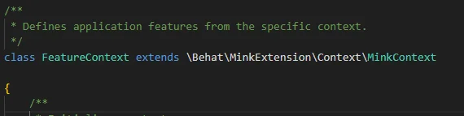

This small change will empower us because now our code will use Mink and thus will benefit from all existing methods of Mink.

To get the list of existing methods, let's run `clear ; vendor/bin/behat -di` in your console:

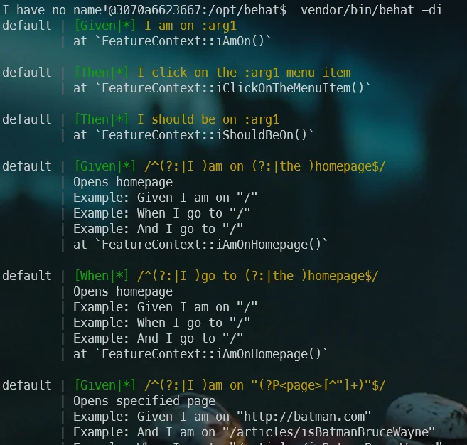

Did you see? We've our three steps (the first three displayed) then we got extra steps coming from Mink. And you can scroll a lot, there are already many steps that Mink allows you to reuse.

Run `vendor/bin/behat` in the console again:

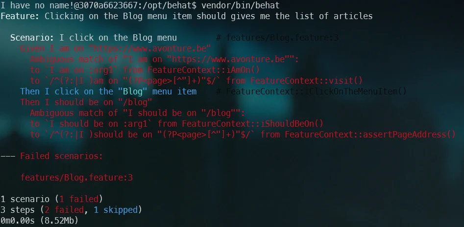

We got the *Ambiguous match of ...* error on the very first step, our *I am on https://www.avonture.be* step. Ambiguous means that we're trying to add some PHP code in our context while that step is already defined (by Mink). So, just drop it by editing your `FeatureContext.php` file, select the `public function iAmOn` and remove the entire function.

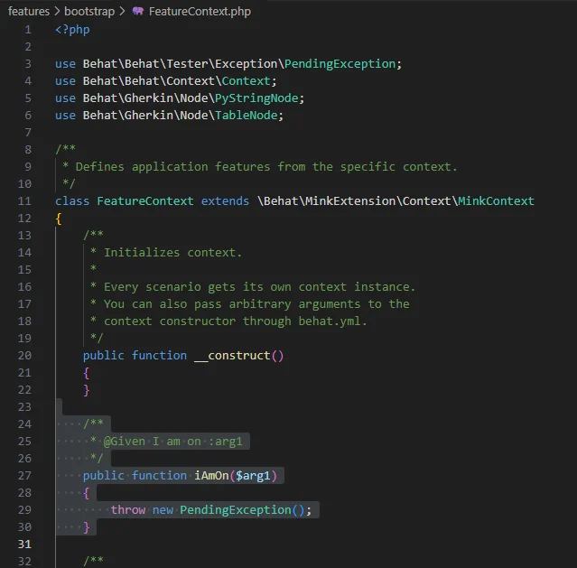

By running `vendor/bin/behat` again and you'll have the same error for `iShouldBeOn` so remove that function too.

Run `clear ; vendor/bin/behat` once more and now we'll got a new error:

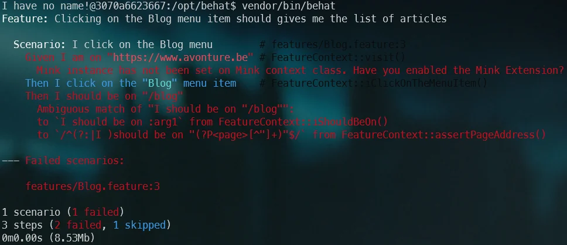

## Installing the Mink extension

We'll now need to reference the `behat-chrome-extension` in a such called `behat.yml` file.

Please create the file called `behat.yml` in your project's root directory; with this content:

<Snippet filename="behat.yaml">

```yaml
default:
    extensions:
        DMore\ChromeExtension\Behat\ServiceContainer\ChromeExtension: ~
        Behat\MinkExtension:
            browser_name: chrome
            base_url: https://www.avonture.be
            sessions:
                default:
                    chrome:
                      api_url: http://0.0.0.0:9222
```

</Snippet>

Also, please edit the file `features/bootstrap/FeatureContext.php`, remove everything and replace the existing content below.

We've changes a few `use` to add Mink libraries (and remove unneeded ones). We've also added a `$mink` private property and put some lines in the `__constructor`.

:::warning Please update the url `https://www.avonture.be` to match your site
:::

<Snippet filename="features/bootstrap/FeatureContext.php">

```php
<?php

use Behat\Mink\Mink;
use Behat\Mink\Session;
use DMore\ChromeDriver\ChromeDriver;
use Behat\Behat\Tester\Exception\PendingException;

/**
 * Defines application features from the specific context.
 */
class FeatureContext extends \Behat\MinkExtension\Context\MinkContext
{

    private Behat\Mink\Mink $mink;

    /**
     * Initializes context.
     *
     * Every scenario gets its own context instance.
     * You can also pass arbitrary arguments to the
     * context constructor through behat.yml.
     */
    public function __construct()
    {
        $this->mink = new Mink(
            [
                'browser' => new Session(
                    new ChromeDriver(
                        'http://0.0.0.0:9222',
                        null,
                        "https://www.avonture.be"  // <-- Think to update to the site you wish to test
                    )
                )
            ]
        );

    }

    /**
     * @Then I click on the :arg1 menu item
     */
    public function iClickOnTheMenuItem($arg1)
    {
        throw new PendingException();
    }
}
```

</Snippet>

By running `vendor/bin/behat` again, we've now another error:

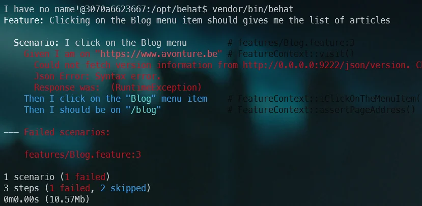

## Time to run Chrome

Create a file called `run.sh` with this content:

<Snippet filename="run.sh">

```bash
#!/usr/bin/env bash

clear

# We'll start Chrome on URL http://0.0.0.0:9222
# If this URL has to be modified, think to update the constructor of FeatureContext.php too
# Note: /usr/bin/google-chrome-stable has been installed in our Dockerfile
nohup /usr/local/bin/chrome/chrome --headless --remote-debugging-address=0.0.0.0 \
    --remote-debugging-port=9222 --no-sandbox --window-size="1920,1080" --disable-dev-shm-usage \
    --disable-extensions --no-startup-window --no-first-run --no-pings > /dev/null 2>&1 &

# Get the process ID of chrome so we can kill the process when we've finished
chromePID=$!

# shellcheck disable=SC2048,SC2086
php -d memory_limit=-1 "vendor/bin/behat" --config=behat.yaml

if ((chromePID > 0)); then
    kill ${chromePID} > /dev/null 2>&1
fi
```

</Snippet>

Then make the file executable by running `chmod +x ./run.sh`.

Now, you can start Behat by starting `./run.sh` in your console.

If everything is going fine, you'll get this:

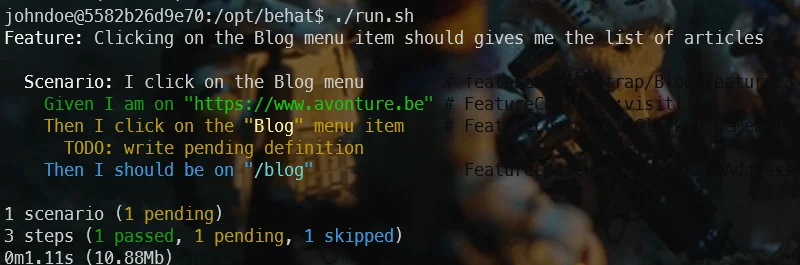

As you can see, the `Given I am on...` line is in green: Behat, thanks to our Chrome driver, has been able to reach the page.

Then the line `Then I click on the "Blog" menu item` is in yellow and this is normal since we haven't yet created the function and, logically, `Then I should be on "/blog"` is in blue because that sentence wasn't executed yet (skipped).

## Writing our iClickOnTheMenuItem method

Back to the `bootstrap/FeatureContext.php` file. Replace the `iClickOnTheMenuItem` method with this code:

<Snippet filename="features/bootstrap/FeatureContext.php">

```php
/**
 * @Then I click on the :menuItem menu item
 */
public function iClickOnTheMenuItem(string $menuItem): void
{
    if (!is_dir('.output')) {
        mkdir('.output', 0777);
    }

    // When entering in the method, take a screenshot so we can assert we're on the homepage
    file_put_contents('.output/homepage.png', $this->getSession()->getDriver()->getScreenshot());

    throw new PendingException();
}
```

</Snippet>

As you can see, we'll create a `.output` folder and the only thing we'll do is to create a screenshot.

Just after having fired `./run.sh` in your console once more, now, you should see a new `.output` folder with an image:

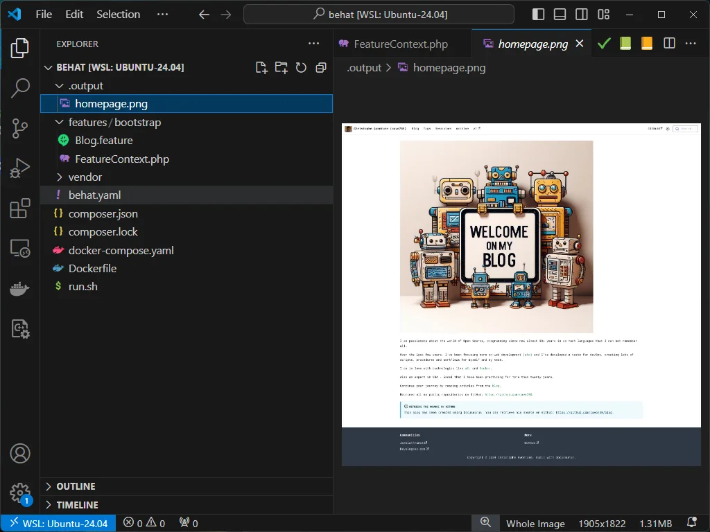

What have we just done? We've verified that when Behat executes our `iClickOnTheMenuItem` method, Chrome does indeed access our home page. We can now simulate a click on the menu entry we want; the Blog menu stored in our $menuItem parameter.

Replace the method with this new code:

<Snippet filename="features/bootstrap/FeatureContext.php">

```php
/**
 * @Then I click on the :menu menu item
 */
public function iClickOnTheMenuItem(string $menu): void
{
    if (!is_dir('.output')) {
        mkdir('.output', 0777);
    }

    // When entering in the method, take a screenshot so we can assert we're on the homepage
    file_put_contents('.output/homepage.png', $this->getSession()->getDriver()->getScreenshot());

    /**
     * @var $elements Behat\Mink\Element\NodeElement
     */
    $elements = $this->getSession()->getPage()->findAll('css', 'a[class="navbar__item navbar__link"]');

    // Now we'll get all links from our navigation bar. $elements will contain more than one link in our case.
    // The CSS selector has been written using our Web developer console; in Edge or Chromium for instance.
    // Loop any elements (our navigation links) and when we've found the one having `Blog` as text, click on it
    foreach ($elements as $element) {
        if ($element->getText() === $menu) {
            $element->click();
        }
    }

    // Give one second to the website to handle the click and, so, to navigate to, as we expect it, the `/blog` path
    sleep(1);

    // Take a second image, now we should be in the list of posts
    file_put_contents('.output/iClickOnBlog.png', $this->getSession()->getDriver()->getScreenshot());
}
```

</Snippet>

Start `./run.sh` once more and bingo!

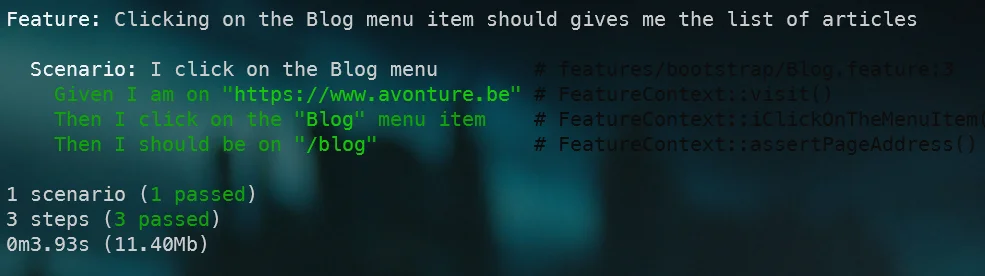

This is a success because the `Then I should be on "/Blog"` has been verified by Mink. We don't need to write the `Then I should be on` method, it's already defined by Mink.

Let's try something else, back in PHP and replace `if ($element->getText() === $menu) {` by `if ($element->getText() === 'Archive') {` so we'll not click anymore on the Blog menu but on `Archive` and see what will happen:

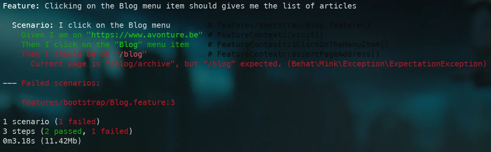

And it fails; great!

## Conclusion

This is the end of this tutorial.

With Behat and Mink, we can automate functional testing.

We'll be able to write scenarios, simulate user actions like clicking on any objects of the page; upload documents, do stuff like f.i. inserting a new blog post then inject some content into the editor and, then, after having saved the item, visit the blog page, order it by date and we can assert that our new post is displayed and is the first one in the list.

We can do this before the application exists (concept of BDD), during the coding (to ensure features are still working even after a big refactoring f.i.) or during the life cycle (to make sure the application is still working as expected).

Continue your journey thanks these websites:

* [Automate testing with Behat](https://docs.pantheon.io/behat),
* [Behat-chrome-extension repository](https://gitlab.com/behat-chrome/behat-chrome-extension),
* [Behat: The Easy and Effective Way to Write Acceptance Tests](https://dev.to/jszutkowski/behat-the-easy-and-effective-way-to-write-acceptance-tests-cm4),
* [Behat - Official website](https://docs.behat.org/en/latest/),
* [Cucumber - Gherkin Tutorial](https://cucumber.io/),
* [DMore - Chrome Mink Driver](https://packagist.org/packages/dmore/chrome-mink-driver) and
* [Mink at a Glance](https://mink.behat.org/en/latest/at-a-glance.html)

## Appendix - List of files and their contents and how to run them

During this tutorial, we've manipulated a lot of files and commands. To allow you to check if your version is well the one used at the end of this article, you'll find every file here below with their content at the end of the tutorial.

As a reminder, when all files below have been created on your disk, first, you'll need to create your Docker image and a container too; this is done by running `docker compose up --detach` in your console.

The second command to run is `docker compose exec -u $(id -u):$(id -g) app composer install` to install all dependencies for PHP.

Finally, to run our `run.sh` script, you should run `docker compose exec -u $(id -u):$(id -g) app ./run.sh`

### behat.yaml

<Snippet filename="behat.yaml">

```yaml
default:
    extensions:
        DMore\ChromeExtension\Behat\ServiceContainer\ChromeExtension: ~
        Behat\MinkExtension:
            browser_name: chrome
            base_url: https://www.avonture.be
            sessions:
                default:
                    chrome:
                      api_url: http://0.0.0.0:9222
```

</Snippet>

### Blog.feature

The relative filename is `features/Blog.feature`.

<Snippet filename="features/Blog.feature">


```gherkin
Feature: Clicking on the Blog menu item should gives me the list of articles

  Scenario: I click on the Blog menu
    Given I am on "https://www.avonture.be"
    Then I click on the "Blog" menu item
    Then I should be on "/blog"
```

</Snippet>

### composer.json

<Snippet filename="composer.json">

```json
{
    "name": "johndoe/behat",
    "description": "Introduction to behat",
    "type": "project",
    "autoload": {
        "psr-4": {
            "Johndoe\\Behat\\": "src/"
        }
    },
    "authors": [
        {
            "name": "John Doe"
        }
    ],
    "require-dev": {
        "behat/behat": "^3",
        "dmore/behat-chrome-extension": "^1.4",
        "friends-of-behat/mink": "^1.11"
    }
}
```

</Snippet>

### compose.yaml

<Snippet filename="compose.yaml">

```yaml
services:
  app:
    build:
      context: .
      args:
        # Please update IDs below if you've another values by running "id -u" (UID) and "id -g" (GID) in your Linux console
        - DOCKER_UID=1000
        - DOCKER_GID=1000
        # The name of the user in Docker; didn't have any importance
        - USERNAME=johndoe
    container_name: php-app
    working_dir: /opt/behat
    volumes:
      # We'll synchronize our local project folder (on our machine) with the Docker container
      - ./:/opt/behat
```

</Snippet>

### Dockerfile

<Snippet filename="Dockerfile">

<!-- cspell:disable -->
```docker
# The user ID and name and group ID of the user to create in our image
ARG DOCKER_UID=1000
ARG DOCKER_GID=1000
ARG USERNAME=johndoe

# The version of Chrome we'll install
ARG CHROME_VERSION=115.0.5763.0

# This is a PHP project
FROM php:8.2-fpm

# Install system dependencies
RUN apt-get update && apt-get install -y git jq zip unzip wget gnupg \
    && apt-get clean \
    && rm -rf /tmp/* /var/list/apt/*

# We'll create a new user with the same uid/gid than ours, on our host machine.
ARG DOCKER_UID
ARG DOCKER_GID
ARG USERNAME

RUN groupadd --gid ${DOCKER_GID} "${USERNAME}" \
    && useradd --home-dir /home/"${USERNAME}" --create-home --uid ${DOCKER_UID} \
        --gid ${DOCKER_GID} --shell /bin/sh --skel /dev/null "${USERNAME}"

# Download and install Chrome
ARG CHROME_VERSION
ARG DOWNLOAD_URL="https://googlechromelabs.github.io/chrome-for-testing/known-good-versions-with-downloads.json"

# Download Chrome (the browser and the driver)
RUN wget --no-check-certificate --no-verbose -O - https://dl-ssl.google.com/linux/linux_signing_key.pub | apt-key add - \
    && sh -c 'echo "deb https://dl.google.com/linux/chrome/deb/ stable main" >> /etc/apt/sources.list.d/google.list' \
    && apt-get update -yqq \
    && apt-get install -y --no-install-recommends -yq gconf-service libasound2 libatk1.0-0 libc6 libcairo2 \
        libcups2 libdbus-1-3 libexpat1 libfontconfig1 libgbm1 libgcc1 libgconf-2-4 \
        libgdk-pixbuf2.0-0 libglib2.0-0 libgtk-3-0 libnspr4 libpango-1.0-0 \
        libpangocairo-1.0-0 libstdc++6 libx11-6 libx11-xcb1 libxcb1 libxcomposite1 \
        libxcursor1 libxdamage1 libxext6 libxfixes3 libxi6 libxrandr2 libxrender1 \
        libxss1 libxtst6 ca-certificates fonts-liberation libnss3 lsb-release \
        xdg-utils \
    && apt-get clean \
    && rm -rf /tmp/* /var/list/apt/* \
    # --- Download the browser ---
    && ZIP_URL=$(curl $DOWNLOAD_URL | jq -r ".versions[] | select(.version==\""$CHROME_VERSION"\").downloads.chrome[] | select(.platform==\""linux64"\") .url") \
    && wget --no-check-certificate --no-verbose -O /tmp/chrome_browser.zip $ZIP_URL \
    && printf "\e[0;105m%s\e[0;0m\n" "Using chromedriver $(/usr/local/bin/chrome/chromedriver --version)" \
    #  Unzip and create the /usr/local/bin/chromedriver executable  (-j means don't create a subfolder with the name of the archive; unzip in the folder directly)
    && unzip -j /tmp/chrome_browser.zip -d /usr/local/bin/chrome \
    && rm -f /tmp/chrome_browser.zip \
    && ls -alh /usr/local/bin/chrome \
    && chmod +x /usr/local/bin/chrome/chrome \
    # --- Download the driver ---
    && ZIP_URL=$(curl $DOWNLOAD_URL | jq -r ".versions[] | select(.version==\""$CHROME_VERSION"\").downloads.chromedriver[] | select(.platform==\""linux64"\") .url") \
    && wget --no-check-certificate --no-verbose -O /tmp/chrome_driver.zip $ZIP_URL \
    #  Unzip and create the /usr/local/bin/chromedriver executable  (-j means don't create a subfolder with the name of the archive; unzip in the folder directly)
    && unzip -j /tmp/chrome_driver.zip -d /usr/local/bin/chrome \
    && rm -f /tmp/chrome_driver.zip \
    && chmod +x /usr/local/bin/chrome/chrome \
    # Make some cleanup
    && apt-get clean \
    && rm -rf /tmp/* /var/list/apt/*

# Get latest composer
COPY --from=composer:latest /usr/bin/composer /usr/bin/composer

# Where we'll put our script
RUN mkdir /opt/behat

# Set working directory
WORKDIR /opt/behat
```
<!-- cspell:enable -->

</Snippet>

### FeatureContext.php

The relative filename is `features/bootstrap/FeatureContext.php`.

<Snippet filename="features/bootstrap/FeatureContext.php">

```php
<?php

use Behat\Mink\Mink;
use Behat\Mink\Session;
use DMore\ChromeDriver\ChromeDriver;
use Behat\Behat\Tester\Exception\PendingException;

/**
 * Defines application features from the specific context.
 */
class FeatureContext extends \Behat\MinkExtension\Context\MinkContext
{

    private Behat\Mink\Mink $mink;

    /**
     * Initializes context.
     *
     * Every scenario gets its own context instance.
     * You can also pass arbitrary arguments to the
     * context constructor through behat.yml.
     */
    public function __construct()
    {
        $this->mink = new Mink(
            [
                'browser' => new Session(
                    new ChromeDriver(
                        'http://0.0.0.0:9222',
                        null,
                        "https://www.avonture.be"  // <-- Think to update to the site you wish to test
                    )
                )
            ]
        );
    }

    /**
     * @Then I click on the :menu menu item
     */
    public function iClickOnTheMenuItem(string $menu): void
    {
        if (!is_dir('.output')) {
            mkdir('.output', 0777);
        }

        // When entering in the method, take a screenshot so we can assert we're on the homepage
        file_put_contents('.output/homepage.png', $this->getSession()->getDriver()->getScreenshot());

        /**
         * @var $elements Behat\Mink\Element\NodeElement
         */
        $elements = $this->getSession()->getPage()->findAll('css', 'a[class="navbar__item navbar__link"]');

        // Now we'll get all links from our navigation bar. $elements will contain more than one link in our case.
        // The CSS selector has been written using our Web developer console; in Edge or Chromium for instance.
        // Loop any elements (our navigation links) and when we've found the one having `Blog` as text, click on it
        foreach ($elements as $element) {
            if ($element->getText() === $menu) {
                $element->click();
            }
        }

        // Give one second to the website to handle the click and, so, to navigate to, as we expect it, the `/blog` path
        sleep(1);

        // Take a second image, now we should be in the list of posts
        file_put_contents('.output/iClickOnBlog.png', $this->getSession()->getDriver()->getScreenshot());
    }
}
```

</Snippet>

### run.sh

<Snippet filename="run.sh">

```bash
#!/usr/bin/env bash

clear

# We'll start Chrome on URL http://0.0.0.0:9222
# If this URL has to be modified, think to update the constructor of FeatureContext.php too
# Note: /usr/bin/google-chrome-stable has been installed in our Dockerfile
nohup /usr/local/bin/chrome/chrome --headless --remote-debugging-address=0.0.0.0 \
    --remote-debugging-port=9222 --no-sandbox --window-size="1920,1080" --disable-dev-shm-usage \
    --disable-extensions --no-startup-window --no-first-run --no-pings > /dev/null 2>&1 &

# Get the process ID of chrome so we can kill the process when we've finished
chromePID=$!

# shellcheck disable=SC2048,SC2086
php -d memory_limit=-1 "vendor/bin/behat" --config=behat.yaml

if ((chromePID > 0)); then
    kill ${chromePID} > /dev/null 2>&1
fi
```

</Snippet>
