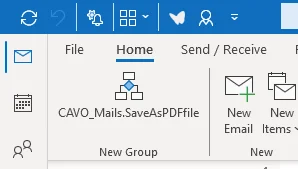
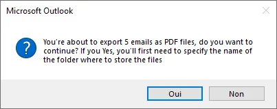
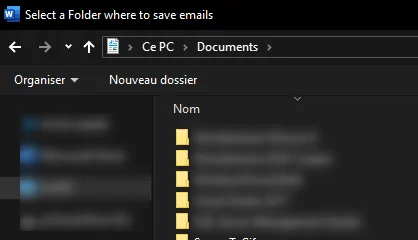

You may also need to select several emails from Microsoft Outlook and save them as PDF files on your hard drive.

In my case, it was when I was complementary self-employed. I had to keep track of the orders I received and the invoices I sent. Saving my orders as PDFs meant that I could keep them as archives, even if my mail server failed.

This post will explain to you how to create such macro for Outlook.

<!-- truncate -->

## Prerequisites

You should have Microsoft Office on your hard disk and you need to have Outlook and Word installed.

The macro will not work with Office online.

## Installation steps

<StepsCard
  title="Installation steps"
  variant="steps"
  steps={[
    'Just start your Microsoft Outlook client (as software on your hard disk; not in your web browser),',
    'Press <kbd>ALT</kbd>+<kbd>F11</kbd> to open the `Visual Basic Editor` (aka `VBE`) window,',
    'Click on the `Insert` menu then `Module`,',
    'Click on the link <a href="https://github.com/cavo789/vba_outlook_save_pdf/blob/master/module.bas">https://github.com/cavo789/vba_outlook_save_pdf/blob/master/module.bas</a> to open my repository on GitHub and click on the `Copy raw file` button to copy the source code in the clipboard',
    'Back to Outlook and press <kbd>CTRL</kbd>+<kbd>V</kbd> in the editor so you paste there the code,',
    'Close the `Visual Basic Editor` and come back to Outlook,',
    'Click anywhere on the Ribbon and select `Customize the Ribbon...`',
    'In the new dialog, click on the `New Group` button',
    'In the *Choose commands from*, select `Macros`, you should see the `SaveAsPDFFile` macro as illustrated below.',
    'Drag and drop the macro to your new group.',
    'Click on the `OK` button to close the dialog.',
  ]}
/>

You should see your new group, in my case, I've created the new group in `Home` and at the first position left so I've this:

## How to use

Select one or more emails then click on your new button.

The macro will ask a first confirmation:

Press `Yes` to continue.

Then, you'll be prompted to select a folder on your disk where to save emails as PDF.

The first dialog will ask if, once exported as PDF, you wish to keep emails in Outlook and remove them.

And the last dialog will ask if you wish to give a name manually to each file (if you've selected five emails, you'll be prompted five times for a filename) or if you wish to use the subject of the email as filename.

At the end, emails have been saved on your hard disk.
