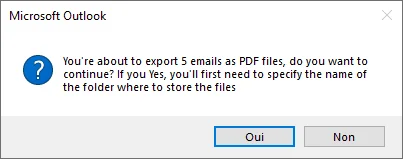
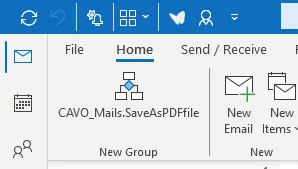
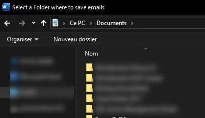

<TLDR>
This article shares a VBA macro for the Outlook desktop client that saves one or more selected emails as PDF files, added to the Ribbon as a custom button via the VBA editor. When run, it prompts for a save folder, whether to delete the emails from Outlook after export, and whether to name each PDF manually or from the email subject.
</TLDR>

You may also need to select several emails from Microsoft Outlook and save them as <Link to="/blog/markitdown">PDF files</Link> on your hard drive.

In my case, it was when I was complementary self-employed. I had to keep track of the orders I received and the invoices I sent. Saving my orders as PDFs meant that I could keep them as archives, even if my mail server failed.

This post will explain to you how to create such a macro for Outlook.

<!-- truncate -->

## Result

Select one or more emails, click the button, and the macro walks you through three prompts:

1. A confirmation to proceed with the selected emails.
2. A folder picker — where the PDFs should be saved.
3. Whether to remove the emails from Outlook afterward, and whether to name each PDF manually or reuse the email's subject line.

At the end, every selected email is saved on your hard disk as a PDF.

## Prerequisites

You should have Microsoft Office on your hard disk and you need to have Outlook and Word installed.

The macro will not work with Office online.

## Installation steps

<StepsCard
  title="Installation steps"
  variant="steps"
  steps={[
    'Just start your Microsoft Outlook client (as software on your hard disk; not in your web browser),',
    'Press <kbd>ALT</kbd>+<kbd>F11</kbd> to open the `Visual Basic Editor` (aka `VBE`) window,',
    'Click on the `Insert` menu then `Module`,',
    'Click on the link <a href="https://github.com/cavo789/vba_outlook_save_pdf/blob/master/module.bas">https://github.com/cavo789/vba_outlook_save_pdf/blob/master/module.bas</a> to open my repository on GitHub and click on the `Copy raw file` button to copy the source code in the clipboard',
    'Back to Outlook and press <kbd>CTRL</kbd>+<kbd>V</kbd> in the editor so you paste there the code,',
    'Close the `Visual Basic Editor` and come back to Outlook,',
    'Click anywhere on the Ribbon and select `Customize the Ribbon...`',
    'In the new dialog, click on the `New Group` button',
    'In the *Choose commands from*, select `Macros`, you should see the `SaveAsPDFFile` macro as illustrated below.',
    'Drag and drop the macro to your new group.',
    'Click on the `OK` button to close the dialog.',
  ]}
/>

You should see <Link to="/blog/vba-excel-ribbon">your new group</Link>, in my case, I've created the new group in `Home` and at the first position left so I've this:

## The folder and naming dialogs

The confirmation, folder picker and naming prompts are described at the top of this article. The folder picker looks like this:

