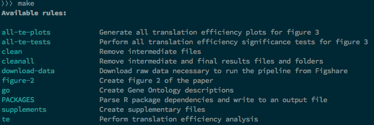

<!-- cspell:ignore ifeq,ifneq,ifdef,Oups,phplint,infile,recipeprefix,sonarqube,testme,findstring,toplevel,concat,outfile -->
<!-- cspell:ignore runsql,regexes -->

When I'm learning, I usually take notes.  I find that it's one of the best ways of remembering what I've seen and being able to come back to it at any time.

Below is a note that I took and revised several times when I took the time to create my first `.make` files.

<!-- truncate -->

## Install the make executable

Just run the following commands to install the `Make` executable on your host machine:

<Terminal>
$ sudo apt-get update && sudo apt-get -y install make
</Terminal>

## How to check if a file exists or not

You can use the `test -s` statement like below:

<Snippet filename="makefile" source="./files/makefile" />

Unlike the `ifeq` statement, `test` should be indented.

We can use the `{ ... }` notation if we need to run more than one command; f.i.:

<Snippet filename="makefile" source="./files/makefile.part2" />

We can also do this before, f.i., includes an external file:

<Snippet filename="makefile" source="./files/makefile.part3" />

Of course, we can also keep it simple i.e. just use the `-` before the command to ignore errors so, below, if the file didn't exist, no error will be raised and the script will continue.

<Snippet filename="makefile" source="./files/makefile.part4" />

## How to check if a folder exists or not

You can use the `ifeq` statement with a Linux shell command like below:

<Snippet filename="makefile" source="./files/makefile.part5" />

Unlike the `test` statement, `ifeq` should be used without indentation. Directly at position column zero.

## Running dependent targets

By running `make php-cs-fixer`, we'll first run `vendor` then `update-them`, finally `php-cs-fixer` i.e. we can define a list of dependent targets.

<Snippet filename="makefile" source="./files/makefile.part6" />

<Terminal>
$ make php-cs-fixer
First get vendors
Then update vendors
And finally run php-cs-fixer
</Terminal>

### Stop the job if a target fails

If one of them fails, the script will stop.  In the example below, `php-cs-fixer` will never print `And finally run php-cs-fixer`.

<Snippet filename="makefile" source="./files/makefile.part7" />

Running `make php-cs-fixer` will output this:

<Terminal>
First get vendors
Then update vendors
And finally run php-cs-fixer
</Terminal>

## Using shell find option to get all dependencies

Imagine you've a lot of `.md` files in the directory. If one change, we'll concat them again. If nothing changes, nothing to do.

This can be done using a shell command for the dependence:

<Snippet filename="makefile" source="./files/makefile.part8" />

(source [https://tech.davis-hansson.com/p/make/#specifying-inputs](https://tech.davis-hansson.com/p/make/#specifying-inputs))

## Don't echo the command

Running `make helloWorld` like below will output two lines on the console.

<Snippet filename="makefile" source="./files/makefile.part9" />

And the output in the console:

<Terminal>
$ echo "Hello world"
Hello world
</Terminal>

To avoid the first one i.e. the output of the fired instruction, just prefix it with an at sign (`@`).

<Snippet filename="makefile" source="./files/makefile.part10" />

Now, only the output will be echoed; no more the instruction itself.

## Using conditional statements

We can make some conditional statement like this but, be careful on the indentation:

<Snippet filename="makefile" source="./files/makefile.part11" />

`make init SET_PHP_VERSION=7.4` will display the downgrade message while `make init SET_PHP_VERSION=8.1` the upgrade one.

Another example:

<Snippet filename="makefile" source="./files/makefile.part12" />

## Ignore error

Don't stop in case of error: add a `-` before the line like :`-php --lint index.php`

<Snippet filename="makefile" source="./files/makefile.part13" />

In case of linting error in `index.php` don't stop the execution of the script and process the next command.

Note: makefile can perhaps display a message like `make: [makefile:114: up] Error 1 (ignored)` to inform the user an error has occurred but has been skipped.  If you don't want it at all (silent output), this is how to do:

<Snippet filename="makefile" source="./files/makefile.part14" />

This command will create a new Docker network called `my_network` and if case of error (the network already exists f.i.), we don't care and don't want to see any output.

## Make sure you're using Bash

By default, `make` is using `/bin/sh`. This can be upgraded by adding this assignment at the top of the `makefile`:

<Snippet filename="makefile" source="./files/makefile.part15" />

(source: [https://tech.davis-hansson.com/p/make/#always-use-a-recent-bash](https://tech.davis-hansson.com/p/make/#always-use-a-recent-bash))

## Set the default target

By default, the first target defined in the file will be the default one i.e. the one fired when the user will just fire `make` on the command line.

<Snippet filename="makefile" source="./files/makefile.part16" />

## Substitution

Consider `make convert INFILE=readme.md`

<Snippet filename="makefile" source="./files/makefile.part17" />

The syntax `outfile=$(INFILE:.md=.pdf)` will replace `.md` by `.pdf` so we can, in this example, derive the output file based on the input file.

## Tab not space

The indentation to use when creating a `makefile` is the tabulation; not spaces. Using spaces will break the file.

<Snippet filename="makefile" source="./files/makefile.part18" />

However it is possible to adapt this behavior using `.RECIPEPREFIX`:

<Snippet filename="makefile" source="./files/makefile.part19" />

(source: [https://tech.davis-hansson.com/p/make/#dont-use-tabs](https://tech.davis-hansson.com/p/make/#dont-use-tabs))

## Using parameters

Running a target with a parameter should be done using named parameters like this:

<Terminal>
$ make hello firstname="Christophe"
</Terminal>

This will create a variable called `firstname`, we then can use it:

<Snippet filename="makefile" source="./files/makefile.part20" />

### Make sure parameters are set

Imagine we want to run `make runsql SQL='SELECT * FROM users LIMIT 10'` i.e. the `SQL`argument should be defined otherwise we'll have a problem.

<Snippet filename="makefile" source="./files/makefile.part21" />

## Working with Docker

In a makefile we can exit the command if we need a given Docker container running.

The `if` statement below will make sure the `sonarqube` container is running; if not because not yet created or in a exit mode f.i., an error statement will be executed and the script will be stopped.

<Snippet filename="makefile" source="./files/makefile.part22" />

The `if` below will check if the container exists and if not, will create it.
The `else` statement knows thus that the container exists but will make sure it's running.

<Snippet filename="makefile" source="./files/makefile.part23" />

## Configure Visual Studio Code

### Add the makefile extension

[https://marketplace.visualstudio.com/items?itemName=ms-vscode.makefile-tools](https://marketplace.visualstudio.com/items?itemName=ms-vscode.makefile-tools)

### Add the .editorconfig file

Make sure your `Makefile` file is correctly formatted; add a file called `.editorconfig` in your root directory.

<Snippet filename=".editorconfig" source="./files/.editorconfig" />

## Some tips

### How to extend a target

You've an existing target, let's say `hello` in our example, and you wish to extend it and add extra actions.

`hello` can be defined in the same makefile or in an included one but let's illustrate this with a basic example: we wish to add the *Nice to meet you* output.

<Snippet filename="makefile" source="./files/makefile.part24" />

If we run that file, here is the output.

<Terminal>
$ make hello
makefile:198: warning: overriding recipe for target 'hello'
makefile:195: warning: ignoring old recipe for target 'hello'
Nice to meet you
</Terminal>

The solution: use `::` (this is called an *explicit rule*) and not a single `:` after the recipe; see the next sample:

<Snippet filename="makefile" source="./files/makefile.part25" />

If we run that file, here is the output.

<Terminal>
$ make hello
Hello world
Nice to meet you
Did you any plans for this weekend?
</Terminal>

Recipes are just extended, the second one is appended to the first and so on so the order is important.

### Getting the current directory into a variable

<Snippet filename="makefile" source="./files/makefile.part26" />

### Get a list of files and initialize a variable

Let's take a real use case: scan a folder called `.docker` and retrieve the list of `compose*.yaml` files there.

The objective is to initialize an environment variable called `COMPOSE_FILE` (see [https://docs.docker.com/compose/environment-variables/envvars/#compose_file](https://docs.docker.com/compose/environment-variables/envvars/#compose_file)) so, when running `docker compose` we can use all files at once (i.e. by not adding the `--file file1.yml --file file2.yml` and on)

So, getting the list of `compose*.yaml` can be done like this:

<Snippet filename="makefile" source="./files/makefile.part27" />

The first line will return f.i. `compose.yaml compose.override.yaml compose.mysql.yaml`.

The second instruction will replace the space by a colon (`:`).

We'll thus obtain `compose.yaml:compose.override.yaml:compose.mysql.yaml`.

Now, to run `docker compose config` for instance, we just need to do the following i.e. first declare the `COMPOSE_FILE` environment variable then run the desired action.

<Snippet filename="makefile" source="./files/makefile.part28" />

### Getting information from the .env file

Getting a value from a `.env` file is easy, just include it then use variables:

<Snippet filename=".env" source="./files/.env" />

<Snippet filename="makefile" source="./files/makefile.part29" />

This `include` tip will work with any file defining a variable and his value

We can perfectly have a file called `Make.config`, not `.env`

#### Define variable based on .env environment variables

Let's imagine you've a variable called `APP_ENV` in your `.env` file.

That variable can be set to `local`, `test` or whatever you want. Will be set to `production` when the application is running in the production environment.

So, based on that variable, we can define a variable like this:

<Snippet filename="makefile" source="./files/makefile.part30" />

This means: if we're not running in production, every command will be fired inside our Docker container. If running in production, the command will be executed directly.

Here is an example:

<Snippet filename="makefile" source="./files/makefile.part31" />

#### Use a default value if the variable is not defined

If the OS environment variable `PHP_VERSION` is not defined, set its default value to `8.1`

<Snippet filename="makefile" source="./files/makefile.part32" />

Another example can be: imagine you've a `.env` file with the `DOCKER_APP_HOME` variable. But, if the variable is not defined, by using the syntax below, you can set a default value.

<Snippet filename="makefile" source="./files/makefile.part33" />

This will allow things like below i.e. target a custom version of a Docker image based on the selected PHP version.

<Snippet filename="makefile" source="./files/makefile.part34" />

##### Override a variable

Even if the variable is still defined, you can override it by passing it on the command line:

<Terminal>
$ make yamllint PHP_VERSION=8.1
</Terminal>

This will start the `yamllint` target with `PHP_VERSION` set to `8.1` even if the variable is already defined and f.i. set to `7.4`.

### How to check if a variable starts with a given value?

The use case is: we have a variable called `PHP_VERSION` and we need to detect if we need to deal with PHP 7 code or PHP 8 or greater.

<Snippet filename="makefile" source="./files/makefile.part35" />

Since Makefile didn't support regexes, we rely on the `shell` for running the regex and to return a non-empty string if the expression is matched. In that case, the `IS_PHP_7` variable is defined and the `ifdef` construction will be verified.

### Verbose mode

The idea: don't show informative message when running some targets.

The code below will check the presence of the `--quiet` argument / value in the `$ARGS` standard variable.

Sample code to demonstrate how to enable/disable verbose mode in a makefile.

Using the "--quiet" argument in ARGS.

* Verbose mode: run `make testme` on the command line
* Silent  mode: run `make testme ARGS="--quiet"` on the command line

<Snippet filename="makefile" source="./files/makefile.part36" />

The code above define a global variable `QUIET` that will be set to `true` or `false` depending on the presence of the `--quiet` keyword in `ARGS`.

Then, use the `ifeq` conditional structure to show (or hide) informative message.

By running `make testme ARGS="--quiet"` only *This is an important message* will be displayed.

### Working with git

#### Retrieve some important information

Retrieve some important variables from the shell:

<Snippet filename="makefile" source="./files/makefile.part37" />

#### Some git targets

When variables have been initialized, we can do things like this:

<Snippet filename="makefile" source="./files/makefile.part38" />

#### Git - Work in progress

Run `make git_wip` to quickly push your changes to the remote repository and skip the local hooks:

<Snippet filename="makefile" source="./files/makefile.part39" />

### Working with PHP project and vendors

#### Updating the vendor folder only when needed

Having a target like below (i.e. called `vendor`) will result in a check *Should the vendor be upgraded or not?*.  This is done by first running the `composer.lock` target. The idea is then to compare the date/time of that file and `composer.json`.  If there is a difference, the `Make` tool will run `composer update` and will generate a newer version of `composer.lock` and thus a newer version of `vendor` too.

If no changes have been made to the `composer.json` file, nothing has to be done since `vendor` is considered up to date.

Pretty easy.

<Snippet filename="makefile" source="./files/makefile.part40" />

To run the scenario, just run `make vendor`.

#### PHP - Quality checks

The portion below can just be copied/pasted in your own `Makefile` to add quality controls features based on the [https://github.com/jakzal/phpqa](https://github.com/jakzal/phpqa) Docker image.

<Snippet filename="makefile" source="./files/makefile.part41" />

## Some functions

### Clean folders

<Snippet filename="makefile" source="./files/makefile.part42" />

We can also test for the existence of the folder first:

<Snippet filename="makefile" source="./files/makefile.part43" />

### Open a web browser

<Snippet filename="makefile" source="./files/makefile.part44" />

This is pretty useful when you work with git repositories:

<Snippet filename="makefile" source="./files/makefile.part45" />

### Self documenting makefile

You can use a tip for creating a target like `help`. The idea is to scan the current `makefile` and extract the list of all verbs and their description.

There are a few different ways to achieve this. I already have written a blog post for this: <Link to="/blog/makefile-help">Linux Makefile - Adding a help screen</Link>.

The complexity comes when you're adding some files using `include` (like the `.env` file) and where the structure can be a bit different that your `makefile`.

The solution given here above is working for me.

## Tutorials

* [Makefile cheatsheet](https://devhints.io/makefile)
* [https://makefiletutorial.com/](https://makefiletutorial.com/)
* [Hello, and welcome to makefile basics](https://gist.github.com/isaacs/62a2d1825d04437c6f08)
* [GNU make](https://www.gnu.org/software/make/manual/html_node/index.html)
