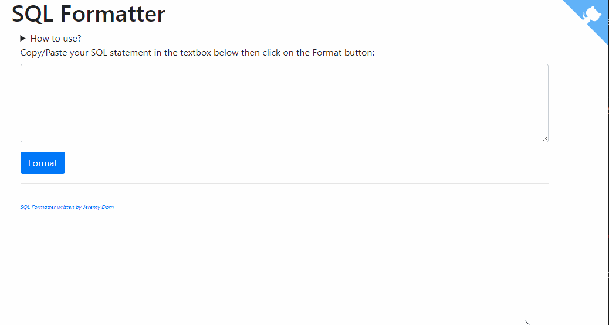

<TLDR>
This article introduces the author's free, self-hosted SQL Formatter tool (source on GitHub, hosted demo at sql-formatter.avonture.be), which turns unreadable single-line legacy SQL queries into properly indented, readable statements — a useful first step before reviewing old database code.
</TLDR>

When faced with legacy code, it is often useful to reformat it to make it readable.  And from there, the study of the code can begin.

There are plenty of reformatting tools for <Link to="/blog/json-lint">json</Link>, <Link to="/blog/online-php-linter">php</Link>, javascript and other languages, but far fewer for a query written in SQL.

Just copy/paste `SELECT LAT_N, CITY, TEMP_F FROM STATS, STATION WHERE MONTH = 7 AND STATS.ID = STATION.ID ORDER BY TEMP_F` in the tool and get

```sql
SELECT
    LAT_N,
    CITY,
    TEMP_F
FROM
    STATS,
    STATION
WHERE
    MONTH = 7
    AND STATS.ID = STATION.ID
ORDER BY
    TEMP_F
```

<!-- truncate -->

Retrieve my **SQL Formatter** tool and sources on [https://github.com/cavo789/sql_formatter](https://github.com/cavo789/sql_formatter).

The tool is accessible online: [https://sql-formatter.avonture.be/](https://sql-formatter.avonture.be/)



I've built a couple of similar self-hosted, single-purpose tools: <Link to="/blog/json-lint">JSON - Online linter</Link> and <Link to="/blog/excel-formatter">Excel Formula Beautifier</Link>.
