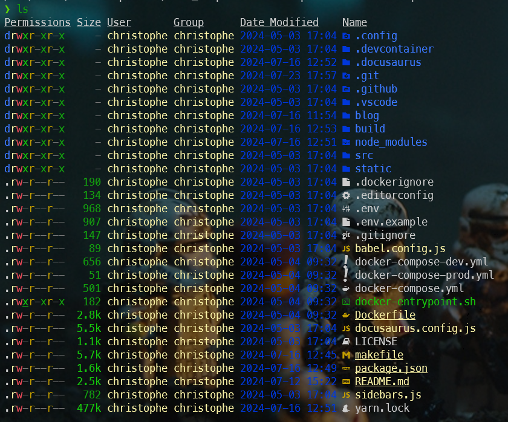

Which CLI command would you say you use most on Linux? Most definitely `ls` to display the list of files in the current directory.

:::note I don't know about you, but I rarely use `ls` without any parameters. Almost without thinking, I add `-alh` every time. It's become mechanical.
:::

And then you'll say to me, well, all you have to do is create an alias `alias ls="ls -alh"`; of course, but let's go further and revisit this basic command and add some functionality to it.

<!-- truncate -->

`eza` is a modern replacement for `ls` as stated on their website: [https://the.eza.website/](https://the.eza.website/).

:::info eza was first called exa
[https://github.com/ogham/exa](https://github.com/ogham/exa) is abandoned; see [this issue](https://github.com/ogham/exa/issues/1243).

**exa is now eza**: [https://the.eza.website/](https://the.eza.website/)
:::

## Install eza

The installation is simple, you just need to run `sudo apt-get update && sudo apt-get install eza`; nothing more.

From now, simply run `eza` on the command line and you'll get the list of files with all the defaults presets.

On my computer, I've chosen for this list of parameters: `--all --long --group --group-directories-first --icons --header --time-style long-iso` and, for sure, I've update by `~/.bashrc` file by adding an alias:

```bash
alias ls='eza --all --long --group --group-directories-first --icons --header --time-style long-iso'
```

And, now, by just typing `ls`, I'll get this:


