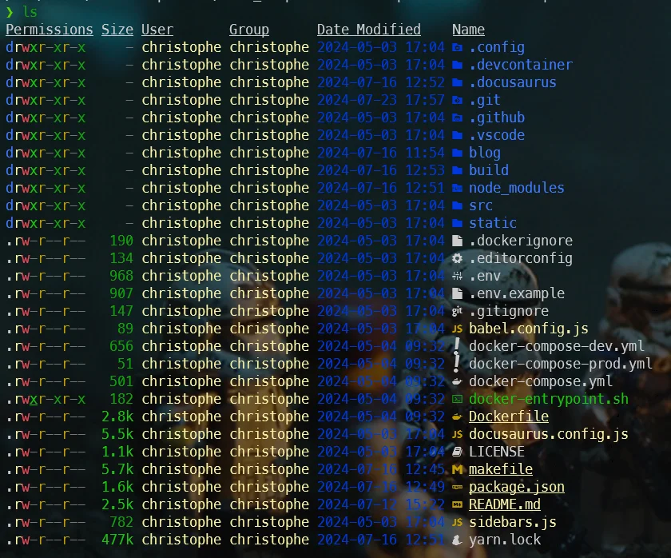

<TLDR>
This article introduces `eza`, a modern replacement for the `ls` command (formerly known as `exa`), offering better defaults, icons, and formatting. It shows how to install it with `apt-get` and set up an alias with a useful combination of flags (`--all --long --group --group-directories-first --icons --header --time-style long-iso`) so `ls` automatically uses `eza` with a richer file listing.
</TLDR>

Which CLI command would you say you use most on Linux? Most definitely `ls` to display the list of files in the current directory.

<AlertBox variant="note" title="I don't know about you, but I rarely use `ls` without any parameters. Almost without thinking, I add `-alh` every time. It's become mechanical." />

And then you'll say to me, well, all you have to do is create an alias `alias ls="ls -alh"`; of course, but let's go further and revisit this basic command and add some functionality to it.

<!-- truncate -->

`eza` is a modern replacement for `ls` as stated on their website: [https://eza.rocks/](https://eza.rocks/).

*It belongs to the same family of "modern rewrites of the classics" as <Link to="/blog/ripgrep">ripgrep</Link> (for `grep`) and <Link to="/blog/git-delta">delta</Link> (for `git diff`). While you're customizing your console, <Link to="/blog/powerlevel10k">Customize your Linux prompt with Powerlevel10k</Link> is worth ten minutes too.*

<AlertBox variant="info" title="eza was first called exa">
[https://github.com/ogham/exa](https://github.com/ogham/exa) is abandoned; see [this issue](https://github.com/ogham/exa/issues/1243).

**exa is now eza**: [https://eza.rocks/](https://eza.rocks/)

</AlertBox>

## Install eza

The installation is simple, you just need to run `sudo apt-get update && sudo apt-get install eza`; nothing more.

From now, simply run `eza` on the command line and you'll get the list of files with all the defaults presets.

On my computer, I've chosen for this list of parameters: `--all --long --group --group-directories-first --icons --header --time-style long-iso` and, for sure, I've updated my `~/.bashrc` file by adding an alias (if you're on ZSH, <Link to="/blog/modular-zsh-workflow">give that alias its own file</Link> rather than growing a monolithic `.zshrc`):

<Terminal typewriter>
$ alias ls='eza --all --long --group --group-directories-first --icons --header --time-style long-iso'
</Terminal>

And, now, by just typing `ls`, I'll get this:

