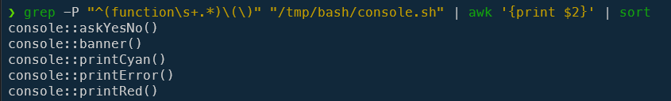
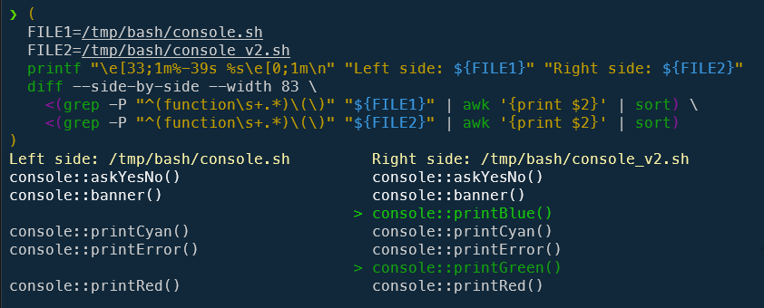
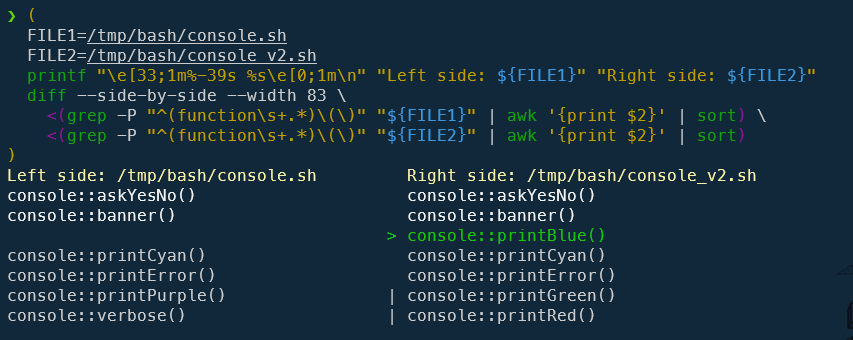
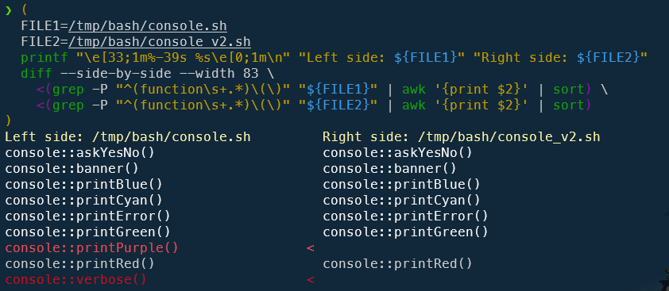
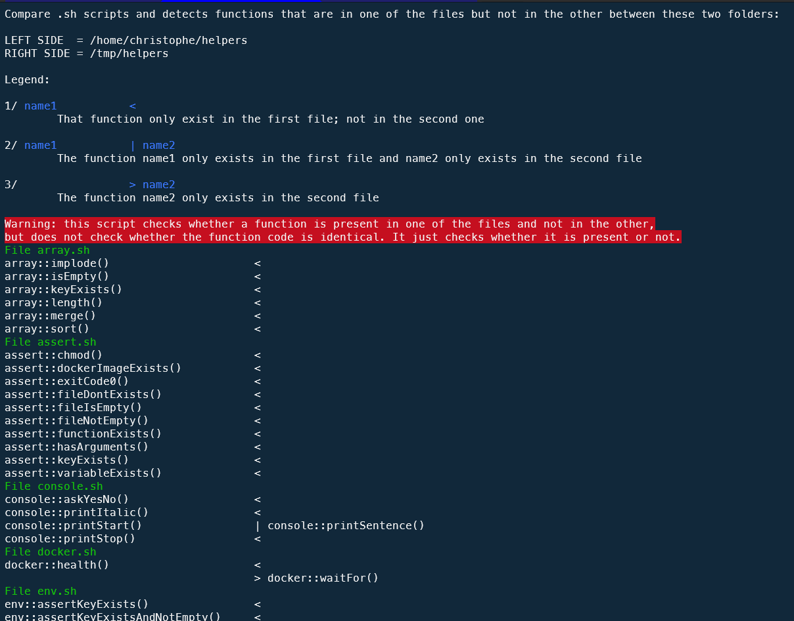
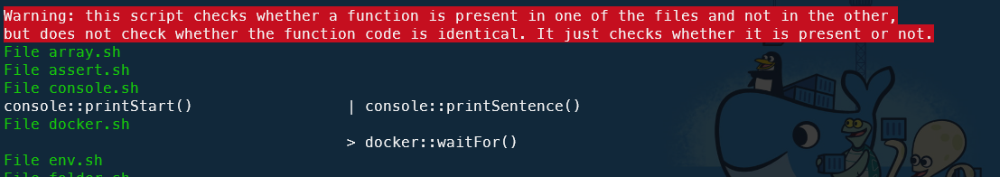

Still faced with the problem of having to compare two versions of the same script (see the article <Link to="/blog/linux-diff-file-folder">Linux - Comparing two folders/files in the console</Link>), this time we're going to consider that the file we need to compare is a Bash script and that we have two versions of it.

And that we may have made the two files evolve in different ways, i.e. that one or other, or even both, of the files may have been modified.

The aim is therefore to compare the versions and highlight the differences.

<!-- truncate -->

## Create some files for this blog post

To be able to reproduce examples used in this blog post, if you need it, please create two files.

Let's say `/tmp/bash/console.sh` for the first file with this content:

<Snippet filename="/tmp/bash/console.sh">

```bash
#!/usr/bin/env bash

function console::printCyan() {
}

function console::askYesNo() {
}

function console::printRed() {
}

function console::printError() {
}

function console::banner() {
}
```

</Snippet>

And, for `/tmp/bash/console_v2.sh`, we'll add two new functions, `printGreen` and `printBlue`, in that order:

<Snippet filename="/tmp/bash/console_v2.sh">

```bash
#!/usr/bin/env bash

function console::printCyan() {
}

function console::askYesNo() {
}

function console::printRed() {
}

function console::printError() {
}

function console::banner() {
}

function console::printGreen() {
}

function console::printBlue() {
}
```

</Snippet>

## Get the list of functions in a Bash script

To get the list of functions declared in a script (let's say `/tmp/bash/console.sh`), just run the command below:

```bash
grep -P "^(function\s+.*)\(\)" "/tmp/bash/console.sh" | awk '{print $2}' | sort
```

This function will retrieve any functions in the file i.e. lines starting with the word `function` followed by any whitespace character then the name of the function then followed by parenthesis. And, finally, sort the list:



## Compare the two versions of the same Bash script and shows which functions are in one and not the other

Regardless of the order in which the functions are declared, the script below, which you can copy and paste into the console, will find the list of functions in the two files, sort the list and compare which functions are in one version and which are not in the other:

```bash
(
  FILE1=/tmp/bash/console.sh
  FILE2=/tmp/bash/console_v2.sh
  printf "\e[33;1m%-39s %s\e[0;1m\n" "Left side: ${FILE1}" "Right side: ${FILE2}"
  diff --side-by-side --width 83 \
    <(grep -P "^(function\s+.*)\(\)" "${FILE1}" | awk '{print $2}' | sort) \
    <(grep -P "^(function\s+.*)\(\)" "${FILE2}" | awk '{print $2}' | sort)
)
```

As you can see, we immediately see that the second file has two additions.



Of course, if we add a new function in `console.sh` and f.i. remove an existing one, we can see it too:



On the image here above, we see three indicators in the middle of the screen:

```text
                                      > console::printBlue()
console::printPurple()                | console::printGreen()
console::verbose()                    | console::printRed()
```

The line with the `>` indicator means that `console::printBlue()` was found only in the second file so we know our first file didn't declare `printBlue`.

And lines with the `|` indicator highlight that we've a mismatch. On both sides we had sorted our list and so, if the same function had been on both sides, we would have had a match. But that's not the case here. On one side we have, for example, `printPurple` while on the other we have `printGreen`. And we've `verbose` and on the other side `printRed`. We can conclude that, in the first file, we don't have `printGreen` and `printRed` and, we don't have `printPurple` and `verbose` in the second file.

By adding `printBlue`, `printGreen` and `printRed` in our first file, now we got:



So now, we can see a new indicator `<`: the function was retrieved only in the first file and not in the second one. Once again, we've the confirmation that we've two new functions (`printPurple` and `verbose`) in our first file and not in the second one.

Right now, our `/tmp/bash/console.sh` contains this:

<Snippet filename="/tmp/bash/console.sh">

```bash
#!/usr/bin/env bash

function console::printCyan() {
}

function console::askYesNo() {
}

function console::printPurple() {
}

function console::verbose() {
}

function console::printError() {
}

function console::banner() {
}

function console::printBlue() {
}

function console::printGreen() {
}

function console::printRed() {
}
```

</Snippet>

and, for `/tmp/bash/console_v2.sh`:

<Snippet filename="/tmp/bash/console_v2.sh">

```bash
#!/usr/bin/env bash

function console::printCyan() {
}

function console::askYesNo() {
}

function console::printRed() {
}

function console::printError() {
}

function console::banner() {
}

function console::printGreen() {
}

function console::printBlue() {
}

```

</Snippet>

:::info The order has no important
Unlike a comparison with `diff`, the order in which the functions appear in the scripts is irrelevant, as we are sorting them.
:::

## Compare Bash scripts in two folders

In the previous chapter, we've seen how to compare two versions of the same script. Let's go one step further and compare two folders: for each script in the two folders, let's run a comparison.

To do this, create the `compare.sh` script on your hard drive with this content:

<Snippet filename="compare.sh">

```bash
#!/usr/bin/env bash

clear

if [ ! $# -eq 2 ]; then
  echo "Usage: $0 <folder_1> <folder_2>"
  exit 1
fi

sourceFolder="$1"
compareWithFolder="$2"

[[ ! -d "${sourceFolder}" ]]      && echo "Error: Source folder ${sourceFolder} not found." &&  exit 1
[[ ! -d "${compareWithFolder}" ]] && echo "Error: CompareWith folder ${compareWithFolder} not found." &&  exit 1

pushd "${sourceFolder}" >/dev/null

printf "\e[37;1m%s\e[0;1m\n\n" "Compare .sh scripts and detects functions that are in one of the files but not in the other between these two folders:"
printf "\e[37;1m%s\e[0;1m\n" "LEFT SIDE  = ${sourceFolder}"
printf "\e[37;1m%s\e[0;1m\n\n" "RIGHT SIDE = ${compareWithFolder}"

printf "\e[37;1m%s\e[0;1m\n\n" "Legend:"
printf "\e[37;1m1/ \e[34;1m%s\e[0;1m\n" "name1           <"
printf "\e[37;1m\t%s\e[0;1m\n\n" "That function only exist in the first file; not in the second one"

printf "\e[37;1m2/ \e[34;1m%s\e[0;1m\n" "name1           | name2"
printf "\e[37;1m\t%s\e[0;1m\n\n" "The function name1 only exists in the first file and name2 only exists in the second file"

printf "\e[37;1m3/ \e[34;1m%s\e[0;1m\n" "                > name2"
printf "\e[37;1m\t%s\e[0;1m\n\n" "The function name2 only exists in the second file"

printf "\e[41;1m%s\e[0;1m\n" "Warning: this script checks whether a function is present in one of the files and not in the other,"
printf "\e[41;1m%s\e[0;1m\n" "but does not check whether the function code is identical. It just checks whether it is present or not."

for bashScript in *.sh; do
    if [[ -f "${compareWithFolder}/${bashScript}" ]]; then
        (
            FILE1="${sourceFolder}/${bashScript}"
            FILE2="${compareWithFolder}/${bashScript}"
            printf "\e[32;1m%s\e[0;1m\n" "File ${bashScript}"
            diff --suppress-common-lines --side-by-side --width 83 \
                <(grep -P "^(function\s+.*)\(\)" "${FILE1}" | awk '{print $2}' | sort) \
                <(grep -P "^(function\s+.*)\(\)" "${FILE2}" | awk '{print $2}' | sort) && \
            printf "\e[32;1m%s\e[0;1m\n"  "The two files are identical"
        )
    fi
done

popd >/dev/null
```

</Snippet>

Now, to run it, just start `./compare.sh foldername1 foldername2`. You'll get something like below i.e. for each scripts in both folders (script in just one folder are ignored), you'll get the name of the script (like `array.sh`) followed by the text `The two files are identical` if both files are identical or, if not, a list of function names and the indicator already seen i.e. `<`, `>` or `|`.



Using this script, it is easy to keep one of the two folders as the *master* (the left-hand folder), i.e. to reproduce in it all the functions that would have been added in a script in the second folder (the one corresponding to the right-hand column).

Once a function has been identified, simply open the *right* file and copy/paste the function into the corresponding file in the *left* folder.

By adding `| grep -E -v "<$"` to our `grep` statement, we can improve the script by ignoring cases when functions are only added in the left-hand folder. Imagine the requirement *In the right-hand folder, if I've added functions to my scripts; what are these functions so that I can copy/paste them into the scripts in the left-hand folder?*

<Snippet filename="compare.sh">

```bash
#!/usr/bin/env bash

clear

if [ ! $# -eq 2 ]; then
  echo "Usage: $0 <folder_1> <folder_2>"
  exit 1
fi

sourceFolder="$1"
compareWithFolder="$2"

[[ ! -d "${sourceFolder}" ]]      && echo "Error: Source folder ${sourceFolder} not found." &&  exit 1
[[ ! -d "${compareWithFolder}" ]] && echo "Error: CompareWith folder ${compareWithFolder} not found." &&  exit 1

pushd "${sourceFolder}" >/dev/null

printf "\e[37;1m%s\e[0;1m\n\n" "Compare .sh scripts and detects functions that are in one of the files but not in the other between these two folders:"
printf "\e[37;1m%s\e[0;1m\n" "LEFT SIDE  = ${sourceFolder}"
printf "\e[37;1m%s\e[0;1m\n\n" "RIGHT SIDE = ${compareWithFolder}"

printf "\e[37;1m%s\e[0;1m\n\n" "Legend:"
printf "\e[37;1m1/ \e[34;1m%s\e[0;1m\n" "name1           <"
printf "\e[37;1m\t%s\e[0;1m\n\n" "That function only exist in the first file; not in the second one"

printf "\e[37;1m2/ \e[34;1m%s\e[0;1m\n" "name1           | name2"
printf "\e[37;1m\t%s\e[0;1m\n\n" "The function name1 only exists in the first file and name2 only exists in the second file"

printf "\e[37;1m3/ \e[34;1m%s\e[0;1m\n" "                > name2"
printf "\e[37;1m\t%s\e[0;1m\n\n" "The function name2 only exists in the second file"

printf "\e[41;1m%s\e[0;1m\n" "Warning: this script checks whether a function is present in one of the files and not in the other,"
printf "\e[41;1m%s\e[0;1m\n" "but does not check whether the function code is identical. It just checks whether it is present or not."

for bashScript in *.sh; do
    if [[ -f "${compareWithFolder}/${bashScript}" ]]; then
        (
            FILE1="${sourceFolder}/${bashScript}"
            FILE2="${compareWithFolder}/${bashScript}"
            printf "\e[32;1m%s\e[0;1m\n" "File ${bashScript}"
            diff --suppress-common-lines --side-by-side --width 83 \
                <(grep -P "^(function\s+.*)\(\)" "${FILE1}" | awk '{print $2}' | sort) \
                <(grep -P "^(function\s+.*)\(\)" "${FILE2}" | awk '{print $2}' | sort) | grep -E -v "<$"
        )
    fi
done

popd >/dev/null
```

</Snippet>

If we run this newer script on the exact same files, now, lines ending with `<` are hidden (only in the left-hand folder) and we just obtains cases when a function is present in the right-hand folder:



This makes it even easier to identify these functions and copy/paste them to the left, for example.
