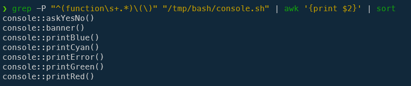
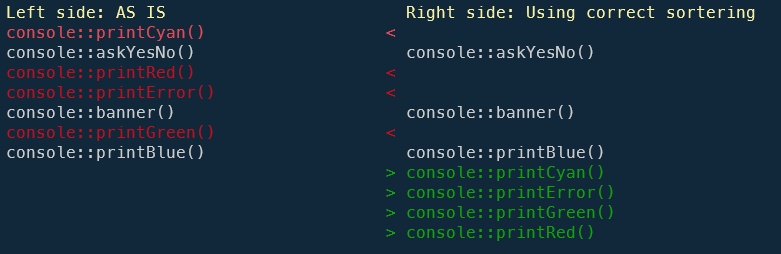
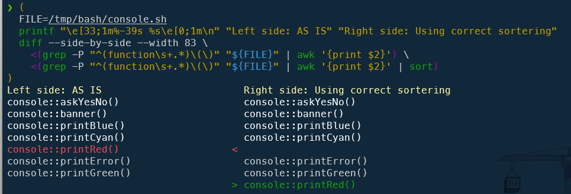
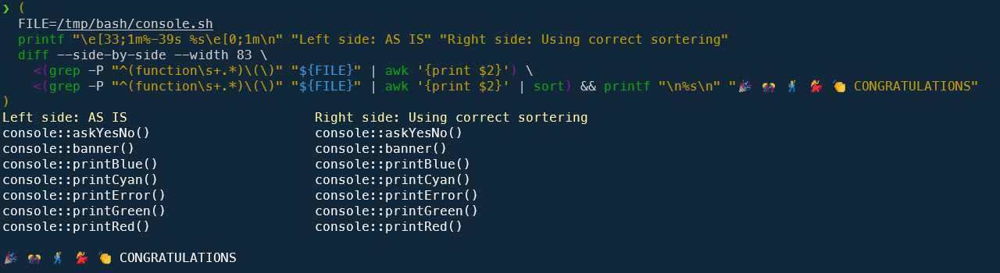
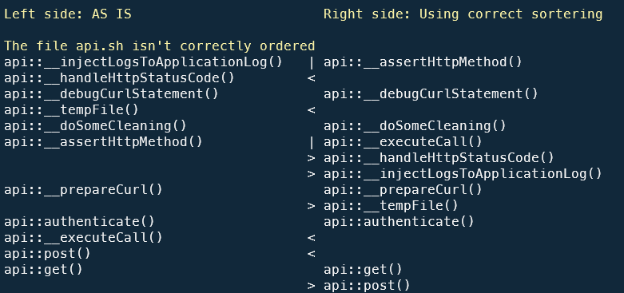
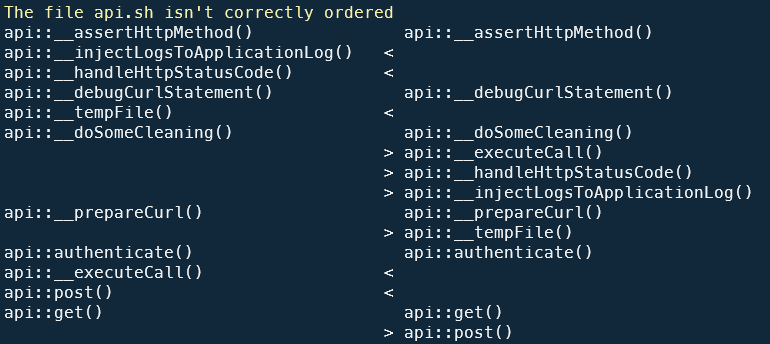
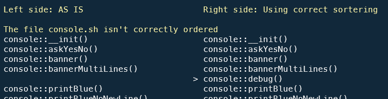

In a previous [article](/blog/linux-compare-two-versions-of-the-same-script), we've seen a simple CLI command to display the list of functions present in a script but what about a Bash script that will scan an entire folder; retrieve any `.sh` scripts and check if functions are sorted in the files?

<!-- truncate -->

## Create a simple Bash script to play with this blog post

Please create the `/tmp/bash/console.sh` file on your disk with this content:

```bash
#!/usr/bin/env bash

function console::printCyan() {
}

function console::askYesNo() {
}

function console::printRed() {
}

function console::printError() {
}

function console::banner() {
}

function console::printGreen() {
}

function console::printBlue() {
}
```

As we can see, we'll just create empty functions in no particular order.

## Get the list of functions in a Bash script

To get the list of functions declared in a script, just run the command below:

```bash
grep -P "^(function\s+.*)\(\)" "/tmp/bash/console.sh" | awk '{print $2}' | sort
```



Ok, now, we know how to sort the list of functions in the console.

Let's use `diff` to compare our existing file (left-hand side) and the sorted list of functions (right-hand side):

```bash
(
  FILE=/tmp/bash/console.sh
  printf "\e[33;1m%-39s %s\e[0;1m\n" "Left side: AS IS" "Right side: Using correct sorter"
  diff --side-by-side --width 83 \
    <(grep -P "^(function\s+.*)\(\)" "${FILE}" | awk '{print $2}') \
    <(grep -P "^(function\s+.*)\(\)" "${FILE}" | awk '{print $2}' | sort)
)
```

As we can see on the image below, the column at the left show that the first-defined function in the `/tmp/bash/console.sh` script is `console::printCyan` followed by `console::askYesNo` and `console::printRed` for the third function declared (in that order) in the Bash script.

In the right column, we can see that the first, sorted, function is `console::askYesNo`, the second is `console::banner` and so on.



Back to the left column: the name displayed in white are already in the correct order!

Let's update partially the `/tmp/bash/console.sh` file and reorder some functions:

```bash
#!/usr/bin/env bash

function console::askYesNo() {
}

function console::banner() {
}

function console::printBlue() {
}

function console::printCyan() {
}

function console::printRed() {
}

function console::printError() {
}

function console::printGreen() {
}
```

Now, rerunning the same command:



We just need to put `console::printRed()` at the end and we'll be fine and, to give some positive feedback, use this enhanced version:

```bash
(
  FILE=/tmp/bash/console.sh
  printf "\e[33;1m%-39s %s\e[0;1m\n" "Left side: AS IS" "Right side: Using correct sorter"
  diff --side-by-side --width 83 \
    <(grep -P "^(function\s+.*)\(\)" "${FILE}" | awk '{print $2}') \
    <(grep -P "^(function\s+.*)\(\)" "${FILE}" | awk '{print $2}' | sort) && printf "\n%s\n" "🎉 🎊 🕺 💃 👏 CONGRATULATIONS"
)
```



If you see this, perfect, functions are correctly ordered in your script.

## Process all scripts from a specific folder

We have just seen, on the command line, how to check whether a Bash script declaring functions does so in alphabetical order.

Let's move on to the industrialization of this concept: a script that will scan each .sh file in a specific folder and check whether the functions are defined in the file in alphabetical order. 

If this is the case, we won't have any display so as not to pollute our console.

If this is not the case, the left-hand side of the screen shows the current order of function declarations and the right-hand side shows the expected order, sorted alphabetically.

To do this, create the `order.sh` script on your hard drive with this content:

```bash
#!/usr/bin/env bash

clear

if [ ! $# -eq 1 ]; then
  echo "Usage: $0 <folder>"
  exit 1
fi

sourceFolder="$1"

[[ ! -d "${sourceFolder}" ]]  && echo "Error: Source folder ${sourceFolder} not found." &&  exit 1

printf "\e[37;1m%s\e[0;1m\n\n" "Check if functions declared in Bash .sh script in folder ${sourceFolder} are correctly ordered in the file."

printf "\e[33;1m%-39s %s\e[0;1m\n\n" "Left side: AS IS" "Right side: Using correct sorter"

pushd "${sourceFolder}" >/dev/null

set +e

for bashScript in *.sh; do 
    result="$(diff --side-by-side --width 83 \
        <(grep -P "^(function\s+.*)\(\)" "${bashScript}" | awk '{print $2}') \
        <(grep -P "^(function\s+.*)\(\)" "${bashScript}" | awk '{print $2}' | sort))"
    
    if ! [[ $? -eq 0 ]]; then
        printf "\e[33;1m%s\e[0;1m\n" "The file ${bashScript} isn't correctly ordered"
        printf "\e[37;1m%s\e[0;1m\n" "${result}"
    fi
done

set -e

popd >/dev/null
```

And now, start the script like this: `./order.sh  ~/helpers`. The expected parameter is the name of a folder containing `.sh` files.



What does that means?  My `~/helpers/api.sh` script is actually (left side) really poorly sorted since there are a lot of differences with the right column (perfect ordering).

The first function in my file is `api::__injectLogsToApplicationLog` while there is a `api::__assertHttpMethod` function later in the code.

By editing my file and moving `api::__assertHttpMethod` at the top of my script, now, by rerunning the script:



Ok, so now, still at the right side, we can see `api::__debugCurlStatement` is expected in the second position, `api::__doSomeCleaning` as the third one then `api::__executeCall()` and so one (as we can see in the right side).

As soon as the `api.sh` file is correctly sorted, rerunning the script won't mention anymore the script but other ones.



The final objective is thus: we expect no output with the script. If all Bash scripts are correctly sorted then the `order.sh` script is no longer going to find any differences, which is in fact what we want.
