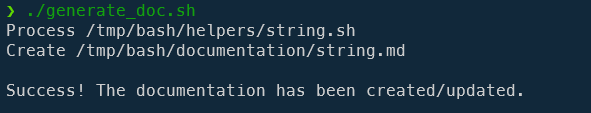

<!-- cspell:ignore HEllow -->

When writing Bash scripts, I'm always putting some description block in front of any functions like I do in any language (think to [PHP Docblock](https://docs.phpdoc.org/guide/getting-started/what-is-a-docblock.html)).

With PHP, there are a few tools like phpDocumentor for extracting these blocks and generate documentation but do such tools exist for Bash? I don't know, I haven't found any.

So I've written a small Bash script to accomplish this i.e. parse any `.sh` file present in a folder, extract doc blocks and create one markdown document for any retrieved script. Each function's documentation will then be copied in Markdown, then a table of contents will be appended and, finally, a generic readme.md file will display the list of markdown files retrieved.

<!-- truncate -->

Let's consider this `/tmp/bash/helpers/string.sh` file:

<Snippet filename="/tmp/bash/helpers/string.sh" source="./files/string.sh" />

We now need to create the `generate_doc.sh` script. Since it's a big script, please click on the next line to get his content. Click again to hide the code.

Please create the file `/tmp/bash/generate_doc.sh` with this content:

<Snippet filename="/tmp/bash/generate_doc.sh" source="./files/generate_doc.sh" />

Once you've created the `/tmp/bash/generate_doc.sh` file and make it executable (`chmod +x ./generate_doc.sh`), just run `./generate_doc.sh` in the console.



The script will process any `.sh` file located in the `helpers` sub-folder (we've created the `string.sh` earlier).

For one file found in the `helpers` folder, the same file will be created in the `documentation` folder so a file called `string.md` will be created. In that markdown file, any functions having a doc-block will be described.

Here the content of the `documentation/string.md` file:

<Snippet filename="documentation/string.md">

```markdown
<!--
    This documentation has been generated automatically.
    Run the generation script (true) to update it if needed

    Last refresh date: xxx
-->

# Documentation string.sh

## List of functions

  * [public function string::upper](#public-function-stringupper)
    * [Description](#description)
    * [Examples](#examples)
    * [Return](#return)
    * [Exit code](#exit-code)

### public function string::upper

#### Description

Make a string uppercase.

#### Examples

echo "HEllow WoRLD!" | string::upper
#Output
HELLO WORLD!

title="$(echo "Project title" | string::upper)"

#### Return

The string in uppercase

#### Exit code

* 0 If successful.
* 1 An error has occurred.

https://github.com/jmcantrell/bashful/blob/master/bin/bashful-utils#L33
```

</Snippet>

And, once every .sh files are processed, a final `documentation/readme.md` file will be created:

<Snippet filename="documentation/readme.md">

```markdown
<!--
    This documentation has been generated automatically.
    Run the generation script (generate_doc.sh) to update it if needed

    Last refresh date: xxx
-->

# List of helpers

* [string.md](string.md)
```

</Snippet>
