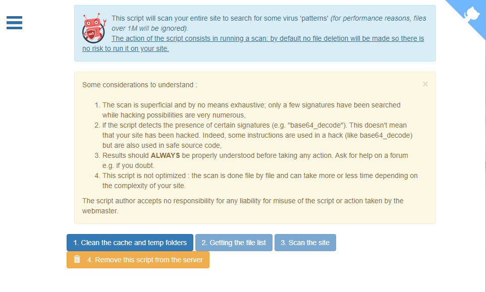
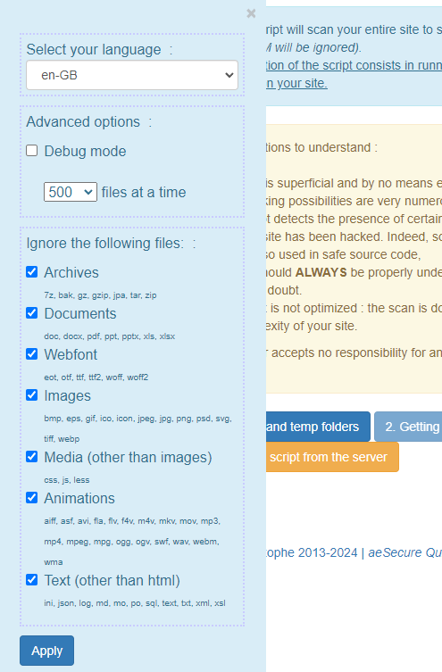

<!-- cspell:ignore aesecure,quickscan -->

In 2018, I published the first version of my free tool, aeSecure QuickScan.

Still up to date, my scanner detects over 45,000 virus signatures and is optimised for Joomla sites.

aeSecure QuickScan recognises native Joomla files from version 1.0.13 up to version J5.1.0.

Simply download the scanner onto your site, run it from a URL and it will scan the site to quickly identify certain viruses or suspicious signatures.

<!-- truncate -->

## Demo

Want to see a demo; just click here: [https://quickscan.avonture.be/](https://quickscan.avonture.be/).

The scanner is running on demo website so you can see how it looks like.

## Download

Please follow this URL: [https://raw.githubusercontent.com/cavo789/aesecure_quickscan/master/aesecure_quickscan.php](https://raw.githubusercontent.com/cavo789/aesecure_quickscan/master/aesecure_quickscan.php), press <kbd>CTRL</kbd>+<kbd>A</kbd> to select the entire content add press <kbd>CTRL</kbd>+<kbd>C</kbd> to copy it in memory.

Go to the folder containing your website (preferably on your local computer), create a new file called f.i. `scan.php` and paste there the content by using <kbd>CTRL</kbd>+<kbd>V</kbd>.

It's simple, no?

So, now, you've copied the scanner engine. Just access the scanner by starting your website like you do every time (let's say by starting  `http://localhost` for a local version of the site) and add the name of the script (so, in short, `http://localhost/scan.php`).

:::info
It's not recommended to do this directly on your real site on the internet but you can. In that case, start your FTP client, do a FTP connection to your site, create a remote `scan.php` file, start your browser and go to your website.

It's not recommended because the scanner will require some computation time and your hosting company will probably stop the process when the PHP script will take more than xxx seconds (will depend on your configuration).

By running the scanner locally, you'll not have such *timeout* problems.
:::

## Run the scanner

Just start your browser and go to the URL where your site is accessible. At the end of the URL, just add `/scan.php` i.e. the name of the file you just created.

The first button *1. Clean the cache and temp folders* will allow you to remove any temporary files so to improve the speed of the scanner by not scanning unneeded files.

Once you've clicked on the first button and action is done, the second button *2. Getting the file list* will browse your website and check if files should be scanned or not.

A file won't be scanned if his signature (his hash) is strictly the same of a "whitelisted" one.

:::White list concept
Think to original files of Joomla. When you do a new installation of Joomla let's say 5.2.0; files contained in the ZIP of Joomla are considered as safe. You trust these files to not contains any viruses. So, original files; coming from Joomla installation if they're **unmodified** are safe. If their signature are strictly the same then files coming from Joomla, aeSecure QuickScan knows that the file is safe. These file's signatures are white listed.
:::

So, step 2 will detect which files are not in a white list and should be scanned.

The third button *3. Scan the site* will start the real scan action. That one can take time and, therefore, it's better to do the scan on your localhost.

The scan is done using Ajax calls.

The last button *4. Remove this script from the server* will make sure to not keep the scanner (the `scan.php` file) onto your website. The script should be removed and not stay there.

## In-depth

During the discovering of your website (*2. Getting the file list*), the scanner will first try to determine if your site is running Joomla and if so, will retrieve the installed version. This step is very fast and will help for getting a boost on performance.

As soon as the scanner has, f.i., detected you're running Joomla 5.2.0, the scanner engine will go to [https://github.com/cavo789/aesecure_quickscan/tree/master/hashes/joomla](https://github.com/cavo789/aesecure_quickscan/tree/master/hashes/joomla) and try to find a file for that version (i.e. `J!5.2.0.json`). If found that version is supported by the scanner and a JSON file will be downloaded. That one contains the file's signatures as we've introduced in the previous chapter.

The scanner will start the get the list of all files of your website and calculate his signature (hash). If the signature is retrieved in the signature file (the JSON), the file will be known as safe.

At the end of action 2, we've then the list of unknown files, the ones the scanner should scan for viruses.

Scanning the site (action 3) means then scan only unknown files; those not on the whitelist. By default, maximum 500 files will be scanned at a time. If your web server returns a timeout (meaning the scan has taken too many times and the server has stopped the action), you can try to reduce the number by clicking on the top left accordion to get the menu and select a lower value:

## Read more

Want to read more? Please go to [https://github.com/cavo789/aesecure_quickscan/blob/master/readme.md](https://github.com/cavo789/aesecure_quickscan/blob/master/readme.md) to continue your discovering.
