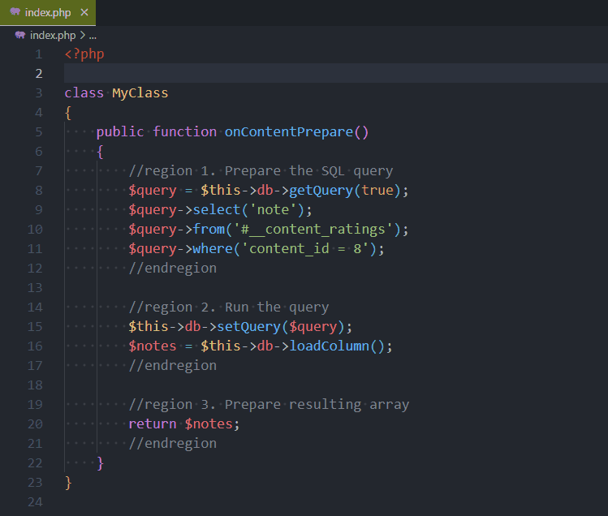
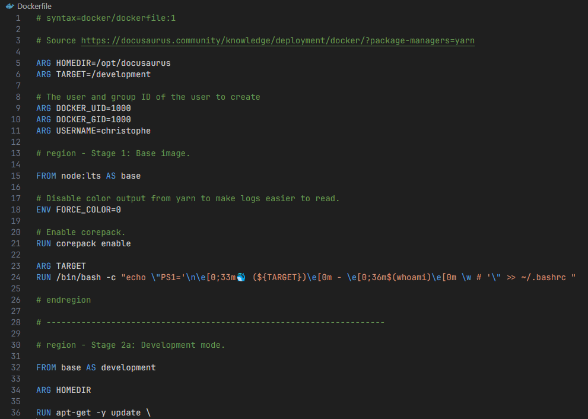
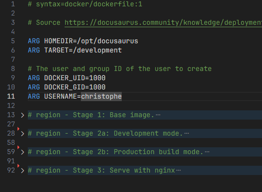
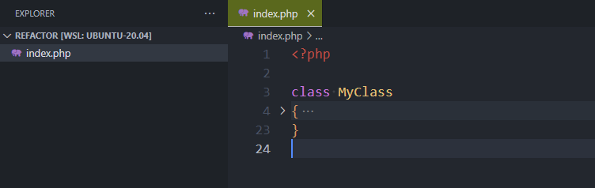

<!-- cspell:ignore hadolint,skel,maptz,regionfolder,specialised -->

VSCode supports `region` and `endregion` tags but not everywhere. These two special tags can be written differently depending on the language you're using but have, always, the same objective: allow you to fold part of the code.

Not everywhere means, for instance, VSCode didn't support code folding by default in Dockerfile. Let's see how to solve this.

<!-- truncate -->

## Code folding in PHP

Consider the following, very basic, example (*very brief example for illustrative purposes*):

<Snippet filename="my_class.php">

```php
<?php

class MyClass
{
    public function onContentPrepare()
    {
        $query = $this->db->getQuery(true);
        $query->select('note');
        $query->from('#__content_ratings');
        $query->where('content_id = 8');

        $this->db->setQuery($query);
        $notes = $this->db->loadColumn();

        return $notes;
    }
}
```

</Snippet>

We can clearly identify three blocks: preparation of the query, run it and return the data. Using regions, we can do this:

<Snippet filename="my_class.php">

```php
<?php

class MyClass
{
    public function onContentPrepare()
    {
        //region 1. Prepare the SQL query
        $query = $this->db->getQuery(true);
        $query->select('note');
        $query->from('#__content_ratings');
        $query->where('content_id = 8');
        //endregion

        //region 2. Run the query
        $this->db->setQuery($query);
        $notes = $this->db->loadColumn();
        //endregion

        //region 3. Prepare resulting array
        return $notes;
        //endregion
    }
}
```

</Snippet>

And now, why folding can be really useful: we can fold / unfold them:



:::tip You should avoid having functions having more than 60 lines
Regions are supported by a very large number of languages, but don't make the mistake of assuming that this allows you to have functions of several dozen lines. That's not the point!  If you have long functions, you need to split them up. You need to create smaller, more specialised functions. We've already touched on this point in a <Link to="/blog/vscode-php-refactoring">previous post</Link>.
:::

## What to do when VSCode didn't support these tags by default?

Let's take a look and the following Dockerfile:

<Snippet filename="Dockerfile">

```docker
# syntax=docker/dockerfile:1

# Source https://docusaurus.community/knowledge/deployment/docker/?package-managers=yarn

ARG HOMEDIR=/opt/docusaurus
ARG TARGET=/development

# The user and group ID of the user to create
ARG DOCKER_UID=1000
ARG DOCKER_GID=1000
ARG USERNAME=christophe

# Stage 1: Base image.

FROM node:lts AS base

# Disable color output from yarn to make logs easier to read.
ENV FORCE_COLOR=0

# Enable corepack.
RUN corepack enable

ARG TARGET
RUN /bin/bash -c "echo \"PS1='\n\e[0;33m🐳 (${TARGET})\e[0m - \e[0;36m$(whoami)\e[0m \w # '\" >> ~/.bashrc "

# --------------------------------------------------------------------

# Stage 2a: Development mode.

FROM base AS development

ARG HOMEDIR

RUN apt-get -y update \
    && apt-get install --yes --no-install-recommends git \
    && git config --global --add safe.directory ${HOMEDIR} \
    && rm -rf /var/lib/apt/lists/*

# We'll create a new user with the same uid/gid than ours, on our host machine.
ARG DOCKER_UID
ARG DOCKER_GID
ARG USERNAME

# hadolint ignore=DL3008
RUN set -e -x \
    && if [ ! "$DOCKER_UID" = "1000" ]; then \
    groupadd --gid ${DOCKER_GID} "${USERNAME}" \
    && useradd --home-dir /home/"${USERNAME}" --create-home --uid ${DOCKER_UID} \
        --gid ${DOCKER_GID} --shell /bin/sh --skel /dev/null "${USERNAME}" ; \
    fi

USER "${USERNAME}"

# Set the working directory to `/opt/docusaurus`.
WORKDIR "${HOMEDIR}"

# --------------------------------------------------------------------

# Stage 2b: Production build mode.

FROM base AS building_production

ARG TARGET

# Target is set in the .env file to "development" or "production"
ENV NODE_ENV="${TARGET}"

# Install the latest version of Docusaurus
ARG HOMEDIR
RUN npx create-docusaurus@latest "${HOMEDIR}/" classic --javascript \
    # Remove dummy files like dummy blog, docs, ... that were added during the installation
    && rm -rf "${HOMEDIR}/blog" "${HOMEDIR}/docs" "${HOMEDIR}/src" \
    && chown -R node:node "${HOMEDIR}/"

# Set the working directory to `/opt/docusaurus`.
WORKDIR "${HOMEDIR}"

# We need our package.json / package.lock file before running yarn install
COPY package.* .

# Install dependencies with `--immutable` to ensure reproducibility.
RUN yarn install --immutable

# Copy over the source code.
COPY . "${HOMEDIR}/"

# Build the static site (generated files will be created in /opt/docusaurus/build)
RUN yarn build

# --------------------------------------------------------------------

# Stage 3: Serve with nginx

FROM nginx:stable-alpine3.19-perl AS production

RUN set -e -x; \
    apk update --no-cache && apk add --no-cache bash \
    && rm -rf /var/cache/apk/*

ARG TARGET

RUN /bin/sh -c "echo \"PS1='\n\e[0;33m🐳 (${TARGET})\e[0m - \e[0;36m$(whoami)\e[0m \w # '\" >> ~/.bashrc "

# Copy the Docusaurus build output.
ARG HOMEDIR

COPY --from=building_production "${HOMEDIR}/build /usr/share/nginx/html"

WORKDIR /usr/share/nginx/html
```

</Snippet>

By opening such file in VSCode didn't provide any collapse/expand features and we will need to scroll a lot. And we don't have a global overview of the structure.



The solution comes by installing a specialised extension: [https://marketplace.visualstudio.com/items?itemName=maptz.regionfolder](https://marketplace.visualstudio.com/items?itemName=maptz.regionfolder).

And, too, by adding these settings in your `.vscode/settings.json` file:

<Snippet filename=".vscode/settings.json">

```json
{
    "maptz.regionfolder": {
        "[dockerfile]": {
            "foldEnd": "\\# endregion",
            "foldEndRegex": "\\# endregion[\\s]*(.*)$",
            "foldStart": "\\# region [NAME],",
            "foldStartRegex": "\\# region[\\s]*(.*)$"
        }
    }
}
```

</Snippet>

Switch back to your tab in VSCode with your opened Dockerfile, press <kbd>CTRL</kbd>+<kbd>P</kbd> and run `Developer: Reload Window` to reload the window once the extension has been enabled and tadaaa!



:::tip No, it's not just a visual trick
When you're working on very long files like, for me, a Dockerfile of over 900 lines, it's really imperative to be able to have regions that you can reduce/expand.

Not only does this make it easier to read, it also facilitates the succession of 'stages' (when programming a multistage Dockerfile).
:::

## Auto fold extension

There some extensions like [Auto Fold](https://marketplace.visualstudio.com/items?itemName=bobmagicii.autofoldyeah) who can automatically fold regions when opening a file.

The idea is: when you open a file with a lot of methods, all functions are first *folded* (we just see the function name, not his content). That way you can directly see the structure of the file, the list of functions and so on without to scroll much.

If you install [Auto Fold](https://marketplace.visualstudio.com/items?itemName=bobmagicii.autofoldyeah), you also need to add the `"autofold.default": 1,` setting in your `settings.json` file.

If you don't know how to do, just press <kbd>CTRL</kbd>-<kbd>,</kbd> (the comma) to display the `Settings` page then start to type `autofold` to get access to the setting.

Now, if you open a file, his content will be automatically folded.


