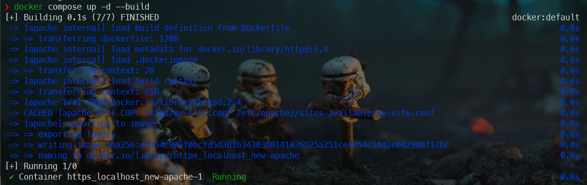
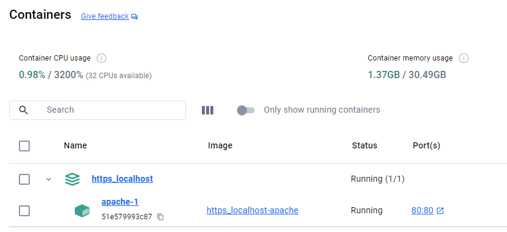
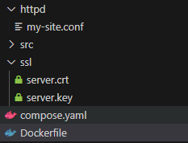
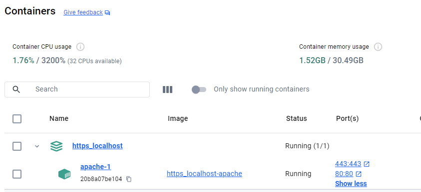
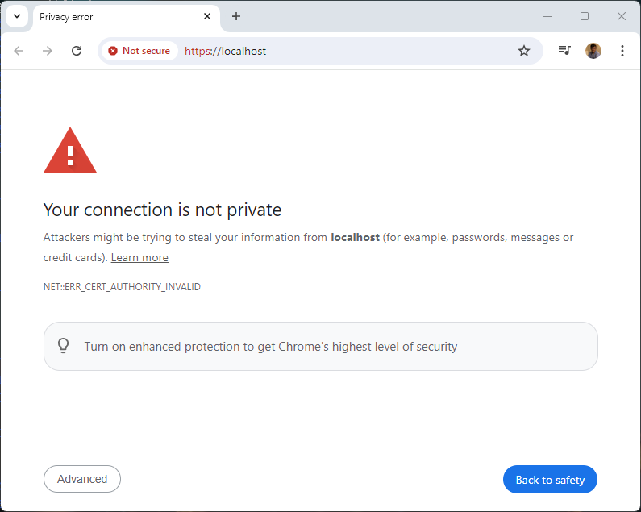
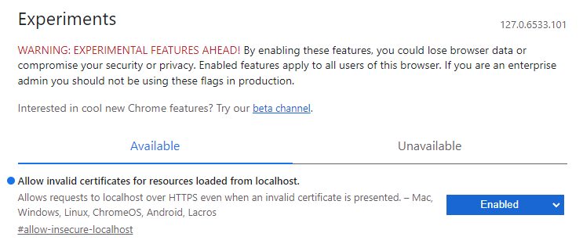
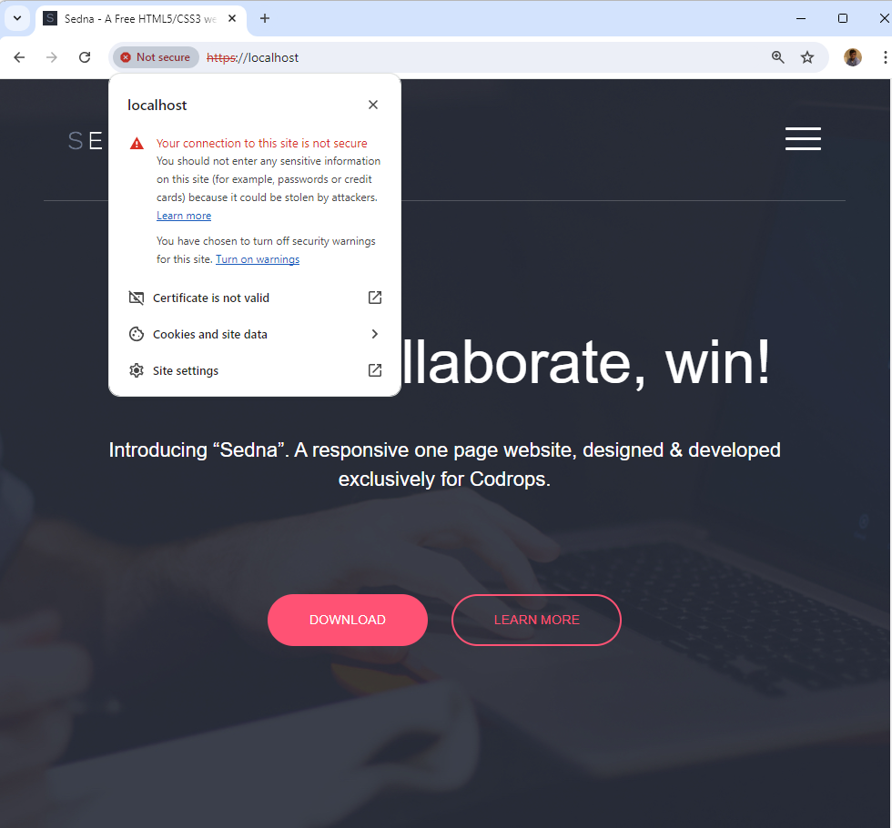

<!-- cspell:ignore htdocs,newkey,keyout,a2enmod,a2ensite,a2dissite,libapache2,unexpire,badaboum,socache,shmcb -->


In a [previous article](/blog/docker-html-site), I've explained how to run a static HTML site in seconds.

The result was a site running on your computer; using `http`. Let's go one step further and learn how to configure Docker to use `https` i.e. SSL and encryption.

In this article, you'll learn how to use Apache, nginx and PHP on your machine and be able to start `https://localhost`.

<!-- truncate -->

Our main objective is to use a [Docker Apache image](https://hub.docker.com/_/httpd) to enable access to localhost using either http or https. To do this, I need to create a so-called *self-signed* certificate and make it work... more or less.

I'm saying *more or less* because running the website over SSL will work but since it's a self-signed certificate, browsers should be configured so they'll *trust* our certificate and, too, if we're using `curl`, we'll need to add the `--insecure` flag.

Then, in the Bonus section, we'll do the same for nginx and for PHP.

## Let's start with just http

First things first, let's create our sandbox i.e. a small site that we will use for this article.

After a quick search on github.com, I've found a nice free one page html5/css3 template: [https://github.com/peterfinlan/Sedna](https://github.com/peterfinlan/Sedna).

### Create a temporary folder and download a sample static site

Let's download the **Sedna** demo site in a temporary folder on our hard disk, unzip the file, rename the default folder name `Sedna-master` to `src` and run the website using Docker:

```bash
mkdir -p /tmp/https_localhost && cd $_
wget https://github.com/peterfinlan/Sedna/archive/refs/heads/master.zip
unzip master.zip && rm master.zip && mv Sedna-master src
docker run -d --name static-site -p 80:80 -v ./src:/usr/local/apache2/htdocs httpd:2.4
```

Once these commands have been fired, please jump to `http://locahost:8080` and you'll get this:


:::tip Crazy easy, no?
:::

The site is running using the http protocol but https is not yet possible. So, let's continue...

Right now, please remove the running container; we'll create it back later on:

```bash
docker container rm static-site --force
```

### Creation of some files we will need

As we've seen, we can run `docker run -d --name static-site -p 80:80 -v ./src:/usr/local/apache2/htdocs httpd:2.4` and bingo, the site is running with http.

We can't use this single line for https because, among other things, we need to use a SSL certificate and we need to configure Apache to use it.

To make things clean and maintainable, let's create some files.

Make sure you're in the `/tmp/https_localhost` folder and create the following files.

<Snippet filename="Dockerfile">

Please create a file called `Dockerfile` with the following content:

```Dockerfile
FROM httpd:2.4

COPY httpd/my-site.conf /etc/apache2/sites-available/my-site.conf
```

</Snippet>

The second file we'll need should be called `compose.yaml` with the following content:

<Snippet filename="compose.yaml">

```yaml
services:
  apache:
    build:
      context: .
    ports:
      - "80:80"
    volumes:
      - ./src:/usr/local/apache2/htdocs
```

:::tip compose.yaml is strictly equivalent to docker-compose.yml
:::

</Snippet>

The third file we'll need should be created in a `httpd` directory and has to be called `my-site.conf` with the following content:

<Snippet filename="httpd/my-site.conf">

```apache
<VirtualHost *:80>
    DocumentRoot /usr/local/apache2/htdocs
    ServerName localhost

    <Directory /usr/local/apache2/htdocs>
        AllowOverride All
        RewriteEngine On
        RewriteCond %{REQUEST_FILENAME} !-f
        RewriteRule ^(.*)$ index.html [QSA,L]
    </Directory>

    ErrorLog /usr/local/apache2/logs/error.log
    CustomLog /usr/local/apache2/logs/access.log combined

</VirtualHost>
```

:::note For a container based on Apache, the website should be copied in folder /usr/local/apache2/htdocs and not, /var/www/html; that one is for a PHP image.
:::

</Snippet>

Everything is now in place for to enable a http access. Still in the `/tmp/https_localhost` folder, now, just run `docker compose up -d --build` to build our custom Docker image and run a container i.e. start the website.

You'll get something like this in the console:



If we take a look on Docker Desktop, list of containers, we'll see our project (called `https_localhost` since it's the name of our folder in this blog post) and we'll see our `apache` service running on port 80.



By accessing `http://localhost` with the browser, we'll get our site, up and running:


Okay, so now we have confirmation that the three files we created above work and allow us http access. Let's go further with https.

## Let's begin the journey to https

We have three main actions to take:

1. Create our SSL certificate so we can use the SSL certificate,
2. We'll need to teach Apache how to deal with our certificate and
3. We'll need to update a few our Docker files.

### Create the SSL certificate

Still in our `/tmp/https_localhost` folder, please create a directory called `ssl` and we'll create our certificate there.

To do this, you can just copy/paste the code below in your console:

```bash
mkdir -p ssl
(
    cd ssl
    openssl req -x509 -nodes -days 365 -newkey rsa:2048 -keyout server.key -out server.crt -subj "/C=US/ST=MyCountry/L=MyCity/O=MyOrganization/CN=localhost"
)
```

The console will display a list of characters but you'll get two new files in the current directory: `server.crt` and `server.key`.

:::info Valid for one year
The certificate (the `.crt` file) and the private key (the `.key` file) will be valid for one year.
:::

:::note For an Apache image, files must be named like that, i.e. server.crt and server.key
As explained on [https://hub.docker.com/_/httpd](https://hub.docker.com/_/httpd), the two files should be named like that, `server.crt` and `server.key`.
:::

### Updating our Apache configuration file

We need to update our Apache configuration file and add a Virtual host for port 443 i.e. the standard one for SSL.

Please edit the `httpd/my-site.conf` existing file and add the content below.

<Snippet filename="httpd/my-site.conf">

```conf
<VirtualHost *:80>
    DocumentRoot /usr/local/apache2/htdocs
    ServerName localhost

    <Directory /usr/local/apache2/htdocs>
        AllowOverride All
        RewriteEngine On
        RewriteCond %{REQUEST_FILENAME} !-f
        RewriteRule ^(.*)$ index.html [QSA,L]
    </Directory>

    ErrorLog /usr/local/apache2/logs/error.log
    CustomLog /usr/local/apache2/logs/access.log combined

</VirtualHost>

// highlight-next-line
<VirtualHost *:443>
    // highlight-next-line
    DocumentRoot /usr/local/apache2/htdocs
    // highlight-next-line
    ServerName localhost
    // highlight-next-line

    // highlight-next-line
    SSLEngine on
    // highlight-next-line
    SSLCertificateFile "/usr/local/apache2/conf/server.crt"
    // highlight-next-line
    SSLCertificateKeyFile "/usr/local/apache2/conf/server.key"
    // highlight-next-line

    // highlight-next-line
    <Directory /usr/local/apache2/htdocs>
        // highlight-next-line
        AllowOverride All
        // highlight-next-line
        RewriteEngine On
        // highlight-next-line
        RewriteCond %{REQUEST_FILENAME} !-f
        // highlight-next-line
        RewriteRule ^(.*)$ index.html [QSA,L]
    // highlight-next-line
    </Directory>
    // highlight-next-line

    // highlight-next-line
    ErrorLog /usr/local/apache2/logs/error.log
    // highlight-next-line
    CustomLog /usr/local/apache2/logs/access.log combined
    // highlight-next-line

// highlight-next-line
</VirtualHost>
```

</Snippet>

:::caution Paths are crucial!
Folder and file names are of major importance. The two certificate files should be saved in folder `/usr/local/apache2/conf/` and be named `server.crt` and `server.key`. This because we're using an Apache Docker image; it's not the same if you're using, f.i., a PHP+Apache image.
:::

### Updating our compose.yaml file

Please edit the existing `compose.yaml` and add the new line below highlighted

<Snippet filename="compose.yaml">

```yaml
services:
  apache:
    build:
      context: .
    ports:
      - "80:80"
     # highlight-next-line
      - "443:443"
    volumes:
      - ./src:/usr/local/apache2/htdocs
```

</Snippet>

So we just need to expose the port 443 from the container to our host. That port is the standard one for the https protocol.

### And, finally, updating our Dockerfile file

The last file we need to update is our existing `Dockerfile` with the new lines below:

<Snippet filename="Dockerfile">

```Dockerfile
FROM httpd:2.4
# highlight-next-line

# highlight-next-line
RUN apt-get update \
    # highlight-next-line
    && apt-get install -y apache2-utils libapache2-mod-php openssl \
    # highlight-next-line
    && rm -rf /var/lib/apt/lists/*
# highlight-next-line

# highlight-next-line
COPY ssl/server.crt /usr/local/apache2/conf/server.crt
# highlight-next-line
COPY ssl/server.key /usr/local/apache2/conf/server.key
# highlight-next-line

COPY httpd/my-site.conf /etc/apache2/sites-available/my-site.conf
# highlight-next-line

# highlight-next-line
RUN sed -i \
    # highlight-next-line
	-e 's/^#\(Include .*httpd-ssl.conf\)/\1/' \
    # highlight-next-line
	-e 's/^#\(LoadModule .*mod_ssl.so\)/\1/' \
    # highlight-next-line
	-e 's/^#\(LoadModule .*mod_socache_shmcb.so\)/\1/' \
    # highlight-next-line
	/usr/local/apache2/conf/httpd.conf
# highlight-next-line

# highlight-next-line
RUN a2enmod ssl \
    # highlight-next-line
    && a2enmod rewrite \
    # highlight-next-line
    && a2dissite 000-default default-ssl \
    # highlight-next-line
    && a2ensite my-site
```

</Snippet>

Here we need to do a lot of stuff. We've to install (`apt-get install`) some Linux binaries to allow later use of `a2enmod` and the SSL protocol.

We need to copy our SSH key (files `server.crt` and `server.key`) in the right place.

We should also update the default `httpd.conf` file of Apache to include some files and some modules.

Finally, we should enable SSL and the mod rewrite of Apache, we've to disable the standard sites (`000-default` and `default-ssl`) and to enable ours (called `my-site`).

### Ready to run the site using both http and https

At this stage, you should have a folder structure like this:



1. A folder called `httpd` containing a file called `my-site.conf` the configuration file for Apache,
2. A folder called `src` with the HTML static website files (plenty of files; coming from Github),
3. A folder called `ssl` with the SSL certificate we've created (a public certificate called `server.crt` and a private key called `server.key`),
4. A file called `compose.yaml` and
5. A file called `Dockerfile`

## Run the site

We need to update our Docker image since we've updated the Dockerfile so we'll run `docker compose up -d --build` to do this.

If we go back to Docker Desktop, we should see this:



We've enabled our site to be able to run on port 80 (http) and 443 (https).

Now that everything is in place, just go to `https://localhost/` and badaboum... It's not working.

:::danger Connection is not private
You'll most probably see the error below with the majority of browsers.



The reason is we're using a **self-signed** certificate and browsers didn't like this.
:::

To make it working, you'll need to create an exception for such certificates.

First follow this link: [chrome://flags/#temporary-unexpire-flags-m118](chrome://flags/#temporary-unexpire-flags-m118)

Press <kbd>CTRL</kbd>+<kbd>F</kbd> and search for **localhost** then switch the feature to `Enabled`:



Now, by going back to `https://localhost` it'll work, you'll get the website but still with a **Not secure** flag:



This flag is well expected so it's not an error. We're using a self-signed certificate and therefore not really trustworthy. However, it's enough to develop in localhost and under SSL.

:::danger Be careful to files and folders names
I spent many hours - too many - writing this article. It looked simple, there are several articles here and there to give the impression that it would be easy, but it was not.

Because the majority of examples I found used a PHP or Nginx image and not Apache. Files and folders names are not the same and we should carefully used the ones required by Apache. It was not explicit at all.
:::

## Using curl

If you want to use curl to test your website, you'll get an error:

```bash
❯ curl https://localhost

curl: (60) SSL certificate problem: self-signed certificate
More details here: https://curl.se/docs/sslcerts.html

curl failed to verify the legitimacy of the server and therefore could not
establish a secure connection to it. To learn more about this situation and
how to fix it, please visit the web page mentioned above.
```

As explained above, the certificate is not valid so you have to use the `--insecure` flag and thus run: `curl https://localhost --insecure`.

:::tip See the bonus part below
Make sure to read the *Install a root CA certificate in the trust store* [chapter](#bonus---install-a-root-ca-certificate-in-the-trust-store).
:::

## Bonus - Configure nginx to use SSL

If you don't want Apache but nginx, please use files below instead.

It's basically the same but you'll notice some differences like in paths and the fact we don't need to install extra dependencies for PHP.

<Snippet filename="Dockerfile">

Please create a file called `Dockerfile` with the following content:

```Dockerfile
FROM nginx:latest

RUN apt-get update \
    && apt-get install -y openssl \
    && rm -rf /var/lib/apt/lists/*

COPY ssl/server.crt /etc/nginx/ssl/server.crt
COPY ssl/server.key /etc/nginx/ssl/server.key

COPY httpd/my-site.conf /etc/nginx/conf.d/my-site.conf
```

</Snippet>

The second file we'll need should be called `compose.yaml` with the following content:

<Snippet filename="compose.yaml">

```yaml
services:
  nginx:
    build:
      context: .
    ports:
      - "80:80"
      - "443:443"
    volumes:
      - ./src:/usr/share/nginx/html
```

:::tip compose.yaml is strictly equivalent to docker-compose.yml
:::

</Snippet>

The third file we'll need should be created in a `httpd` directory and has to be called `my-site.conf` with the following content:

<Snippet filename="httpd/my-site.conf">

```apache
server {
    listen 80;

    server_name localhost;

    root /usr/share/nginx/html;
}

server {
    listen 443 ssl;
    listen [::]:443;

    server_name localhost;

    ssl_certificate /etc/nginx/ssl/server.crt;
    ssl_certificate_key /etc/nginx/ssl/server.key;

    root /usr/share/nginx/html;
 }
```

</Snippet>

## Bonus - Configure PHP to use SSL

If you don't want Apache but PHP (because you've to execute some PHP code), please use files below instead.

It's basically the same but you'll notice some differences like in paths and the fact we don't need to install extra dependencies for PHP.

Please create a file called `Dockerfile` with the following content:

<Snippet filename="Dockerfile">

```Dockerfile
FROM php:8.3-apache

COPY ssl/server.crt /etc/ssl/certs/server.crt
COPY ssl/server.key /etc/ssl/private/server.key

COPY httpd/my-site.conf /etc/apache2/sites-available/my-ssl.conf

RUN a2enmod ssl && \
    a2enmod rewrite && \
    a2dissite 000-default default-ssl && \
    a2ensite my-ssl
```

</Snippet>

The second file we'll need should be called `compose.yaml` with the following content:

<Snippet filename="compose.yaml">

```yaml
services:
  php:
    build:
      context: .
    ports:
      - "80:80"
      - "443:443"
    volumes:
      - ./src:/var/www/html/
```

:::tip compose.yaml is strictly equivalent to docker-compose.yml
:::

</Snippet>

The third file we'll need should be created in a `httpd` directory and has to be called `my-site.conf` with the following content:

<Snippet filename="httpd/my-site.conf">

```apache
<VirtualHost *:80>
    DocumentRoot /var/www/html
    ServerName localhost

    <Directory /var/www/html>
        AllowOverride All
        RewriteEngine On
        RewriteCond %{REQUEST_FILENAME} !-f
        RewriteRule ^(.*)$ index.html [QSA,L]
    </Directory>

    ErrorLog /var/log/apache2/error.log
    CustomLog /var/log/apache2/access.log combined


</VirtualHost>

<VirtualHost *:443>
    DocumentRoot /var/www/html
    ServerName localhost

    SSLEngine on
    SSLCertificateFile "/etc/ssl/certs/server.crt"
    SSLCertificateKeyFile "/etc/ssl/private/server.key"

    <Directory /var/www/html>
        AllowOverride All
        RewriteEngine On
        RewriteCond %{REQUEST_FILENAME} !-f
        RewriteRule ^(.*)$ index.html [QSA,L]
    </Directory>

    ErrorLog /var/log/apache2/error.log
    CustomLog /var/log/apache2/access.log combined

</VirtualHost>
```

</Snippet>

## Bonus - Install a root CA certificate in the trust store

As explained [here](https://documentation.ubuntu.com/server/how-to/security/install-a-root-ca-certificate-in-the-trust-store), we can trust, locally, our self-signed certificate.

To do this, we simply need to copy our `.crt` file to our `/usr/local/share/ca-certificates` folder and update the list of certificates. This can be done using the `update-ca-certificates` command.

The code below will install the certificate we've created in the blog post (`ssl/server.crt`) to the `/usr/local/share/ca-certificates` then run the `update-ca-certificates` command:

```bash
sudo apt-get install -y ca-certificates
sudo cp ssl/server.crt /usr/local/share/ca-certificates
sudo update-ca-certificates
```

:::note The certificate should have the .crt extension
:::

And, now, we can f.i. run `curl https://localost` (without the `--insecure` flag). We'll no more received an error.
