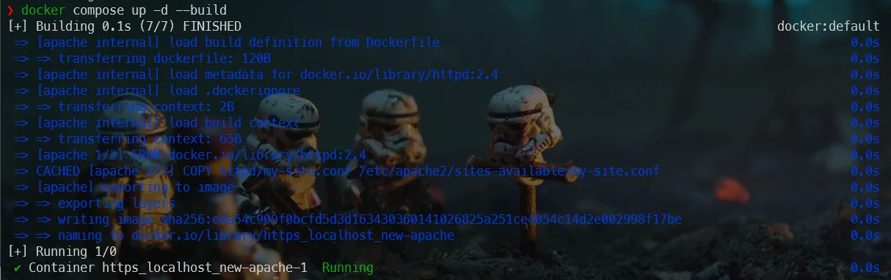
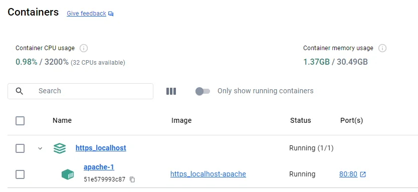
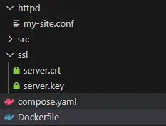
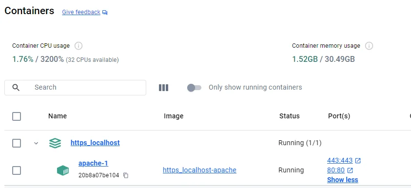
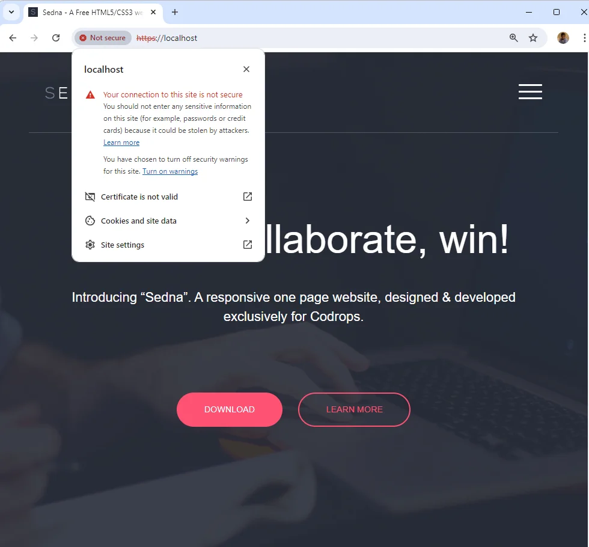

<!-- cspell:ignore htdocs,newkey,keyout,a2enmod,a2ensite,a2dissite,libapache2,unexpire,badaboum,socache,shmcb,mkcert,CAROOT,certutil -->

In a <Link to="/blog/docker-html-site">previous article</Link>, I've explained how to run a static HTML site in seconds.

The result was a site running on your computer; using `http`. Let's go one step further and learn how to configure Docker to use `https` i.e. SSL and encryption.

In this article, you'll learn how to use Apache, nginx and PHP on your machine and be able to start `https://localhost`.

<!-- truncate -->

Our main objective is to use a [Docker Apache image](https://hub.docker.com/_/httpd) to enable access to localhost using either http or https. To do this, we need a SSL certificate.

We'll use [mkcert](https://github.com/FiloSottile/mkcert), a tool that creates a local Certificate Authority (CA) and issues certificates signed by it. Once the CA is installed in your browser's trust store, `https://localhost` works without any security warning — and `curl` works without `--insecure`.

Then, in the Bonus section, we'll do the same for nginx and for PHP.

## Let's start with just http

First things first, let's create our sandbox i.e. a small site that we will use for this article.

After a quick search on github.com, I've found a nice free one page html5/css3 template: [https://github.com/peterfinlan/Sedna](https://github.com/peterfinlan/Sedna).

### Create a temporary folder and download a sample static site

Let's download the **Sedna** demo site in a temporary folder on our hard disk, unzip the file, rename the default folder name `Sedna-master` to `src` and run the website using Docker:

<Terminal typewriter>
$ mkdir -p /tmp/https_localhost && cd $_
$ wget https://github.com/peterfinlan/Sedna/archive/refs/heads/master.zip
$ unzip master.zip && rm master.zip && mv Sedna-master src
$ docker run -d --name static-site -p 80:80 -v ./src:/usr/local/apache2/htdocs httpd:2.4
</Terminal>

Once these commands have been fired, please jump to `http://localhost` and you'll get this:

<AlertBox variant="info" title="Crazy easy, no?" />

The site is running using the http protocol but https is not yet possible. So, let's continue...

Right now, please remove the running container; we'll create it back later on:

<Terminal typewriter>
$ docker container rm static-site --force
</Terminal>

### Creation of some files we will need

As we've seen, we can run `docker run -d --name static-site -p 80:80 -v ./src:/usr/local/apache2/htdocs httpd:2.4` and bingo, the site is running with http.

We can't use this single line for https because, among other things, we need to use a SSL certificate and we need to configure Apache to use it.

To make things clean and maintainable, let's create some files.

Make sure you're in the `/tmp/https_localhost` folder and create the following files.

<Snippet filename="Dockerfile" source="./files/Dockerfile" />

The second file we'll need should be called `compose.yaml` with the following content:

<Snippet filename="compose.yaml" source="./files/compose.yaml" />

<AlertBox variant="info" title="compose.yaml is strictly equivalent to docker-compose.yml" />

The third file we'll need should be created in a `httpd` directory and has to be called `my-site.conf` with the following content:

<Snippet filename="httpd/my-site.conf" source="./files/my-site.conf" />

<AlertBox variant="note" title="For a container based on Apache, the website should be copied in folder /usr/local/apache2/htdocs and not, /var/www/html; that one is for a PHP image." />

Everything is now in place to enable a http access. Still in the `/tmp/https_localhost` folder, now, just run `docker compose up -d --build` to build our custom Docker image and run a container i.e. start the website.

You'll get something like this in the console:

If we take a look on Docker Desktop, list of containers, we'll see our project (called `https_localhost` since it's the name of our folder in this blog post) and we'll see our `apache` service running on port 80.

By accessing `http://localhost` with the browser, we'll get our site, up and running:

Okay, so now we have confirmation that the three files we created above work and allow us http access. Let's go further with https.

## Let's begin the journey to https

We have three main actions to take:

1. Create our SSL certificate so we can use the SSL certificate,
2. We'll need to teach Apache how to deal with our certificate and
3. We'll need to update a few our Docker files.

### Create the SSL certificate

Still in our `/tmp/https_localhost` folder, please create a directory called `ssl` and we'll create our certificate there.

First, install [mkcert](https://github.com/FiloSottile/mkcert) if you haven't already. On Ubuntu/Debian:

<Terminal typewriter>
$ sudo apt install mkcert
</Terminal>

Then generate the local CA and the certificate:

<Terminal typewriter>
$ mkdir -p ssl
$ mkcert -install
$ mkcert -cert-file ssl/server.crt -key-file ssl/server.key localhost 127.0.0.1
</Terminal>

`mkcert -install` creates a local CA and registers it in your system's trust store. `mkcert` then issues `server.crt` and `server.key` — both files land directly in the `ssl/` folder.

The certificate covers both `localhost` (DNS) and `127.0.0.1` (IP), so accessing the site by either address works without a browser warning.

<AlertBox variant="info" title="Valid for two years">
Certificates generated by mkcert are valid for two years. To renew, simply re-run the `mkcert` command.
</AlertBox>

<AlertBox variant="note" title="For an Apache image, files must be named like that, i.e. server.crt and server.key">
As explained on [https://hub.docker.com/_/httpd](https://hub.docker.com/_/httpd), the two files should be named like that, `server.crt` and `server.key`.
</AlertBox>

### Updating our Apache configuration file

We need to update our Apache configuration file and add a Virtual host for port 443 i.e. the standard one for SSL.

Please edit the `httpd/my-site.conf` existing file and add the content below.

<Snippet filename="httpd/my-site.conf" source="./files/my-site.part2.conf" />

<AlertBox variant="highlyImportant" title="Paths are crucial!">
Folder and file names are of major importance. The two certificate files should be saved in folder `/usr/local/apache2/conf/` and be named `server.crt` and `server.key`. This because we're using an Apache Docker image; it's not the same if you're using, f.i., a PHP+Apache image.
</AlertBox>

### Updating our compose.yaml file

Please edit the existing `compose.yaml` and add the new line below highlighted

<Snippet filename="compose.yaml" source="./files/compose.part2.yaml" />

So we just need to expose the port 443 from the container to our host. That port is the standard one for the https protocol.

### And, finally, updating our Dockerfile file

The last file we need to update is our existing `Dockerfile` with the new lines below:

<Snippet filename="Dockerfile" source="./files/Dockerfile.part2" />

Here we need to do a lot of stuff. We've to install (`apt-get install`) some Linux binaries to allow later use of `a2enmod` and the SSL protocol.

We need to copy our SSL certificate and private key (files `server.crt` and `server.key`) in the right place.

We should also update the default `httpd.conf` file of Apache to include some files and some modules.

Finally, we should enable SSL and the mod rewrite of Apache, we've to disable the standard sites (`000-default` and `default-ssl`) and to enable ours (called `my-site`).

### Ready to run the site using both http and https

At this stage, you should have a folder structure like this:

1. A folder called `httpd` containing a file called `my-site.conf` the configuration file for Apache,
2. A folder called `src` with the HTML static website files (plenty of files; coming from Github),
3. A folder called `ssl` with the SSL certificate we've created (a public certificate called `server.crt` and a private key called `server.key`),
4. A file called `compose.yaml` and
5. A file called `Dockerfile`

## Run the site

We need to update our Docker image since we've updated the Dockerfile so we'll run `docker compose up -d --build` to do this.

If we go back to Docker Desktop, we should see this:

We've enabled our site to be able to run on port 80 (http) and 443 (https).

Now that everything is in place, just go to `https://localhost/` and you'll get the website:

Because we used `mkcert -install` earlier, the browser already trusts the local CA that signed our certificate — so the padlock is green and there's no security warning.

<AlertBox variant="info" title="Using Windows or WSL2?">
`mkcert -install` registers the CA in the Linux system store. If your browser runs on Windows, you also need to import the root CA into Windows. See the [Bonus section below](#bonus---install-the-mkcert-root-ca-in-your-browser) for instructions.
</AlertBox>

<AlertBox variant="danger" title="Be careful to files and folders names">
I spent many hours - too many - writing this article. It looked simple, there are several articles here and there to give the impression that it would be easy, but it was not.

Because the majority of examples I found used a PHP or Nginx image and not Apache. Files and folders names are not the same and we should carefully used the ones required by Apache. It was not explicit at all.

</AlertBox>

## Using curl

Because `mkcert -install` registered the local CA in the system trust store, `curl` works without any extra flag:

<Terminal typewriter>
$ curl https://localhost
</Terminal>

If you're on a machine where the CA is not installed (or you skipped `mkcert -install`), you'll get:

<Terminal typewriter>
$ curl https://localhost
curl: (60) SSL certificate problem: unable to get local issuer certificate
</Terminal>

In that case you can either pass the CA explicitly or use `--insecure` as a quick workaround:

<Terminal typewriter>
$ curl --cacert "$(mkcert -CAROOT)/rootCA.pem" https://localhost
$ curl --insecure https://localhost
</Terminal>

## Bonus - Configure nginx to use SSL

If you don't want Apache but nginx, please use files below instead.

It's basically the same but you'll notice some differences like in paths and the fact we don't need to install extra dependencies for PHP.

<Snippet filename="Dockerfile" source="./files/Dockerfile.part3" />

The second file we'll need should be called `compose.yaml` with the following content:

<Snippet filename="compose.yaml" source="./files/compose.part3.yaml" />

<AlertBox variant="info" title="compose.yaml is strictly equivalent to docker-compose.yml" />

The third file we'll need should be created in a `httpd` directory and has to be called `my-site.conf` with the following content:

<Snippet filename="httpd/my-site.conf" source="./files/my-site.part3.conf" />

## Bonus - Configure PHP to use SSL

If you don't want Apache but PHP (because you've to execute some PHP code), please use files below instead.

It's basically the same but you'll notice some differences like in paths and the fact we don't need to install extra dependencies for PHP.

Please create a file called `Dockerfile` with the following content:

<Snippet filename="Dockerfile" source="./files/Dockerfile.part4" />

The second file we'll need should be called `compose.yaml` with the following content:

<Snippet filename="compose.yaml" source="./files/compose.part4.yaml" />

<AlertBox variant="info" title="compose.yaml is strictly equivalent to docker-compose.yml" />

The third file we'll need should be created in a `httpd` directory and has to be called `my-site.conf` with the following content:

<Snippet filename="httpd/my-site.conf" source="./files/my-site.part4.conf" />

## Bonus - Install the mkcert root CA in your browser

When you run `mkcert -install`, the local CA is added to the trust store of your current OS. That is enough for Linux-native browsers (e.g., Firefox or Chrome running directly in Ubuntu).

If your browser runs on **Windows** — including when you work inside WSL2 or a Docker devcontainer — you need to import the root CA into the Windows certificate store too. You only have to do this once per machine.

### Find the root CA file

<Terminal typewriter>
$ mkcert -CAROOT
/home/christophe/.local/share/mkcert
$ ls $(mkcert -CAROOT)
rootCA-key.pem  rootCA.pem
</Terminal>

`rootCA.pem` is the public certificate of your local CA. Keep `rootCA-key.pem` private — anyone holding it can sign certificates that your system will trust.

### Import into Windows (from WSL2 or PowerShell)

**From WSL2**, you can use the Windows `certutil.exe` directly (WSL2 has access to Windows executables):

<Terminal typewriter>
$ CAROOT=$(mkcert -CAROOT)
$ certutil.exe -addstore -f "ROOT" "$(wslpath -w "$CAROOT/rootCA.pem")"
</Terminal>

**From a PowerShell terminal running as Administrator**:

<Terminal typewriter>
PS> certutil -addstore -f "ROOT" "$env:USERPROFILE\.local\share\mkcert\rootCA.pem"
</Terminal>

Or manually: double-click on `rootCA.pem` → *Install Certificate* → *Local Machine* → *Place all certificates in the following store* → *Trusted Root Certification Authorities*.

After importing, restart Chrome or Edge and `https://localhost` (or `https://127.0.0.1`) will show a green padlock with no warning.

### Linux system trust store only

If you only need `curl` or other command-line tools to trust the CA (without installing it in Windows), copy the root CA to the system store:

<Terminal typewriter>
$ sudo apt-get install -y ca-certificates
$ sudo cp "$(mkcert -CAROOT)/rootCA.pem" /usr/local/share/ca-certificates/mkcert-rootCA.crt
$ sudo update-ca-certificates
</Terminal>

<AlertBox variant="note" title="The file must have the .crt extension when placed in /usr/local/share/ca-certificates" />

After this, `curl https://localhost` works without any extra flag.
