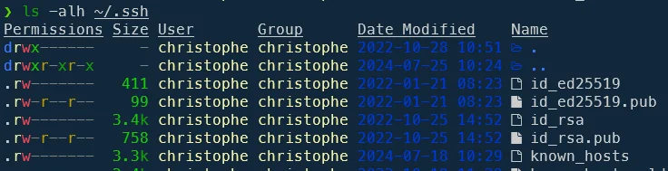
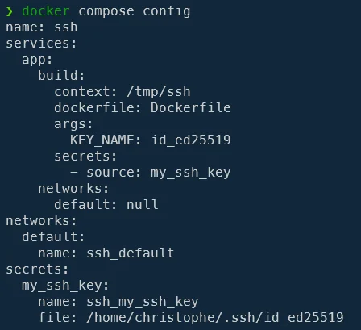
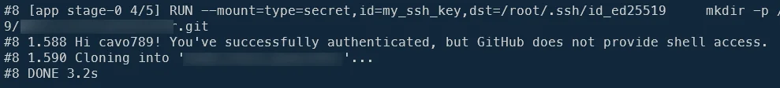
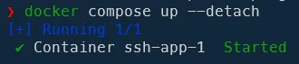
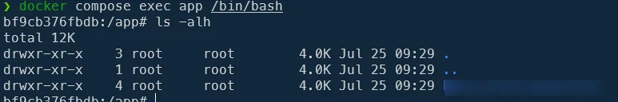
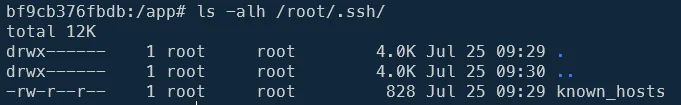
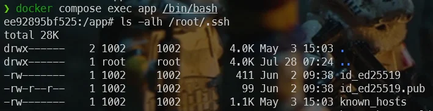
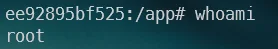

<!-- cspell:ignore keyscan -->

There are plenty articles on the Internet but I didn't find the one that allowed me, without an impressive amount of trial and error, to find the solution.

So here's another article to add to the long list: how to access a private project stored at Github when creating a Docker image. In other words, the SSH key is not stored in the image. Docker will just use your key when executing the project recovery *layer* (the one containing the `git clone` instruction) and will not keep track of the key afterwards.

<!-- truncate -->

My use case: I wish to build a Docker image and during the build phase, I need to grab a copy of a private repository I've put on github.com.

When I'll access to the container, the project will then be available but I don't have, anywhere in my image, a copy of my SSH key so I won't be able to run a `git pull` f.i. since no more authentication are possible.

## But, why is it important?

As soon as you need to access to something private like a private repository (on Github, Gitlab or anywhere else; it doesn't matter) during the build stage, Docker has to be able to connect as yourself.

You can provide your own credentials or using a token or copying your SSH key in the image or ... You can do this but **you'll be making a serious design error**: by reading your Dockerfile anyone will be able to see your private information(in case of hardcoding) or by starting an interactive bash session, it'll be able to f.i. display the list of environment variables (like using `printenv`) or trying to access to display files (like trying to access to `.git` folders, ssh folders, ...) and **it'll work!**.

Also, there are existing tools like [SecretScanner](https://github.com/deepfence/SecretScanner) allowing to deeply scan layers (a Docker image is composed in multiple layers) and even if the secret is stored in a file that no longer exists in the final image, if it has been saved in a layer, then this type of tool will be able to retrieve it.

<AlertBox variant="caution" title="">
So, in conclusion: there is only one way to use secrets using Docker and you'll learn how in this article.

</AlertBox>

## Which key to use

<AlertBox variant="caution" title="">
This part is one of the most important ones. First, of course, you should already have created a SSH key (see my <Link to="/blog/github-connect-using-ssh">Github - Connect your account using SSH and start to work with git@ protocol</Link> if needed).

Then you should know which protocol you've used and that's really important. Is your key stored in a file called `id_ed25519` or `id_rsa` or something else. Only you know.

Just run `ls -alh ~/.ssh` to get the list of your keys:

I'm using two different keys as you can see: `id_ed25519` or `id_rsa`. Files having the `.pub` extensions are the public keys; those without extensions are the private keys.

</AlertBox>

It's important to know which key has been used to link your Github profile.

You can just display the file to your console like f.i. `cat ~/.ssh/id_ed25519.pub` or `cat ~/.ssh/id_rsa.pub` (the public key file) and look at the end: is the mentioned email is the one you're using on Github.com? If yes, you've probably identified the key.

In my case, the key I've used for github.com is `id_25519` so I'll use that one in the next chapter.

## Creating files

We'll need to files; `compose.yaml` and `Dockerfile`.

### compose.yaml

Here is my `compose.yaml` content:

<Snippet filename="compose.yaml" source="./files/compose.yaml" />

As you can see, we've five specific lines.

In our `services -> app --> build` entry, we should add the `secrets` and the name of one (or more) secrets.

I've also added an argument called `KEY_NAME` just because I need to inform Docker which key I'm using (is it `id_ed25519` or `id_rsa` or another one).

Secrets have to be defined at the same indentation level of `services` and the notation is this one:

<Snippet filename="compose.yaml" source="./files/compose.part2.yaml" />

You can use what you want for `a_secret_name`; for instance, `my_ssh_key`.

<AlertBox variant="info" title="docker compose config">
You can, if you want, run `docker compose config` to check if your file is correct. You'll also see the full path for the used key.

</AlertBox>

### Dockerfile

Time to create our second file, `Dockerfile`:

<Snippet filename="Dockerfile" source="./files/Dockerfile" />

<AlertBox variant="caution" title="Think to replace cavo789/my_private_repo.git and refers one of your repositories" />

As you can see, we are setting `KEY_NAME="id_rsa"` as the default value (but will be overwritten by our declaration in the yaml file) then later on, we need to create the `/root/.ssh`folder and we are adding `github.com` in the list of known hosts.

The most important thing comes then. We should use the `RUN --mount=type=secret` syntax so inform Docker that this layer will use a Docker secret. We need to provide the name of our secret (which was set in our yaml file and it's `my_ssh_key` here) then we need to define where that secret has to be stored **during this layer**. Our variable `KEY_NAME` find his interest here: our SSH key was `id_ed25519` and this is the value of the `KEY_NAME` variable.

So, in short `--mount=type=secret,id=my_ssh_key,dst=/root/.ssh/${KEY_NAME}` will be translated to `--mount=type=secret,id=my_ssh_key,dst=/root/.ssh/id_ed25519`.

During this layer thus, our local SSH key will be saved to `/root/.ssh/id_ed25519`. The other lines in that `RUN` layer will first create a `/app` folder, jump in it, then run `ssh -T git@github.com` just for debugging (we expect to see on the screen `Hi your_name! You've successfully authenticated`) and finally we're git cloning our private repository using SSH.

## Create the image and jump in the container

Ok, so you've the created the two files on your hard disk.

Run `docker compose --progress plain build --no-cache` in your console to build the image and enable the verbose mode.

As you can see below, we can confirm that our SSH key was shared during the build process.

You'll now create the container; by running `docker compose up --detach`.

Now, just to check, we can jump inside the container by running `docker compose exec app /bin/bash`.

We can verify that our key wasn't stored in the image by running `ls -alh /root/.ssh/`

We can check too: jumping in our project folder and running `git pull` will fail with the error below:

<Terminal>
git@github.com: Permission denied (publickey).
fatal: Could not read from remote repository.

Please make sure you have the correct access rights
and the repository exists.
</Terminal>

And this is what we expect: our key isn't part of the image so we can't connect anymore to Github.

## Sharing your keys also with the container

Ok, we've seen how to share the SSH key with Docker but only during the build phase. As we've seen above, jumping in the container and running `git pull` has failed; exactly what we wanted in the previous chapter.

But now, if we need to share our key also with the container so we can work on the project, update it and push changes / pull modifications, how to do?

Please edit the `compose.yaml` file and add these two lines:

<Snippet filename="compose.yaml" source="./files/compose.part3.yaml" />

Then recreate the container by running `docker compose up --detach`. Jump in the container by running `docker compose exec app /bin/bash` and go in your project folder. Now, by running `git pull`, as you'll see, it'll work.

Why? Because your SSH keys are now part of the container as we can see by running `ls -alh /root/.ssh`:

<AlertBox variant="caution" title="Keys are not stored in the image even when you've shared them with the container">
Just to be clear: the notion of volume we've just implemented concerns the container and not the image. In other words, SSH keys are not stored in the Docker image. You could give it to someone else (e.g. by saving the image on Docker Hub); your keys won't be there and will remain on your computer. Your image and your secrets are safe.

Then, when the user run `docker compose up --detach` using the `compose.yaml` file where there are the two lines we've just added (the ones for adding the volume); these are his keys, on his computer, not yours.

</AlertBox>

<AlertBox variant="caution" title="Please take note of the running user in your container">
In our example here, the default user is `root` as we can see by jumping in the container and running `whoami`.

So, when we've started `git pull`, it was under `root`. This is why we've mounted our volume like below:

<Snippet filename="compose.yaml" source="./files/compose.part4.yaml" />

Imagine the current user was `christophe`. In that case the mount should be done like this:

<Snippet filename="compose.yaml" source="./files/compose.part5.yaml" />

</AlertBox>
