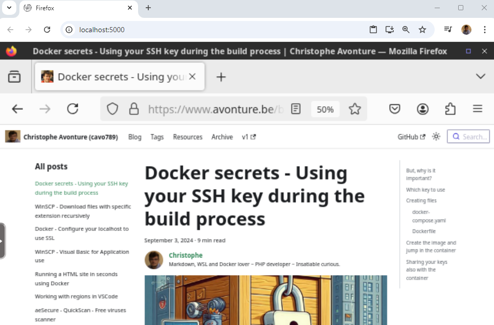
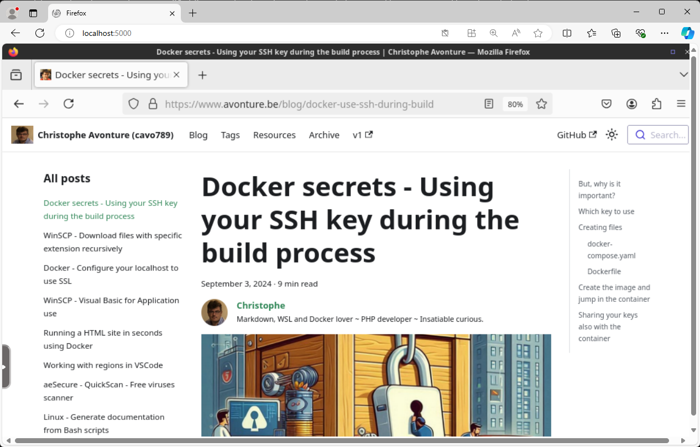
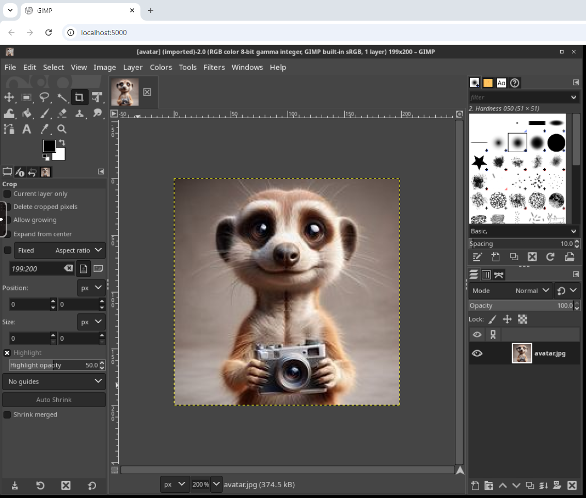

<!-- cspell:ignore seccomp,pgid,puid -->

In a future article, I'll be covering a subject I've just discovered: the possibility of running graphical interfaces in Docker and, therefore, having a Linux application running in Windows.

But first, let's take a look at a few graphical interfaces, such as Firefox or GIMP (image processing software), which can be run as if they were web applications.

<!-- truncate -->

## Start Firefox in your browser

Imagine you're a web developer and just want to check if your site can be displayed on a specific version of Firefox (without having to install the version, of course).

Copy/paste the command below in your console (coming from [https://hub.docker.com/r/linuxserver/firefox](https://hub.docker.com/r/linuxserver/firefox)):

<Terminal>
$ docker run -d \
    --name=firefox \
    --security-opt seccomp=unconfined \
    -e PUID=1000 \
    -e PGID=1000 \
    -e TZ=Etc/UTC \
    -e FIREFOX_CLI=https://www.linuxserver.io/ \
    -p 3000:3000 \
    -p 3001:3001 \
    -v /path/to/config:/config \
    --shm-size="1gb" \
    --restart unless-stopped \
    lscr.io/linuxserver/firefox:latest
</Terminal>

Then open your browser and surf to `http://localhost:3000` to start Firefox. You can then surf to any amazing site:

 <AlertBox variant="info" title="On my screenshot above, you'll see I'm using the port 5000 instead (this because my blog is running on port 3000)" />

And, for the fun, here is the same but I've started Firefox in Docker in an MS-DOS environment and, then, I've used Edge instead of Chrome:

The command I've used in DOS is: `docker run -d --name=firefox --security-opt seccomp=unconfined -e PUID=1000 -e PGID=1000 -e TZ=Etc/UTC -e FIREFOX_CLI=https://www.linuxserver.io/ -p 3000:3000 -p 3001:3001 -v %CD%\temp:/config --shm-size="1gb" --restart unless-stopped lscr.io/linuxserver/firefox:latest`.

## Start GIMP in your browser

Another example is running GIMP in the browser. Take a look on [https://github.com/linuxserver/docker-gimp?tab=readme-ov-file#docker-cli-click-here-for-more-info](https://github.com/linuxserver/docker-gimp?tab=readme-ov-file#docker-cli-click-here-for-more-info). You'll get there a command to start in your console.

First, make sure to create a subfolder called `config` and, in my example below, I'll also create a subfolder `images` where I've copied an avatar of a meerkat.

<Terminal>
$ docker run -d \
    --name=gimp \
    --security-opt seccomp=unconfined \
    -e PUID=1000 \
    -e PGID=1000 \
    -e TZ=Etc/UTC \
    -p 3000:3000 \
    -p 3001:3001 \
    -v ./config:/config \
    -v ./images:/images \
    -w /images \
    --restart unless-stopped \
    lscr.io/linuxserver/gimp:latest
</Terminal>

Like earlier, now, just start your browser and surf to `http://localhost:3000` to start GIMP:

The MS-DOS version of the CLI is: `docker run -d --name=gimp --security-opt seccomp=unconfined -e PUID=1000 -e PGID=1000 -e TZ=Etc/UTC -p 3000:3000 -p 3001:3001 -v %CD%/config:/config -v ./images:/images -w /images --restart unless-stopped lscr.io/linuxserver/gimp:latest`.

