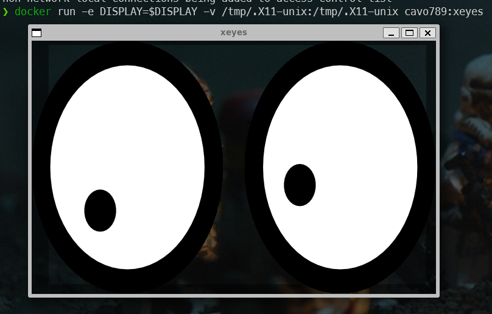
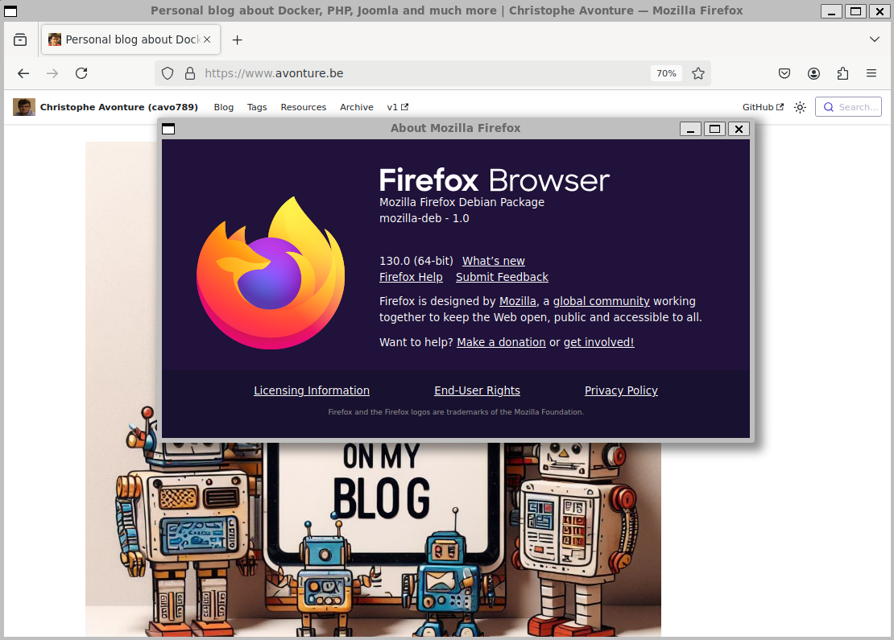
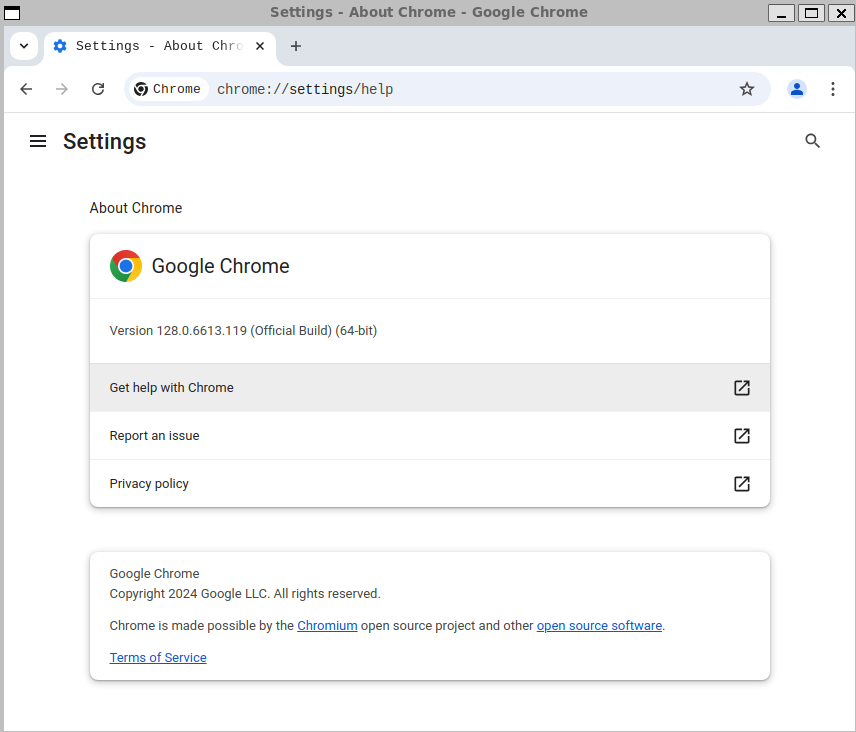
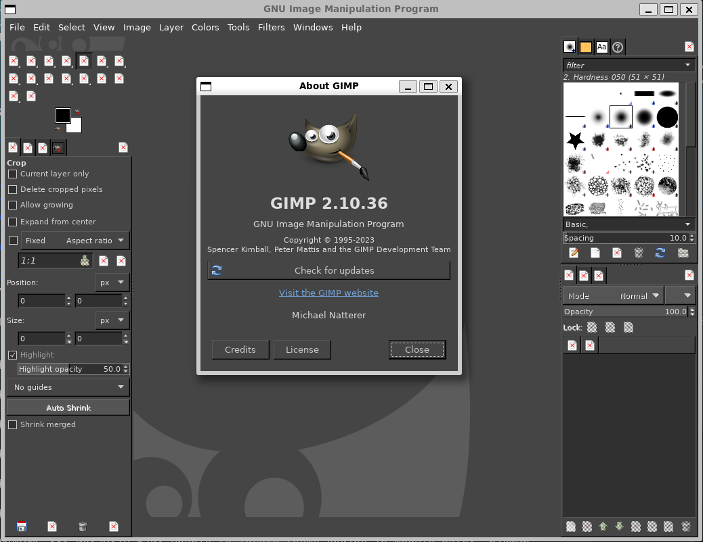

<!-- cspell:ignore xeyes,xhost,dearmor,dpkg,favourite -->

In my <Link to="/blog/docker-gui-in-browser">previous post</Link>, I've illustrated how to start Firefox or GIMP in a browser. This was the first part of this series about graphical user interfaces because, until very recently, I didn't know it was possible to run GUIs with Docker and that's just amazing.

<AlertBox variant="info" title="`GUI` stands for `Graphical User Interface`" />

So, using Docker, we can start Firefox or GIMP or even ... [Doom 2](https://hub.docker.com/r/classiccontainers/doom2).

In this blog post, we'll create our own xeyes Docker image, then play with Firefox and Gimp.

<!-- truncate -->

## Creating our own xeyes Docker image

Let's start with something really geeky.

Go to a temporary folder (f.i. `mkdir -p /tmp/xeyes && cd $_`) and create a file called `Dockerfile` with this content:

<Snippet filename="Dockerfile" source="./files/Dockerfile" />

Now, create the image by docker build like this: `docker build --tag cavo789/xeyes .` (replace `cavo789` by anything else like your pseudo).

Make sure you've a variable called `DISPLAY`. You can check this by running `printenv | grep DISPLAY`. If you don't have it, create the variable by running `export DISPLAY=:0` in the console.

Now, run `xhost +local:docker` in your console. That command grants permission to connect to an X server using the Docker socket. This means that applications running within Docker containers can display their graphical user interface (GUI) on the host system. The expected result is this text: `non-network local connections being added to access control list`

Now, simply run a container using and make sure to share the `DISPLAY` variable: `docker run --rm --env DISPLAY=$DISPLAY --volume /tmp/.X11-unix:/tmp/.X11-unix cavo789:xeyes`.

Yes, it's true, it's useless, but wow! it's possible to run a GUI from a container and replicate the image in real time on our host machine.

## Creating our own Firefox Docker image

So, once you've understood the very basic example of xeyes, you can think out-of-the-box: which GUI can I install using Docker.

Let's try Firefox... By using my favourite search engine, I've found this post: [Install Official Firefox .deb in Dockerfile](https://jetthoughts.com/blog/install-official-firefox-deb-in-dockerfile-docker-devops/).

In a Dockerfile and with small changes, this give this:

<Snippet filename="Dockerfile" source="./files/Dockerfile.part2" />

To build the image, please run the next command (and think to change `cavo789` by your pseudo): `docker build --tag cavo789/firefox .`.

And to start Firefox, just run `docker run --rm -v /tmp/.X11-unix:/tmp/.X11-unix -e DISPLAY=$DISPLAY cavo789/firefox`.

As you know, my OS is Windows 11 and I'm running Linux thanks the amazing WSL2 technology. So, in short, here above, you can see I've started Firefox for Debian as a windowed application in my Windows.

The old MS-DOS developer in me continues to be amazed by this possibility.

## Creation our own Chrome Docker image

We can do the same with Chrome:

<Snippet filename="Dockerfile" source="./files/Dockerfile.part3" />

Build the image using `docker build --tag cavo789/chrome .` then run it using `docker run --rm -v /tmp/.X11-unix:/tmp/.X11-unix -e DISPLAY=$DISPLAY cavo789/chrome`.

## Creating our own GIMP Docker image

Ok, now, I think you've understood how it works. So, very shortly, here is how to run GIMP for Linux in a Docker container:

<Snippet filename="Dockerfile" source="./files/Dockerfile.part4" />

Create the image by running `docker build --tag cavo789/gimp .`.

And to start GIMP, just run `docker run --rm -v /tmp/.X11-unix:/tmp/.X11-unix -e DISPLAY=$DISPLAY cavo789/gimp`.

