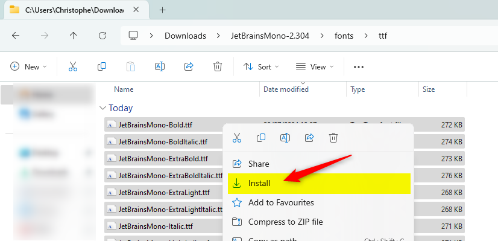
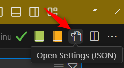

As you know, VSCode is highly customizable; you can install plethora of addons, change the default theme and use your preferred font.

Just take a look on the **JetBrains Mono font**. This is a free of charge font, for both commercial and non-commercial purposes.

In addition to the fact that it is particularly legible, making it much clearer to distinguish between an O (the letter) and a 0 (the number), between an I (upper-case I) and an l (lower-case l); **JetBrains Mono font** comes with nice ligature elements.

<!-- truncate -->

Visit [https://www.jetbrains.com/lp/mono/](https://www.jetbrains.com/lp/mono/) to see the potential of the font.

## Install JetBrains Mono font

It's easy: go to [https://www.jetbrains.com/lp/mono/#how-to-install](https://www.jetbrains.com/lp/mono/#how-to-install) and click on the `Download font` button.

Once downloaded, go to your downloads folder and unzip the file then jump in the `JetBrainsMono` newly created folder and go in the `fonts/ttf`. You'll find there several subfolders. Under Windows, just open the first folder, select all files and do a right-click. From the contextual menu, select `Install` as you can see below:



## Configure VSCode to use JetBrains Mono font

* Press <kbd>CTRL</kbd>+<kbd>,</kbd> to open your settings page
* Under the `Text Editor --> Font` section, type `JetBrains Mono` for the font family.

But the easier way is:

* Press <kbd>CTRL</kbd>+<kbd>,</kbd> to open your settings page
* In the top right part of the screen, retrieve the `Open Settings (JSON)` button and click on it



* Then copy paste these entries:

```json
"editor.fontFamily": "JetBrains Mono",
"editor.fontSize": 14,
"editor.fontLigatures": true,
```

Save, close VSCode and open it again (or simply press <kbd>CTRL</kbd>+<kbd>SHIFT</kbd>+<kbd>P</kbd> and run `Developer: Reload Window`)
