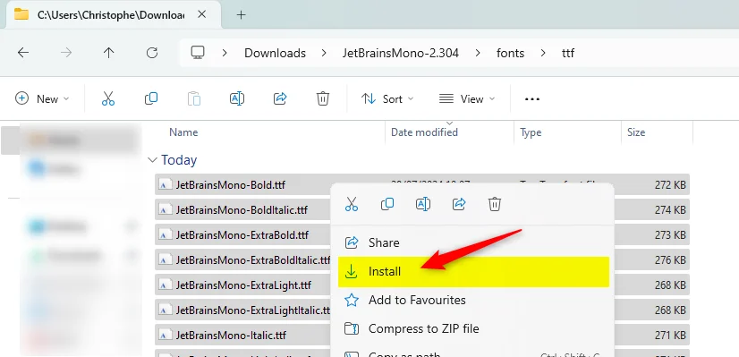
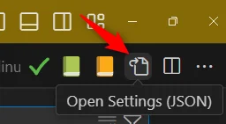

<TLDR>
This article shows how to install the free JetBrains Mono font (which clearly distinguishes O/0 and I/l, and supports code ligatures) and configure VSCode to use it via the `editor.fontFamily` and `editor.fontLigatures` settings in `settings.json`.
</TLDR>

As you know, VSCode is highly customizable; you can install <Link to="/blog/vscode-export-list-of-extensions">a plethora of addons</Link>, change the default theme, and use your preferred font.

*The same font, installed as a Nerd Font variant, is what makes the icons of <Link to="/blog/powerlevel10k_sandbox">Powerlevel10k</Link> and <Link to="/blog/linux-eza">eza</Link> display correctly in your terminal — so it's worth setting it in <Link to="/blog/windows-terminal">Windows Terminal</Link> too.*

Just take a look at the **JetBrains Mono font**. This is a free-of-charge font, for both commercial and non-commercial purposes.

In addition to the fact that it is particularly legible, making it much clearer to distinguish between an O (the letter) and a 0 (the number), between an I (upper-case I) and an l (lower-case l); **JetBrains Mono font** comes with nice ligature elements.

<!-- truncate -->

Visit [https://www.jetbrains.com/lp/mono/](https://www.jetbrains.com/lp/mono/) to see the potential of the font.

## Install JetBrains Mono font

It's easy: go to [https://www.jetbrains.com/lp/mono/#how-to-install](https://www.jetbrains.com/lp/mono/#how-to-install) and click on the `Download font` button.

Once downloaded, go to your downloads folder and unzip the file then jump into the newly created `JetBrainsMono` folder and go into `fonts/ttf`. You'll find there several subfolders. Under Windows, just open the first folder, select all files and do a right-click. From the contextual menu, select `Install` as you can see below:

## Configure VSCode to use JetBrains Mono font

- Press <kbd>CTRL</kbd>+<kbd>,</kbd> to open your settings page
- Under the `Text Editor --> Font` section, type `JetBrains Mono` for the font family.

But the easier way is:

- Press <kbd>CTRL</kbd>+<kbd>,</kbd> to open your settings page
- In the top right part of the screen, retrieve the `Open Settings (JSON)` button and click on it

- Then copy paste these entries:

<Snippet filename=".vscode/settings.json" source="./files/settings.json" />

Save, close VSCode and open it again (or simply press <kbd>CTRL</kbd>+<kbd>SHIFT</kbd>+<kbd>P</kbd> and run `Developer: Reload Window`)

Now that your editor looks the way you want, <Link to="/blog/vscode-codesnap">CodeSnap</Link> lets you turn any selection into a shareable screenshot that shows off that font.
